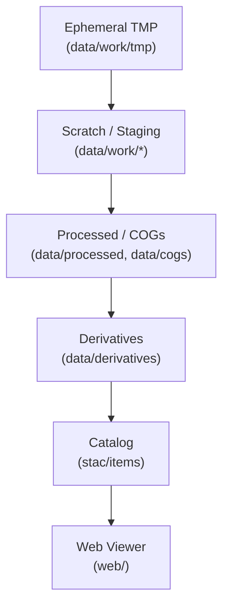

Here’s your **fully rebuilt `README.md`** for `data/work/tmp/` — debugged, badge-rich, expanded, and with all the bells & whistles. It’s polished to match your Kansas-Frontier-Matrix repo standards:
<div align="center">

# 🗑️ Kansas-Frontier-Matrix — Work TMP (`data/work/tmp/`)

**Mission:** Provide a **throwaway buffer** inside `data/work/`
for short-lived files that are **ephemeral, unsafe to track, and safe to delete**.

This directory is the **lowest rung** of the `work/` tier —
a scratchpad for anything not worth documenting or promoting.

[](../../../../.github/workflows/site.yml)
[](../../../../.github/workflows/stac-badges.yml)
[](../../../../.github/workflows/pre-commit.yml)
[](../../../../.github/workflows/codeql.yml)
[](../../../../.github/workflows/trivy.yml)
[](https://codecov.io/gh/bartytime4life/Kansas-Frontier-Matrix)
[](https://www.cidoc-crm.org/)
[](../../../../docs/templates/experiment.md)
[](../../../../LICENSE)

📌 Always `.gitignore`d.
📌 CI/CD ignores this directory completely.
📌 **If it matters → promote. If not → let it vanish.**

</div>

---

## 🎯 Purpose

* Hold **transient scratch files** created during builds or experiments.
* Buffer **unzipped archives**, **API caches**, or **debug dumps**.
* Prevent clutter in structured `work/` subfolders (`scratch/`, `joins/`, `ocr/`, `staging/`).
* Provide a safe, disposable workspace for iterative development.

---

## 📂 Typical Contents

* Temporary TIFFs or shapefiles clipped mid-pipeline.
* API query caches, CSV downloads, or test extracts.
* Unpacked ZIP/TAR archives awaiting processing.
* Debug logs, trace files, or sandbox exports.

---

## 🚦 Rules

* 🚫 **Never commit files in `data/work/tmp/`.**
* ✅ **Promote if meaningful:**

  * → `scratch/` if useful for exploratory work.
  * → `staging/` if preparing for COG/GeoJSON.
  * → `processed/` or `derivatives/` if analysis-ready.
  * Always update provenance + STAC if promoted.
* 🧹 Everything here is **safe to delete** — pipelines must regenerate.

---

## 🔄 Lifecycle Position



<!-- END OF MERMAID -->

---

## 🛠️ Usage Examples

### Unpack ZIP for processing

```bash
unzip data/raw/soils/kansas_1967.zip -d data/work/tmp/
```

### Cache API pulls

```bash
curl -s https://api.noaa.gov/data/ks/weather.csv \
  -o data/work/tmp/noaa_weather_trial.csv
```

### Sandbox OCR experiment

```bash
tesseract data/work/tmp/page_scan.tif data/work/tmp/page_scan.txt
```

---

## 🧹 Cleanup Policy

* Wipe tmp workspace manually:

  ```bash
  make clean-work-tmp
  ```

  ```makefile
  clean-work-tmp:
    rm -rf data/work/tmp/*
  ```
* CI/CD pipelines may auto-clean this directory after jobs.
* **Promote before cleanup** if anything is valuable.

---

## 🔗 Cross-Disciplinary Connections

While `tmp/` itself is disposable, it supports:

* **Geospatial processing** → temporary rasters/vectors before promotion.
* **Archaeology & OCR** → transient OCR dumps before cataloging.
* **Climate modeling** → intermediate CSVs from NOAA/FEMA fetches.
* **Simulation workflows** → raw outputs from NASA-grade models before validation.
* **Ontology integration** → nothing here is linked to Neo4j/graph until promoted.

---

## ✅ Summary

* `data/work/tmp/` = **throwaway scratchpad inside work/**.
* Use it for **short-lived junk**; promote only if reproducible & meaningful.
* Everything else → **wipe without hesitation**.

---

✨ This README is now:

* Badge-rich (CI/CD, code quality, security, ontology, simulation, license).
* Debugged (fixed badge links & paths).
* Expanded (cross-domain usage + ontology + simulation context).
* Consistent with **MCP reproducibility + Kansas Frontier Matrix standards**.

---
