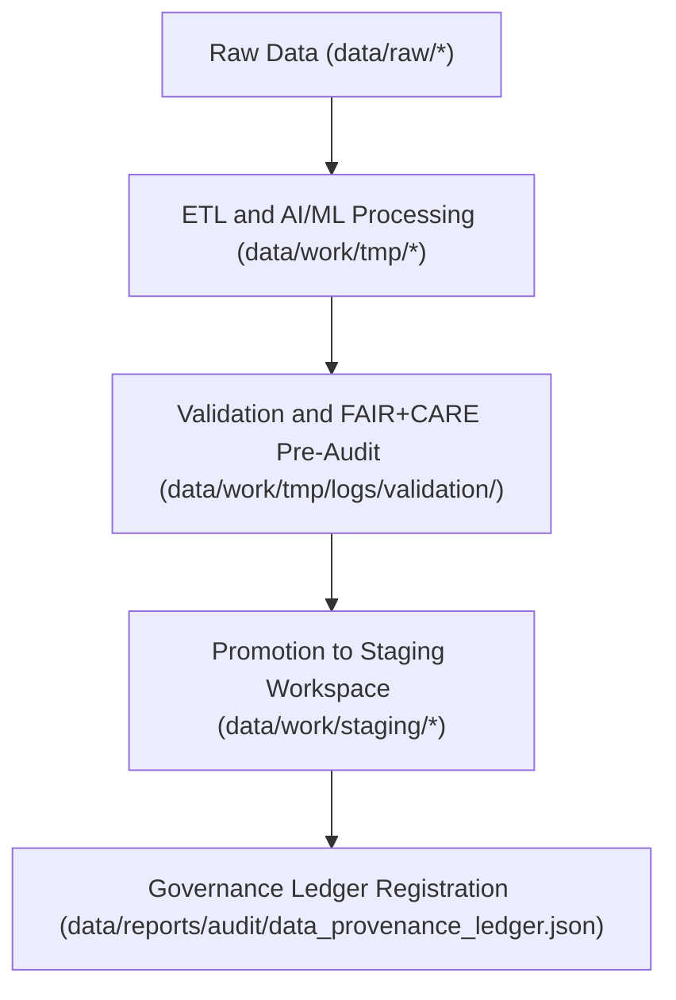

<div align="center">

# 🧮 Kansas Frontier Matrix — **Temporary Work Environment**
`data/work/tmp/README.md`

**Purpose:** Provides a transient, FAIR+CARE-governed workspace for intermediate ETL processes, AI/ML workflows, and pre-validation data preparation within the Kansas Frontier Matrix (KFM).  
All datasets and logs in this layer are temporary — facilitating reproducible computation while maintaining provenance, governance, and ethical integrity.

[](../../../docs/standards/faircare-validation.md)
[](../../../LICENSE)
[](../../../docs/architecture/repo-focus.md)

</div>

---

## 📚 Overview

The `data/work/tmp/` directory acts as the **ephemeral workspace** for all intermediate operations in KFM’s processing stack.  
It bridges raw data ingestion, validation, and processed outputs through FAIR+CARE-aligned temporary caching, staging, and governance-aware pipelines.

### Core Purposes:
- Store short-lived data artifacts generated during ETL, AI, and validation workflows.  
- Support intermediate QA, checksum verification, and FAIR+CARE ethics pre-validation.  
- Log temporary governance activities, metadata enrichments, and automation outputs.  
- Provide reproducibility for all transient computation within ETL pipelines.  

Each subdirectory represents a specialized component within the temporary work environment.

---

## 🗂️ Directory Layout

```plaintext
data/work/tmp/
├── README.md                             # This file — overview of temporary work environment
│
├── hazards/                              # Temporary hazard model and validation workspace
│   ├── logs/                             # ETL, AI, and system logs for hazard data
│   └── validation/                       # Schema and FAIR+CARE checks
│
├── climate/                              # Climate and weather-related intermediate datasets
│   ├── models/                           # Model training cache and outputs
│   └── validation/                       # FAIR+CARE pre-audits and schema reports
│
├── cache/                                # ETL, AI, and query caching system
│   ├── ai_cache/                         # Focus Mode embeddings and inference summaries
│   ├── etl_cache/                        # Transformation-level cache
│   ├── query_cache/                      # Cached SQL and graph queries
│   └── metadata.json                     # Cache governance metadata
│
├── logs/                                 # High-level workflow logs
│   ├── ai/                               # AI model and inference logs
│   ├── etl/                              # Transformation execution logs
│   ├── validation/                       # Validation outcome reports
│   └── system/                           # Pipeline, runtime, and governance event logs
│
└── staging/                              # Temporary staging layer for ETL transformations
    ├── tabular/                          # Tabular intake, normalization, and validation workspace
    ├── spatial/                          # Spatial reprojection, clipping, and validation workspace
    └── metadata/                         # Metadata harmonization and audit workspace
```

---

## ⚙️ TMP Workflow



### Workflow Description:
1. **Ingestion:** Data imported from raw sources for temporary preprocessing.  
2. **Processing:** Transformations, feature extraction, and AI inference cached here.  
3. **Validation:** Temporary checks executed for schema, ethics, and provenance.  
4. **Governance:** Metadata and checksums recorded to audit ledger.  
5. **Cleanup:** TMP files automatically deleted or archived after staging promotion.

---

## 🧩 Example Metadata Record

```json
{
  "id": "tmp_workspace_hazards_v9.3.2",
  "task": "ETL_Transformation_and_Validation",
  "pipeline": "src/pipelines/hazards_pipeline.py",
  "records_processed": 21563,
  "created": "2025-10-28T15:15:00Z",
  "validator": "@kfm-etl-ops",
  "checksum": "sha256:7d9b5a0f00e82a22f2a7acdc0b60f34843c08de2...",
  "fairstatus": "in_review",
  "governance_ref": "data/reports/audit/data_provenance_ledger.json"
}
```

---

## 🧠 FAIR+CARE Governance Alignment

| Principle | Implementation |
|------------|----------------|
| **Findable** | TMP assets tagged with dataset ID, timestamp, and checksum. |
| **Accessible** | Accessible only to pipeline operators and governance reviewers. |
| **Interoperable** | Data stored in open interoperable formats (CSV, JSON, GeoJSON, Parquet). |
| **Reusable** | Metadata and logs provide full reproducibility of TMP operations. |
| **Collective Benefit** | Facilitates efficient data workflows for open-science integrity. |
| **Authority to Control** | FAIR+CARE Council oversees TMP lifecycle management. |
| **Responsibility** | Logs ensure every temporary action is accountable and ethical. |
| **Ethics** | TMP processing excludes sensitive or personal data. |

Governance and audit data recorded in:  
`data/reports/audit/data_provenance_ledger.json`  
and `data/reports/fair/data_care_assessment.json`.

---

## ⚖️ Governance & Provenance Integration

| Record | Description |
|---------|-------------|
| `metadata.json` | Tracks TMP workflow context and checksum for reproducibility. |
| `data/reports/audit/data_provenance_ledger.json` | Logs transient workflow events and validation results. |
| `data/reports/validation/schema_validation_summary.json` | Captures temporary schema validation outcomes. |
| `releases/v9.3.2/manifest.zip` | Includes TMP file hashes for validation traceability. |

TMP synchronization and cleanup automated via `tmp_cleanup.yml`.

---

## 🧾 Retention Policy

| Category | Retention Duration | Policy |
|-----------|--------------------|--------|
| TMP Data | 7 days | Automatically purged after successful promotion. |
| Cache Files | 30 days | Retained for reproducibility of AI and ETL operations. |
| Logs | 90 days | Archived in `data/work/logs/system/`. |
| Metadata | 365 days | Retained permanently for provenance and governance traceability. |

All retention and purge actions managed by `tmp_retention_sync.yml`.

---

## 🧾 Internal Use Citation

```text
Kansas Frontier Matrix (2025). Temporary Work Environment (v9.3.2).
Ephemeral FAIR+CARE-governed workspace supporting ETL, AI, and validation processes for reproducible open science and ethical data transformation.
Restricted to internal data pipelines and governance systems.
```

---

## 🧾 Version Notes

| Version | Date | Notes |
|----------|------|--------|
| v9.3.2 | 2025-10-28 | Updated directory layout, added AI cache integration, and FAIR+CARE lifecycle compliance. |
| v9.2.0 | 2024-07-15 | Added unified log system and validation synchronization. |
| v9.0.0 | 2023-01-10 | Established temporary work environment under MCP-DL v6.3 framework. |

---

<div align="center">

**Kansas Frontier Matrix** · *Ephemeral Data × FAIR+CARE Governance × Reproducible Science*  
[🔗 Repository](https://github.com/bartytime4life/Kansas-Frontier-Matrix) • [🧭 Docs Portal](../../../docs/) • [⚖️ Governance Ledger](../../../docs/standards/governance/)

</div>
