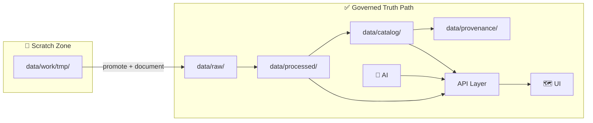

# 🧪 `data/work/tmp/` — Temporary Workspace (Scratch + Prototypes)


> **⚠️ Treat this folder as disposable.**  
> Anything here may be deleted, re-generated, or overwritten at any time.  
> If it matters, **promote it** to the canonical data/outputs path with metadata + provenance.

---

## 🎯 What this folder is for

Use `data/work/tmp/` for **fast iteration** during development:

- 🧫 **Experiments & spikes** (new ETL ideas, one-off transforms, quick validations)
- 🧪 **Model / prompt trials** (RAG chunking tests, evaluation drafts, embeddings sanity checks)
- 🗺️ **Map/UI prototypes** (style drafts, layer experiments, static exports)
- 📦 **Intermediate artifacts** that should **not** become part of the governed “truth path” yet
- 📊 **Draft analysis outputs** (plots, quick tables, preliminary summaries)

---

## 🚫 What this folder is NOT for

Do **not** place any of the following in `tmp/`:

- 🔐 **Secrets** (API keys, tokens, credentials, `.env` with real values)
- 🧍 **Personal/regulated data** (PII/PHI, sensitive locations, restricted cultural data)
- 🧱 **Production-ready datasets** (anything intended to be canonical or user-facing)
- 📦 **Unlicensed or unclear-license data** (if you can’t prove it’s allowed, don’t store it here)
- 🧨 **“Mystery outputs”** (artifacts without a runnable script + inputs documented)

---

## 🧭 Where “real” data should live (canonical paths)

This project follows a **governed pipeline / truth path** concept.

✅ When an experiment becomes “real,” promote results out of `tmp/` into the appropriate stage:

- 📥 `data/raw/` — immutable source snapshots  
- 🏭 `data/processed/` — cleaned/standardized outputs  
- 🗂️ `data/catalog/` — dataset metadata (e.g., STAC/DCAT-like records)  
- 🧾 `data/provenance/` — lineage logs (e.g., W3C PROV-style)  
- 🌐 Served via API → 🗺 UI / 🤖 AI (no bypassing)



---

## 📁 Suggested layout inside `tmp/`

Keep your mess **organized** 😄

```text
📁 data/work/tmp/
├── 📁 runs/              # timestamped experiment runs (recommended)
├── 📁 scratch/           # notebooks, quick scripts, throwaway snippets
├── 📁 downloads/         # temporary external pulls (must record source + license)
├── 📁 staging/           # interim artifacts you intend to promote soon
├── 📁 exports/           # files meant to share (images, clips, demos) — still non-canonical
└── 📄 README.md          # (this file)
```

> If you need a new folder, make it **obvious** and **single-purpose**.

---

## 🏷️ Naming conventions (small rules, big wins)

### ✅ For run folders
Use **ISO dates** + descriptive slugs:

- `runs/2026-02-03_layer-style-spike/`
- `runs/2026-02-03_rag-chunking-eval/`

### ✅ For files
Prefer:

- `kebab-case.ext`
- include a **scope** (layer/model/dataset) and a **hint** (v1/v2, bbox, year, etc.)

Examples:
- `ndvi-preview-1935.png`
- `county-joins-qc-v2.csv`
- `rag-sources-top20.json`

---

## 🧾 Minimum documentation for anything non-trivial

If a folder exists for more than ~1 day, add a tiny manifest.

### 📄 `RUN.md` (recommended)
Put this next to outputs in a `runs/.../` folder:

```markdown
# Run: rag-chunking-eval

- Date: 2026-02-03
- Owner: @you
- Goal: Compare chunk sizes (256/512/1024) for retrieval quality
- Inputs:
  - data/raw/<...>
- Command:
  - python pipelines/<script>.py --chunk 512 --topk 20
- Outputs:
  - chunks-512.jsonl
  - eval-summary.md
- Promote?:
  - If ✅, move `chunks-512.jsonl` → data/processed/... and write catalog + provenance
```

### ✅ Golden rule
If someone else can’t reproduce it from your notes + a script, it’s still “scratch.”

---

## 🧠 AI / LLM experiments in `tmp/`

This folder is appropriate for:
- prompt drafts, retrieval experiments, evaluation harness prototypes
- synthetic test corpora (clearly labeled)
- temporary embedding caches (if they can be regenerated)

**Guardrails to keep:**
- 🧷 Keep a **“No Source, No Answer”** mindset even in experiments  
- 🧹 sanitize inputs used for demos
- 🧾 log which sources were used to generate outputs (even if it’s just a short list)

---

## 🕸️ UI / web prototypes in `tmp/`

If you’re prototyping front-end ideas here:

- 🧱 Keep **HTML for structure** and **CSS for presentation** (separation keeps prototypes clean)
- ♿ Default to accessible patterns (semantic headings, readable contrast, keyboard nav)
- 🧭 Prototype navigation and layout intentionally (don’t “just place stuff”)

> Tip: If a prototype starts looking “real,” move it into the proper `web/` (or equivalent) area and wire it into the governed API path.

---

## 🧯 Safety checklist before promoting anything out of `tmp/`

- [ ] License/source is known and allowed
- [ ] No secrets / tokens / credentials included
- [ ] No sensitive personal or restricted data included
- [ ] Transform is reproducible (script + params)
- [ ] Metadata exists (what is it, where did it come from, what changed)
- [ ] Provenance is recorded (inputs → steps → outputs)
- [ ] If it feeds UI/AI, it goes through the API (no direct bypass)

---

## 🧼 Cleanup expectations

This directory should stay **light**:

- 🗑️ Feel free to delete old runs
- 🧊 Prefer re-generable artifacts over storing huge binaries
- 🧹 If it’s older than a sprint and not being promoted, remove it

---

## 🤝 Working agreement

This folder exists to **move fast without breaking trust** 🚀✅  
Prototype here. Validate here. Document lightly. Then **promote** into the truth path with full rigor.

<sub>🔁 Back to top: [Temporary Workspace](#-dataworktmp--temporary-workspace-scratch--prototypes)</sub>