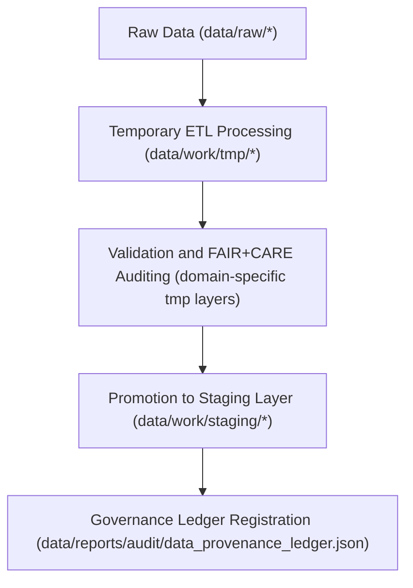

<div align="center">

# 🧮 Kansas Frontier Matrix — **Temporary Work Environment**
`data/work/tmp/README.md`

**Purpose:** Ephemeral FAIR+CARE-governed workspace for intermediate ETL transformations, model outputs, and validation checkpoints across multiple data domains in the Kansas Frontier Matrix (KFM).  
All datasets and logs within this layer are temporary — enabling reproducibility and transparent data flow while maintaining strict ethical and provenance standards.

[](../../../docs/standards/faircare-validation.md)
[](../../../LICENSE)
[](../../../docs/architecture/repo-focus.md)

</div>

---

## 📚 Overview

The `data/work/tmp/` directory functions as a **multi-domain, transient workspace** for intermediate processing across KFM’s major scientific and archival modules.  
It temporarily hosts normalized data fragments, validation reports, and AI model artifacts used during ETL, analytics, and quality assurance.  

### Key Responsibilities:
- Provide an isolated sandbox for **domain-specific ETL pipelines** (e.g., hydrology, hazards, terrain).  
- Support **pre-validation** and **checksum audits** for FAIR+CARE compliance.  
- Store **AI/ML intermediate artifacts**, model predictions, and logs.  
- Maintain **provenance continuity** while ensuring non-persistent data lifecycles.  

All contents are regenerated automatically by KFM’s pipelines and removed after successful staging or validation.

---

## 🗂️ Directory Layout

```plaintext
data/work/tmp/
├── README.md                            # This file — overview of temporary work environment
│
├── climate/                             # Temporary workspace for climate data ingestion, reanalysis, and ETL validation
├── hazards/                             # Intermediate hazard datasets (tornado, flood, drought) under QA transformation
├── hydrology/                           # Temporary hydrologic data (streamflow, aquifers, drainage basins)
├── landcover/                           # Transient workspace for raster classification and vegetation coverage processing
├── tabular/                             # Tabular ingestion and schema-normalization sandbox for ETL
├── terrain/                             # Temporary digital elevation model (DEM) and slope derivation workspace
└── text/                                # Temporary text and document-processing layer for OCR, transcripts, and NLP
```

---

## ⚙️ TMP Workflow



### Workflow Description:
1. **Ingestion:** Raw data pulled into the corresponding domain-specific TMP folder.  
2. **Transformation:** Schema normalization, feature engineering, and pre-validation occur.  
3. **FAIR+CARE Audit:** Each dataset undergoes automated ethical and reproducibility checks.  
4. **Promotion:** Once validated, files move to the appropriate staging layer.  
5. **Governance:** Metadata, lineage, and checksum results logged to governance records.

---

## 🧩 Example TMP Metadata Record

```json
{
  "id": "tmp_hazards_etl_v9.3.2",
  "domain": "hazards",
  "records_processed": 12842,
  "created": "2025-10-28T15:30:00Z",
  "pipeline": "src/pipelines/etl/hazards_tmp_pipeline.py",
  "validation_status": "in_review",
  "fairstatus": "compliant",
  "checksum": "sha256:c8f9d9c6b16f5b15c3e46a9e5a24a019f15d24a9...",
  "governance_ref": "data/reports/audit/data_provenance_ledger.json"
}
```

---

## 🧠 FAIR+CARE Governance Alignment

| Principle | Implementation |
|------------|----------------|
| **Findable** | TMP data indexed by domain, pipeline, and checksum metadata. |
| **Accessible** | Stored in open interoperable formats for internal access only. |
| **Interoperable** | Conforms to KFM’s JSON schema and FAIR+CARE metadata framework. |
| **Reusable** | Fully traceable via governance ledger and manifest registry. |
| **Collective Benefit** | Enables safe, reproducible data processing without polluting raw or staging layers. |
| **Authority to Control** | FAIR+CARE Council manages domain-specific retention and purging rules. |
| **Responsibility** | All transformations and logs linked to validator identity and runtime context. |
| **Ethics** | Excludes sensitive or personally identifiable information. |

Governance integration is logged automatically to:  
`data/reports/audit/data_provenance_ledger.json` and `data/reports/fair/data_care_assessment.json`.

---

## ⚖️ Governance & Provenance Integration

| Record | Description |
|---------|-------------|
| `metadata.json` | Captures temporary workflow metadata and validation status. |
| `data/reports/audit/data_provenance_ledger.json` | Records lineage for all TMP events. |
| `data/reports/validation/schema_validation_summary.json` | Captures schema testing and pre-validation results. |
| `releases/v9.3.2/manifest.zip` | Contains TMP checksum hashes and integrity records. |

TMP synchronization and cleanup tasks managed via `tmp_sync.yml`.

---

## 🧾 Retention Policy

| Category | Retention Duration | Policy |
|-----------|--------------------|--------|
| Domain TMP Data | 7 days | Purged automatically post-validation or staging promotion. |
| AI/ML Intermediate Outputs | 14 days | Retained for reproducibility testing. |
| Logs and Validation Reports | 30 days | Archived to `data/work/logs/system/`. |
| Metadata Records | 365 days | Retained permanently for provenance auditing. |

Retention and cleanup automation handled by `tmp_retention_cleanup.yml`.

---

## 🧾 Internal Use Citation

```text
Kansas Frontier Matrix (2025). Temporary Work Environment (v9.3.2).
Ephemeral FAIR+CARE-aligned workspace supporting ETL, AI, and validation workflows across environmental, spatial, and archival domains.
Restricted to internal data processing and governance validation.
```

---

## 🧾 Version Notes

| Version | Date | Notes |
|----------|------|--------|
| v9.3.2 | 2025-10-28 | Added multi-domain structure and harmonized FAIR+CARE compliance framework. |
| v9.2.0 | 2024-07-15 | Introduced terrain and text TMP layers for new ETL workflows. |
| v9.0.0 | 2023-01-10 | Established transient TMP environment for reproducible intermediate data. |

---

<div align="center">

**Kansas Frontier Matrix** · *Transient Data × FAIR+CARE Governance × Provenance Integrity*  
[🔗 Repository](https://github.com/bartytime4life/Kansas-Frontier-Matrix) • [🧭 Docs Portal](../../../docs/) • [⚖️ Governance Ledger](../../../docs/standards/governance/)

</div>
