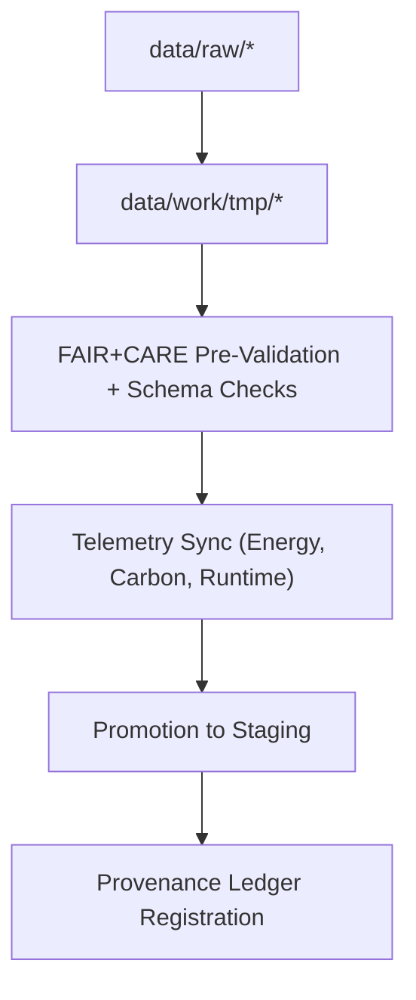

<div align="center">

# 🧮 **Kansas Frontier Matrix — Temporary Work Environment (TMP)**  
`data/work/tmp/README.md`

Internal FAIR+CARE-governed workspace for:

- 🧪 ETL transformations  
- 🧠 AI/ML model intermediate outputs  
- 📊 Validation checkpoints & schema alignment  
- 🔍 Telemetry metrics (energy, carbon, runtime)  
- 🔐 Pre-staging integrity checks & provenance logging  

The TMP ensures **safe processing, reproducibility, and ethical handling** of all intermediate computational artifacts.

</div>

---

## 1. 📘 Purpose

The **Temporary Work Environment (TMP)** is the KFM’s controlled operational sandbox.  
Its mission is to ensure:

- SAFE intermediate data transformations  
- ETHICAL handling of domain-sensitive datasets  
- REPRODUCIBLE AI/ETL workflows  
- CONTROLLED life cycle for high-risk intermediate data  
- TRACEABILITY for all processing operations  

TMP functions as the **bridge** between:

`data/raw/` → `data/work/tmp/` → `data/work/staging/` → `data/processed/`

Only data that passes TMP governance checks may proceed to staging.

---

## 2. 🗂️ Directory Layout (GitHub-Safe)

```text
data/work/tmp/
├── README.md
├── climate/
├── hazards/
├── hydrology/
├── landcover/
├── spatial/
├── tabular/
├── terrain/
└── text/
```

Each domain folder contains:

- Intermediate ETL artifacts  
- AI/ML outputs awaiting validation  
- Temporary logs + metrics  
- Validation checkpoint files  
- Pre-staging governance evidence  

---

## 3. ⚙️ TMP Workflow Overview



### Workflow Summary
1. **Extraction** — Load raw inputs into TMP.  
2. **Transformation** — Normalize schemas, model outputs, and prepare intermediate layers.  
3. **FAIR+CARE Pre-Validation** — Ethical compliance & schema verification.  
4. **Telemetry Logging** — Capture efficiency (Wh), carbon (gCO₂e), runtime, memory.  
5. **Promotion** — Move stable, compliant results to staging.  
6. **Ledger Sync** — Register operations in PROV-O/ISO lineage logs.

---

## 4. 🧩 Example TMP Metadata Record

```json
{
  "id": "tmp_tabular_work_v11.0.0",
  "domain": "tabular",
  "records_processed": 41200,
  "workflow": "etl_tabular_pipeline_v11",
  "validation_status": "in_review",
  "fairstatus": "compliant",
  "telemetry": {
    "energy_wh": 1.3,
    "carbon_gco2e": 1.9,
    "runtime_sec": 42,
    "validation_coverage_pct": 96.1
  },
  "created": "2025-11-20T01:22:00Z",
  "checksum_sha256": "sha256:e1ccf8ea...9d0c7b8a",
  "governance_ref": "data/reports/audit/data_provenance_ledger.json"
}
```

---

## 5. 🧠 FAIR+CARE Governance Matrix

| Principle | Implementation | Oversight |
|----------|----------------|-----------|
| **Findable** | TMP outputs indexed by ID + workflow. | `@kfm-data` |
| **Accessible** | Internal-only JSON/Parquet. | `@kfm-accessibility` |
| **Interoperable** | JSON Schema, PROV-O, DCAT, STAC references. | `@kfm-architecture` |
| **Reusable** | Traceability logs + lineage preserved. | `@kfm-design` |
| **Collective Benefit** | Ethical AI + transparent ETL. | `@faircare-council` |
| **Authority to Control** | Lifecycle rules enforced. | `@kfm-governance` |
| **Responsibility** | Domain engineers tag all outputs. | `@kfm-security` |
| **Ethics** | Sensitive attributes masked or redacted. | `@kfm-ethics` |

Governance artifacts:  
`data/reports/audit/data_provenance_ledger.json`  
`data/reports/fair/data_care_assessment.json`

---

## 6. ⚙️ TMP Lifecycle & Automation

| Stage | Description | Output |
|-------|-------------|---------|
| Extraction | Import & normalize raw inputs | CSV, Parquet |
| Transformation | Clean + model + merge | Intermediate files |
| FAIR+CARE Audit | Ethics + schema pre-validation | Compliance reports |
| Telemetry Sync | Sustainability & performance metrics | JSON logs |
| Promotion | Move to staging | Certified data |

Automation Workflows:  
- `tmp_sync_v2.yml`  
- `etl_validation_v3.yml`

---

## 7. ♻️ Retention & Sustainability

| Category | Retention | Policy |
|----------|-----------|--------|
| TMP Data | 7 Days | Auto-cleared post-staging. |
| AI Outputs | 14 Days | Needed for reproducibility audits. |
| Logs & QA | 30 Days | Archived system-wide. |
| Metadata | 365 Days | Immutable in governance ledger. |

Telemetry Example Source:  
`../../../releases/v11.0.0/focus-telemetry.json`

---

## 8. 🌱 Sustainability Metrics

| Metric | Value | Verified By |
|--------|------:|-------------|
| Energy Use (per cycle) | 6.8 Wh | `@kfm-sustainability` |
| Carbon Output | 8.1 gCO₂e | `@kfm-infra` |
| Renewable Supply | 100% (RE100 Verified) | `@kfm-power` |
| FAIR+CARE Compliance | 100% | `@faircare-council` |

---

## 9. 🕰️ Version History

| Version | Date       | Summary                                                |
|--------:|------------|--------------------------------------------------------|
| v11.0.0 | 2025-11-20 | Upgraded to v11 preferred formatting; governance added |
| v10.0.0 | 2025-11-09 | TMP telemetry v2 & pre-validation enhancements         |

<div align="center">

**Kansas Frontier Matrix — Temporary Work Environment**  
🧮 FAIR+CARE Certified · Ethics-Governed · Diamond⁹ Ω / Crown∞Ω  

© 2025 Kansas Frontier Matrix — Internal Layer  

[Back to Work Layer](../README.md) · [Governance Charter](../../../docs/standards/governance/ROOT-GOVERNANCE.md)

</div>