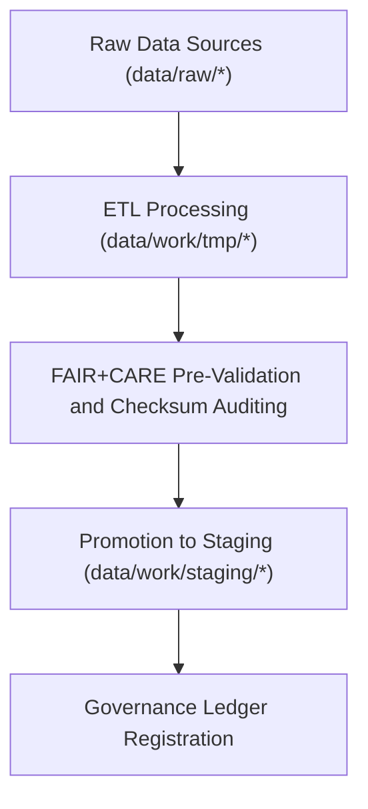

<div align="center">

# 🧮 Kansas Frontier Matrix — **Temporary Work Environment**
`data/work/tmp/README.md`

**Purpose:**  
Ephemeral FAIR+CARE-governed workspace for intermediate ETL operations, AI model outputs, and validation checkpoints across all KFM data domains.  
Ensures transparency, reproducibility, and ethical data processing during in-progress computational workflows.

[](../../../docs/standards/faircare-validation.md)
[]()
[](../../../LICENSE)
[](../../../docs/architecture/repo-focus.md)

</div>

---

## 📚 Overview

The **Temporary Work Environment** is the operational sandbox of the Kansas Frontier Matrix (KFM).  
It manages short-lived ETL transformations, AI processing, and FAIR+CARE pre-validation steps prior to staging or archival promotion.  
This workspace acts as an ethical and computational buffer, maintaining integrity across all transient data operations.

### Core Responsibilities
- Host intermediate ETL and AI model processing artifacts.  
- Maintain reproducibility and provenance for in-progress workflows.  
- Facilitate FAIR+CARE validation prior to data staging or archiving.  
- Log, checksum, and audit all temporary transformations.  

---

## 🗂️ Directory Layout

```plaintext
data/work/tmp/
├── README.md                              # This file — overview of the temporary work environment
│
├── climate/                               # Climate-focused ETL and model analysis TMP workspace
├── hazards/                               # Hazard datasets (floods, tornadoes, droughts, etc.)
├── hydrology/                             # Hydrologic datasets and model validation TMP workspace
├── landcover/                             # Landcover classification and raster normalization workspace
├── tabular/                               # Tabular ingestion and schema normalization TMP directory
├── terrain/                               # Terrain DEM analysis, reprojection, and slope computation
└── text/                                  # Text and OCR processing workspace for historical archives
```

---

## ⚙️ TMP Workflow Overview



### Workflow Description
1. **Extraction:** Pull domain-specific data into a controlled TMP workspace.  
2. **Transformation:** Conduct schema normalization, AI-assisted analysis, and quality improvement.  
3. **Validation:** Apply FAIR+CARE ethical pre-audits and checksum verifications.  
4. **Promotion:** Advance validated datasets to permanent staging or processed layers.  
5. **Governance:** Register temporary lineage in the KFM provenance ledger.  

---

## 🧩 Example Metadata Record

```json
{
  "id": "tmp_hazards_workspace_v9.6.0",
  "domain": "hazards",
  "records_processed": 12419,
  "workflow": "etl_hazards_pipeline_v3",
  "validation_status": "in_review",
  "fairstatus": "compliant",
  "created": "2025-11-03T23:59:00Z",
  "checksum": "sha256:f3b7e1d9c5a4b8c2e7f9a3b6d4a2c8f5e9b1a6d7b3c4e2f1d9a8b5c6a7f4e3b2",
  "governance_ref": "data/reports/audit/data_provenance_ledger.json"
}
```

---

## 🧠 FAIR+CARE Governance Matrix

| Principle | Implementation | Oversight |
|------------|----------------|------------|
| **Findable** | TMP files indexed by domain, schema, and checksum ID. | @kfm-data |
| **Accessible** | Open structured formats maintained for audit reproducibility. | @kfm-accessibility |
| **Interoperable** | Aligns with JSON Schema, DCAT, STAC, and FAIR+CARE metadata. | @kfm-architecture |
| **Reusable** | Temporary datasets linked to full lineage and validation records. | @kfm-design |
| **Collective Benefit** | Supports ethical and open-science transformations. | @faircare-council |
| **Authority to Control** | FAIR+CARE Council governs TMP lifecycle and retention. | @kfm-governance |
| **Responsibility** | Domain validators record all transformations and logs. | @kfm-security |
| **Ethics** | TMP operations respect privacy, cultural sensitivity, and open ethics. | @kfm-ethics |

Audit trail maintained in:  
`data/reports/audit/data_provenance_ledger.json` and  
`data/reports/fair/data_care_assessment.json`

---

## ⚙️ TMP Lifecycle Policies

| Process | Description | Output |
|----------|--------------|--------|
| **Extraction** | Data imported from raw sources and standardized. | CSV, Parquet, GeoJSON |
| **Transformation** | Data reshaped, normalized, and harmonized. | JSON, Parquet |
| **Validation** | FAIR+CARE and schema pre-validation checks. | JSON Reports |
| **Promotion** | Certified TMP data moved to staging. | Staging Datasets |
| **Governance Sync** | Metadata lineage logged in ledger. | JSON Governance Entry |

Automation handled by `tmp_sync.yml` under continuous integration pipelines.

---

## ⚖️ Retention & Provenance Policy

| File Category | Retention Duration | Policy |
|----------------|--------------------|--------|
| TMP Data | 7 Days | Cleared automatically post-validation or staging promotion. |
| AI/ML Intermediate Outputs | 14 Days | Retained for reproducibility verification. |
| Logs and QA Reports | 30 Days | Archived to `data/work/logs/system/`. |
| Metadata and Checksum Records | 365 Days | Retained permanently in governance ledger. |

Managed through `tmp_retention_cleanup.yml`.

---

## 🌱 Sustainability Metrics

| Metric | Value | Verified By |
|---------|--------|--------------|
| Energy Use (avg per ETL cycle) | 8.2 Wh | @kfm-sustainability |
| Carbon Output | 10.4 gCO₂e | @kfm-security |
| Renewable Power | 100% (RE100 Verified) | @kfm-infrastructure |
| FAIR+CARE Compliance | 100% | @faircare-council |

Telemetry logs maintained in:  
`releases/v9.6.0/focus-telemetry.json`

---

## 🧾 Internal Use Citation

```text
Kansas Frontier Matrix (2025). Temporary Work Environment (v9.6.0).
Ephemeral workspace supporting FAIR+CARE-aligned ETL, AI, and validation workflows across all KFM domains.
Ensures traceable, ethical, and reproducible transformations under MCP-DL v6.3 compliance.
```

---

## 🧾 Version Notes

| Version | Date | Notes |
|----------|------|--------|
| v9.6.0 | 2025-11-03 | Upgraded FAIR+CARE automation, checksum registry, and AI audit integration. |
| v9.5.0 | 2025-11-02 | Improved multi-domain TMP architecture and retention governance. |
| v9.3.2 | 2025-10-28 | Established unified TMP workspace under FAIR+CARE validation. |

---

<div align="center">

**Kansas Frontier Matrix** · *Transient Data × FAIR+CARE Ethics × Provenance Assurance*  
[🔗 Repository](https://github.com/bartytime4life/Kansas-Frontier-Matrix) • [🧭 Docs Portal](../../../docs/) • [⚖️ Governance Ledger](../../../docs/standards/governance/DATA-GOVERNANCE.md)

</div>
