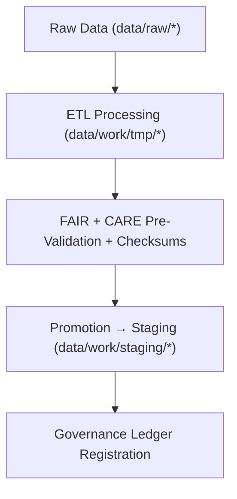

<div align="center">

# 🧮 Kansas Frontier Matrix — **Temporary Work Environment**
`data/work/tmp/README.md`

**Purpose:**  
Ephemeral FAIR+CARE-governed workspace for **intermediate ETL operations, AI model outputs, and validation checkpoints** across all KFM domains.  
Ensures transparency, reproducibility, and ethical data processing during in-progress computational workflows.

[](../../../docs/architecture/README.md)
[](../../../docs/standards/faircare-validation.md)
[]()
[](../../../LICENSE)

</div>

---

## 📘 Overview

The **Temporary Work Environment** is KFM’s operational sandbox.  
It manages short-lived ETL transformations, AI processing, and **FAIR+CARE pre-validation** steps prior to staging or archival promotion—acting as an ethical buffer for all transient operations.

### Core Responsibilities
- Host intermediate ETL and AI artifacts.  
- Maintain reproducibility and provenance for in-progress workflows.  
- Facilitate FAIR+CARE validation prior to staging/archiving.  
- Log, checksum, and audit all temporary transformations.  

---

## 🗂️ Directory Layout

```plaintext
data/work/tmp/
├── README.md
├── climate/
├── hazards/
├── hydrology/
├── landcover/
├── tabular/
├── terrain/
└── text/
```

---

## ⚙️ TMP Workflow Overview



### Steps
1. **Extraction** — Pull domain data into controlled TMP workspace.  
2. **Transformation** — Normalize schema, run AI analysis, improve quality.  
3. **Validation** — Apply FAIR+CARE pre-audits + checksum verifications.  
4. **Promotion** — Move validated outputs to staging/processed layers.  
5. **Governance** — Register lineage in provenance ledger.

---

## 🧩 Example TMP Metadata Record

```json
{
  "id": "tmp_hazards_workspace_v9.7.0",
  "domain": "hazards",
  "records_processed": 12419,
  "workflow": "etl_hazards_pipeline_v3",
  "validation_status": "in_review",
  "fairstatus": "compliant",
  "created": "2025-11-06T23:59:00Z",
  "checksum_sha256": "sha256:f3b7e1d9c5a4b8c2e7f9a3b6d4a2c8f5e9b1a6d7b3c4e2f1d9a8b5c6a7f4e3b2",
  "governance_ref": "data/reports/audit/data_provenance_ledger.json"
}
```

---

## 🧠 FAIR+CARE Governance Matrix

| Principle | Implementation | Oversight |
|-----------|----------------|-----------|
| **Findable** | TMP files indexed by domain, schema, checksum ID. | `@kfm-data` |
| **Accessible** | Open structured formats for audit reproducibility. | `@kfm-accessibility` |
| **Interoperable** | Aligns with JSON Schema, DCAT, STAC, FAIR+CARE. | `@kfm-architecture` |
| **Reusable** | Linked to lineage and validation reports. | `@kfm-design` |
| **Collective Benefit** | Supports ethical, open-science transformations. | `@faircare-council` |
| **Authority to Control** | Council governs TMP lifecycle + retention. | `@kfm-governance` |
| **Responsibility** | Validators document transformations and logs. | `@kfm-security` |
| **Ethics** | Privacy + cultural sensitivity respected. | `@kfm-ethics` |

**Audit trail:**  
`data/reports/audit/data_provenance_ledger.json` · `data/reports/fair/data_care_assessment.json`

---

## ⚙️ TMP Lifecycle Policies

| Process        | Description                               | Output                    |
|----------------|-------------------------------------------|---------------------------|
| Extraction     | Import & standardize from raw sources     | CSV, Parquet, GeoJSON     |
| Transformation | Reshape, normalize, and harmonize         | JSON, Parquet             |
| Validation     | FAIR+CARE & schema pre-validation         | JSON Reports              |
| Promotion      | Move certified TMP data to staging        | Staging Datasets          |
| Governance     | Log lineage to the provenance ledger      | Governance JSON Entry     |

**Automation:** `tmp_sync.yml` (CI pipelines)

---

## ♻️ Retention & Sustainability

| Category                   | Retention | Policy                                           |
|---------------------------|----------:|--------------------------------------------------|
| TMP Data                  | 7 Days    | Cleared post-validation or staging promotion.    |
| AI/ML Intermediate Output | 14 Days   | Retained for reproducibility verification.       |
| Logs & QA Reports         | 30 Days   | Archived to `data/work/logs/system/`.            |
| Metadata & Checksums      | 365 Days  | Retained in governance ledger.                   |

**Telemetry:** `../../../releases/v9.7.0/focus-telemetry.json`

---

## 🧾 Internal Citation

```text
Kansas Frontier Matrix (2025). Temporary Work Environment (v9.7.0).
Ephemeral workspace supporting FAIR+CARE-aligned ETL, AI, and validation workflows across KFM domains—ensuring traceable, ethical, and reproducible transformations under MCP-DL v6.3.
```

---

## 🕰️ Version History

| Version | Date       | Author        | Summary |
|--------:|------------|---------------|---------|
| v9.7.0  | 2025-11-06 | `@kfm-ops`    | Upgraded telemetry schema; retention + governance tables refreshed. |
| v9.6.0  | 2025-11-03 | `@kfm-ops`    | FAIR+CARE automation + checksum registry + AI audit integration. |

---

<div align="center">

**Kansas Frontier Matrix**  
*Transient Data × FAIR+CARE Ethics × Provenance Assurance*  
© 2025 Kansas Frontier Matrix — Internal · FAIR+CARE Certified · Diamond⁹ Ω / Crown∞Ω Ultimate Certified  

[Back to Work Layer](../README.md) · [Governance Charter](../../../docs/standards/governance/DATA-GOVERNANCE.md)

</div>