<div align="center">

# 🧮 Kansas Frontier Matrix — **Temporary Work Environment**
`data/work/tmp/README.md`

**Purpose:** Transient FAIR+CARE-governed workspace for intermediate ETL transformations, AI model outputs, and validation checkpoints across multiple KFM data domains.  
Provides an ephemeral, fully auditable sandbox for data harmonization, ensuring transparency, ethics, and reproducibility across all temporary workflows.

[](../../../docs/standards/faircare-validation.md)
[](../../../LICENSE)
[](../../../docs/architecture/repo-focus.md)

</div>

---

## 📚 Overview

The `data/work/tmp/` directory serves as a **multi-domain transient layer** for intermediate data operations across Kansas Frontier Matrix (KFM) pipelines.  
It temporarily hosts ETL transformations, validation outputs, and AI/ML artifacts generated during processing and quality assurance.

### Core Responsibilities
- Provide isolated **domain-level ETL sandboxes** (e.g., hazards, climate, hydrology).  
- Host **temporary validation reports**, checksum audits, and FAIR+CARE ethics evaluations.  
- Support **AI/ML model testing**, training, and inference traceability.  
- Maintain provenance continuity with **automatic purging** post-validation.  
- Emit telemetry for **runtime diagnostics**, **data integrity metrics**, and **FAIR+CARE audit trails**.  

All TMP contents are ephemeral and auto-cleaned after pipeline promotion or archival.

---

## 🗂️ Directory Layout

```plaintext
data/work/tmp/
├── README.md                            # This file — documentation for the temporary workspace
│
├── climate/                             # Temporary climate datasets (reanalysis, gridded ETL)
├── hazards/                             # Hazard domain workspace (flood, tornado, drought)
├── hydrology/                           # Transient hydrologic ETL and basin-level transformations
├── landcover/                           # Vegetation & raster classification normalization
├── tabular/                             # Temporary workspace for tabular ingestion and QA
├── terrain/                             # DEM processing, slope, and elevation analysis
└── text/                                # OCR, NLP, and document pre-processing environment
```

---

## ⚙️ TMP Workflow

```mermaid
flowchart TD
    A["Raw Data (data/raw/*)"] --> B["Temporary ETL Processing (data/work/tmp/*)"]
    B --> C["Validation + FAIR+CARE Audit (domain-specific tmp layers)"]
    C --> D["Promotion → Staging (data/work/staging/*)"]
    D --> E["Governance Ledger Registration + Telemetry Sync"]
```



### Workflow Description
1. **Ingestion:** Raw data imported into relevant domain-specific TMP workspace.  
2. **Transformation:** Apply schema normalization, feature extraction, and harmonization.  
3. **FAIR+CARE Audit:** Run ethical and reproducibility checks across TMP artifacts.  
4. **Promotion:** Move validated outputs to staging (`data/work/staging/`).  
5. **Governance:** Register checksum, lineage, and audit results in the provenance ledger.

---

## 🧩 Example TMP Metadata Record

```json
{
  "id": "tmp_hazards_etl_v9.5.0",
  "domain": "hazards",
  "records_processed": 12842,
  "created": "2025-11-02T16:30:00Z",
  "pipeline": "src/pipelines/etl/hazards_tmp_pipeline.py",
  "validation_status": "passed",
  "fairstatus": "compliant",
  "ai_drift_detected": false,
  "telemetry_link": "releases/v9.5.0/focus-telemetry.json",
  "checksum": "sha256:c8f9d9c6b16f5b15c3e46a9e5a24a019f15d24a9...",
  "governance_ref": "data/reports/audit/data_provenance_ledger.json"
}
```

---

## 🧠 FAIR+CARE + AI Governance Alignment

| Principle | Implementation |
|------------|----------------|
| **Findable** | TMP data indexed by domain, checksum, and telemetry reference. |
| **Accessible** | Stored in open interoperable formats, accessible to governance reviewers. |
| **Interoperable** | Adheres to JSON Schema + FAIR+CARE metadata standards. |
| **Reusable** | Traceable through checksums, manifests, and ledger records. |
| **Collective Benefit** | Enables ethical, transparent AI and data transformation workflows. |
| **Authority to Control** | FAIR+CARE Council manages domain purge and ethics policy. |
| **Responsibility** | All pipelines register logs with validator ID and telemetry. |
| **Ethics** | No PII or sensitive information; AI operations validated for bias. |

All TMP governance events are logged to:  
`data/reports/audit/data_provenance_ledger.json` • `data/reports/fair/data_care_assessment.json`

---

## ⚙️ Validation & Telemetry Integration

| Record | Description |
|---------|-------------|
| `metadata.json` | Captures TMP pipeline runtime and schema conformance. |
| `data/reports/audit/data_provenance_ledger.json` | Logs lineage and validation summaries. |
| `data/reports/validation/schema_validation_summary.json` | Records schema QA and normalization tests. |
| `releases/v9.5.0/manifest.zip` | Contains TMP checksums and AI telemetry archives. |
| `releases/v9.5.0/focus-telemetry.json` | Logs domain-specific metrics for governance dashboards. |

TMP activities synchronized through **`tmp_sync.yml`** and logged to telemetry.

---

## 🧾 Retention Policy

| Category | Retention Duration | Policy |
|-----------|--------------------|--------|
| Domain TMP Data | 7 days | Auto-deleted after validation and staging promotion. |
| AI/ML Intermediate Outputs | 14 days | Retained for reproducibility and model audits. |
| Logs & Reports | 30 days | Archived to `data/work/logs/system/` for governance. |
| Metadata Records | 365 days | Archived in provenance ledger for traceability. |

Cleanup managed by **`tmp_retention_cleanup.yml`** and AI purge policies.

---

## 🧾 Internal Use Citation

```text
Kansas Frontier Matrix (2025). Temporary Work Environment (v9.5.0).
Ephemeral FAIR+CARE and AI-governed workspace supporting ETL, ML, and validation workflows across KFM’s environmental and historical data domains.
Restricted to internal data processing, QA, and governance validation.
```

---

## 🧾 Version Notes

| Version | Date | Notes |
|----------|------|--------|
| v9.5.0 | 2025-11-02 | Added telemetry integration, AI audit hooks, and improved governance linkage. |
| v9.3.2 | 2025-10-28 | Multi-domain FAIR+CARE harmonization and ethics governance added. |
| v9.2.0 | 2024-07-15 | Introduced terrain and text TMP layers for new ETL workflows. |
| v9.0.0 | 2023-01-10 | Established transient TMP environment for reproducible intermediate data. |

---

<div align="center">

**Kansas Frontier Matrix** · *Transient Data × FAIR+CARE Ethics × AI Governance × Provenance Traceability*  
[🔗 Repository](https://github.com/bartytime4life/Kansas-Frontier-Matrix) • [🧭 Docs Portal](../../../docs/) • [⚖️ Governance Ledger](../../../docs/standards/governance/)

</div>
