<div align="center">

# 🧩 Kansas Frontier Matrix — **Temporary Workspace (Diamond⁶∞ Crown∞ Certified)**  
`data/work/tmp/`

**Mission:** Serve as KFM’s **cognitive sandbox** — a self-learning, AI-supervised,  
ephemeral workspace for ETL experimentation, validation, and AI explainability testing,  
ensuring **zero data waste**, **total reproducibility**, and **ethical automation**.

[](../../../../.github/workflows/site.yml)
[](../../../../.github/workflows/focus-validate.yml)
[]()
[](../../../../docs/standards/governance.md)
[](../../../../LICENSE)

</div>

---

## 🧭 System Context

`data/work/tmp/` is KFM’s **short-term AI reasoning layer**,  
bridging raw computation, validation, and governance.  
Focus Mode AI observes, learns, and optimizes every temporary data operation.

> *“Temporary by design — intelligent by evolution.”*

---

## 🌍 System-of-Systems Integration Map


The **Temporary Workspace** acts as KFM’s *short-term memory* —  
a live sandbox where data learning occurs before permanent storage.

---

## 🧠 AI Awareness & Contextual Learning

Focus Mode AI continuously refines KFM’s reproducibility intelligence by:
- Learning from transformation patterns and error recovery.
- Measuring resource efficiency and FAIR compliance.
- Detecting ethical or environmental impact anomalies.
- Improving model explainability through self-validation cycles.

> *The workspace itself teaches the system how to improve reproducibility.*

---

## 🗂 Directory Layout

```bash
data/work/tmp/
├── terrain/       # Temporary DEM, slope, hillshade intermediates
├── hydrology/     # Watershed, flood polygon staging
├── landcover/     # Vegetation classification intermediates
├── climate/       # Weather + drought test data
├── hazards/       # Tornado/wildfire overlays
├── tabular/       # CSV or Parquet validation slices
└── text/          # OCR/NLP intermediate corpora
```

Each subfolder mirrors `data/processed/` structure,  
preserving schema compatibility across workflows.

---

## 🧮 FAIR+CARE Evidence Table

| Principle | Evidence | Validation Source | Verified Score |
|------------|-----------|-------------------|----------------|
| **Findable** | AI-indexed logs by ETL session ID | `focus-validate.yml` | 100% |
| **Accessible** | Open, non-sensitive data only | LICENSE | 99% |
| **Interoperable** | Schema parity with STAC 1.0 | `stac-validate.yml` | 98% |
| **Reusable** | Deterministic regeneration workflows | `Makefile` | 99% |
| **CARE: Benefit** | Supports FAIR data ethics | FAIR dashboard | 99% |
| **CARE: Responsibility** | AI deletion traceability | Governance audit | 100% |

---

## 🔒 Security & Data Policy Matrix

| Control Area | Policy | Reviewer | Audit Source |
|---------------|---------|-----------|---------------|
| **Data Access** | Restricted to CI & ETL roles | @kfm-security | trivy.yml |
| **Cleanup Approval** | AI cleanup under ethics review | @kfm-ethics | cleanup-ai.json |
| **Checksum Validation** | Pre-deletion hash check required | @kfm-data | checksum-verify.yml |
| **License Enforcement** | Public-domain datasets only | @kfm-governance | fair/summary.json |

---

## ♻️ Autonomous Lifecycle Flow


---

## 🧩 AI Model Provenance & Explainability

| Model | Purpose | Framework | Explainability | Version | Validation |
|:------|:----------|:-----------|:----------------|:----------|:-------------|
| `focus-work-tmp-v3` | Drift tracking + reproducibility | PyTorch | SHAP + Neo4j linkage | 3.1 | `/reports/ai/focus-work-tmp.json` |
| `cleanup-agent` | Predictive cleanup & energy optimization | Python | LIME | 1.4 | `/reports/ai/tmp-cleanup.json` |
| `fair-telemetry-agent` | CARE metric scoring & transparency | Custom | Rule-based | 1.0 | `/reports/fair/tmp-summary.json` |

---

## 🧩 Telemetry Schema & Live Example

```json
{
  "tmp_session_id": "tmp_2025-10-22T19:30Z",
  "focus_score": 0.97,
  "checksum_drift": 0.002,
  "runtime_seconds": 21.5,
  "fair_score": 0.99,
  "a11y_score": 0.98,
  "energy_usage_watts": 12.4,
  "retention_hours": 48,
  "status": "validated"
}
```

---

## 🔁 AI Cleanup & Regeneration Workflow

```mermaid
graph LR
A[AI Monitors Workspace] --> B[Checksum Drift Detected]
B --> C[Cleanup Triggered · Manifest Signed]
C --> D[Governance Review · AI Ethics Approval]
D --> E[Makefile Regeneration · STAC Validation]
E --> F[Telemetry Updated · FAIR+CARE Report Published]
```



---

## 🧩 Governance & Oversight Roles

| Role | Responsibility | Owner | Frequency | Scope |
|------|----------------|--------|------------|-------|
| **FAIR Officer** | FAIR+CARE scoring + public reporting | @kfm-fair | Quarterly | FAIR |
| **AI Ethics Lead** | Ethical AI deletion oversight | @kfm-ethics | Biannual | AI |
| **Security Officer** | Manifest signing + integrity audits | @kfm-security | Monthly | Infra |
| **Accessibility Auditor** | a11y compliance for AI UIs | @kfm-accessibility | Annual | Accessibility |
| **Governance Auditor** | Final oversight and policy adherence | @kfm-governance | Quarterly | Global |

---

## 🧩 Self-Audit Metadata

```json
{
  "readme_id": "KFM-DATA-WORK-TMP-RMD-v6.0.0",
  "validation_timestamp": "2025-10-22T20:15:00Z",
  "validated_by": "@kfm-data",
  "governance_reviewer": "@kfm-governance",
  "ai_ethics_reviewer": "@kfm-ethics",
  "focus_model": "focus-work-tmp-v3",
  "audit_status": "pass",
  "ai_integrity": "verified",
  "fair_care_score": 80.0,
  "checksum_policy": "sha256",
  "retention_policy": "48-hour rolling",
  "energy_efficiency": "AI optimized",
  "security_signature": "pgp-sha256:<signature-id>"
}
```

---

## 🧾 Version History

| Version | Date | Author | Reviewer | AI Audit | FAIR/CARE | Security | Drift Δ | Summary |
|----------|------|---------|-----------|-----------|-----------|-----------|----------|----------|
| v6.0.0 | 2025-10-22 | @kfm-data | @kfm-governance | ✅ | 100% | PGP ✓ | +0.1% | Crown∞: AI learning feedback, explainability, and FAIR+CARE full integration |
| v5.1.0 | 2025-10-20 | @kfm-data | @kfm-qa | ✅ | 99% | ✓ | +0.3% | Crown⁺⁺: AI cleanup + telemetry improvements |
| v5.0.0 | 2025-10-17 | @kfm-architecture | @kfm-security | ✅ | 97% | ✓ | +0.4% | FAIR baseline + reproducibility alignment |

---

### 🪶 Acknowledgments

Maintained by **@kfm-data**, **@kfm-architecture**, and **@kfm-fair**,  
with oversight from @kfm-ai, @kfm-ethics, @kfm-security, @kfm-accessibility, and @kfm-governance.  
Special recognition to the **FAIR Data Alliance**, **MCP Council**, and **STAC Working Group**  
for leading the evolution of ethical, autonomous sandbox frameworks.

---

<div align="center">

[](../../../../.github/workflows/site.yml)
[](../../../../.github/workflows/focus-validate.yml)
[](../../../../reports/focus-telemetry/drift.json)
[](../../../../reports/fair/summary.json)
[](../../../../data/checksums/)
[]()
[](../../../../docs/standards/ai-integrity.md)
[](../../../../docs/standards/governance.md)
[](../../../../docs/standards/)
</div>
