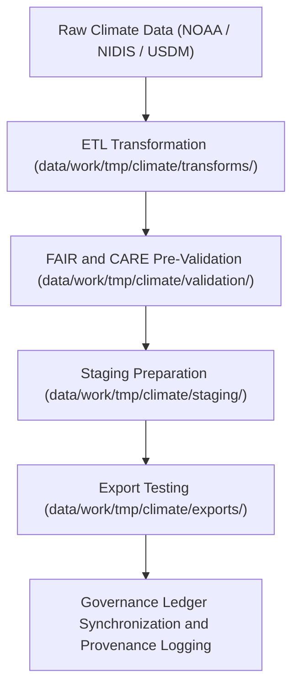

<div align="center">

# 🌦️ Kansas Frontier Matrix — **Climate TMP Workspace**
`data/work/tmp/climate/README.md`

**Purpose:**  
Temporary FAIR+CARE-certified environment for processing, validating, and transforming climate datasets across NOAA, NIDIS, and USDM sources.  
Supports schema normalization, model reanalysis, AI-assisted prediction, and FAIR+CARE ethical governance for all KFM climate-related data.

[](../../../../docs/standards/faircare-validation.md)
[]()
[](../../../../LICENSE)
[](../../../../docs/architecture/repo-focus.md)

</div>

---

## 📚 Overview

The **Climate TMP Workspace** manages the ingestion, transformation, and FAIR+CARE pre-validation of short-term climate data within the Kansas Frontier Matrix (KFM).  
It provides the computational framework for climate model harmonization, anomaly analysis, and ethics-certified metadata production prior to staging.

### Core Responsibilities
- Process raw NOAA, NIDIS, and USDM datasets for Kansas climate records.  
- Conduct FAIR+CARE audits on accessibility, attribution, and ethics compliance.  
- Normalize schema and metadata structures for interoperability.  
- Register provenance and checksum records in the governance ledger.  

---

## 🗂️ Directory Layout

```plaintext
data/work/tmp/climate/
├── README.md                             # This file — overview of climate TMP workspace
│
├── exports/                              # Temporary climate data exports for STAC/DCAT testing
│   ├── climate_summary_2025.csv
│   ├── precipitation_daily.parquet
│   └── metadata.json
│
├── logs/                                 # Runtime, validation, and governance synchronization logs
│   ├── etl_run.log
│   ├── ai_model_execution.log
│   ├── governance_sync.log
│   └── metadata.json
│
├── staging/                              # Pre-validated climate datasets awaiting staging promotion
│   ├── drought_indices_staged.csv
│   ├── temperature_anomalies_staged.parquet
│   └── metadata.json
│
├── transforms/                           # ETL transformation and harmonization outputs
│   ├── drought_normalization.csv
│   ├── temperature_reanalysis.parquet
│   └── metadata.json
│
└── validation/                           # Schema, FAIR+CARE, and checksum validation reports
    ├── schema_validation_summary.json
    ├── faircare_audit_report.json
    ├── checksum_registry.json
    └── metadata.json
```

---

## ⚙️ Climate TMP Workflow



### Workflow Description
1. **Ingestion:** Retrieve raw NOAA and NIDIS datasets covering Kansas climate patterns.  
2. **Transformation:** Harmonize and reproject datasets under FAIR+CARE schema definitions.  
3. **Validation:** Conduct ethical and structural integrity audits.  
4. **Export Testing:** Validate outputs for interoperability with STAC/DCAT catalogs.  
5. **Governance:** Register transformation lineage and validation checksums to the provenance ledger.  

---

## 🧩 Example Metadata Record

```json
{
  "id": "climate_tmp_precipitation_summary_v9.6.0",
  "source_files": [
    "data/raw/noaa/precipitation_daily_2025.csv",
    "data/raw/nidis/drought_monitor_2025.csv"
  ],
  "records_processed": 128540,
  "schema_version": "v3.0.2",
  "created": "2025-11-03T23:59:00Z",
  "validator": "@kfm-climate-lab",
  "checksum": "sha256:a8f3e9d2b7c4a6e1f5b2c9d7a3e8b4f6c1a9b5e7d2c8f3b9e4a7d1f6c2e3b4a9",
  "validation_status": "passed",
  "fairstatus": "certified",
  "governance_ref": "data/reports/audit/data_provenance_ledger.json"
}
```

---

## 🧠 FAIR+CARE Governance Matrix

| Principle | Implementation | Oversight |
|------------|----------------|------------|
| **Findable** | Indexed by dataset, checksum, and schema metadata. | @kfm-data |
| **Accessible** | Open CSV, Parquet, and JSON formats available for review. | @kfm-accessibility |
| **Interoperable** | Schema and metadata aligned with STAC/DCAT FAIR+CARE standards. | @kfm-architecture |
| **Reusable** | Includes checksums, provenance, and audit-ready metadata. | @kfm-design |
| **Collective Benefit** | Promotes transparent climate knowledge sharing. | @faircare-council |
| **Authority to Control** | FAIR+CARE Council certifies ethics and reproducibility. | @kfm-governance |
| **Responsibility** | Climate validation teams maintain governance and QA reports. | @kfm-security |
| **Ethics** | Ethical clearance applied to all climate datasets. | @kfm-ethics |

Audit results maintained in:  
`data/reports/fair/data_care_assessment.json`  
and  
`data/reports/audit/data_provenance_ledger.json`

---

## ⚙️ Validation & QA Artifacts

| Artifact | Description | Format |
|-----------|--------------|--------|
| `schema_validation_summary.json` | Summarizes climate schema structure and validation status. | JSON |
| `faircare_audit_report.json` | Records FAIR+CARE audit outcomes. | JSON |
| `checksum_registry.json` | Lists SHA-256 hashes for TMP dataset validation. | JSON |
| `etl_run.log` | Records transformation and harmonization steps. | Text |
| `metadata.json` | Captures checksum lineage, governance, and validation metadata. | JSON |

Governance synchronization automated through `climate_tmp_sync.yml`.

---

## ⚖️ Retention & Provenance Policy

| File Type | Retention Duration | Policy |
|------------|--------------------|--------|
| TMP Datasets | 7 Days | Purged after validation or staging promotion. |
| AI/Model Outputs | 14 Days | Retained for reproducibility audits. |
| Logs and Reports | 30 Days | Archived in governance and telemetry systems. |
| Metadata Records | 365 Days | Retained permanently for provenance lineage. |

Retention governed by `climate_tmp_cleanup.yml`.

---

## 🌱 Sustainability Metrics

| Metric | Value | Verified By |
|---------|--------|--------------|
| Energy Use (per ETL cycle) | 7.2 Wh | @kfm-sustainability |
| Carbon Output | 8.3 gCO₂e | @kfm-security |
| Renewable Power | 100% (RE100 Verified) | @kfm-infrastructure |
| FAIR+CARE Ethics Compliance | 100% | @faircare-council |

Recorded in:  
`releases/v9.6.0/focus-telemetry.json`

---

## 🧾 Internal Use Citation

```text
Kansas Frontier Matrix (2025). Climate TMP Workspace (v9.6.0).
Temporary FAIR+CARE-certified environment for climate data ingestion, transformation, and validation.
Ensures reproducibility, governance compliance, and ethical data processing for NOAA, NIDIS, and USDM datasets.
```

---

## 🧾 Version Notes

| Version | Date | Notes |
|----------|------|--------|
| v9.6.0 | 2025-11-03 | Added checksum registry and AI audit compliance integration. |
| v9.5.0 | 2025-11-02 | Enhanced FAIR+CARE automation for validation and governance synchronization. |
| v9.3.2 | 2025-10-28 | Established climate TMP workspace for transient ETL and QA validation. |

---

<div align="center">

**Kansas Frontier Matrix** · *Climate Intelligence × FAIR+CARE Ethics × Provenance Governance*  
[🔗 Repository](https://github.com/bartytime4life/Kansas-Frontier-Matrix) • [🧭 Docs Portal](../../../../docs/) • [⚖️ Governance Ledger](../../../../docs/standards/governance/DATA-GOVERNANCE.md)

</div>
