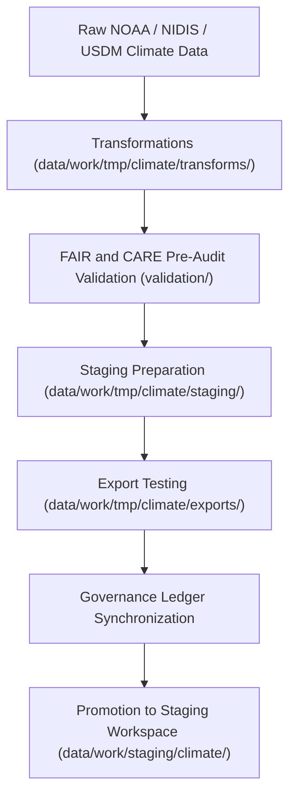

<div align="center">

# 🌦️ Kansas Frontier Matrix — **Climate TMP Workspace**
`data/work/tmp/climate/README.md`

**Purpose:** Temporary FAIR+CARE-governed workspace for ingesting, transforming, validating, and exporting climate-related datasets in the Kansas Frontier Matrix (KFM).  
Supports ETL, reanalysis, and AI-driven workflows for temperature, drought, and precipitation datasets from NOAA, NIDIS, and affiliated open data providers.

[](../../../../docs/standards/faircare-validation.md)
[](../../../../LICENSE)
[](../../../../docs/architecture/repo-focus.md)

</div>

---

## 📚 Overview

The `data/work/tmp/climate/` directory functions as the **transient processing layer** for climate data in the KFM ecosystem.  
It is the first step after data ingestion, handling cleaning, transformation, FAIR+CARE pre-validation, and export preparation before datasets are promoted to the staging layer.

This workspace manages short-lived files for:
- Schema-normalized climate data (e.g., temperature anomalies, drought indices).  
- FAIR+CARE audits and pre-validation reports.  
- Model training or AI-driven anomaly detection outputs.  
- Intermediate and governance-tracked transformation artifacts.  

All artifacts are **temporary** and automatically purged following successful validation and governance ledger registration.

---

## 🗂️ Directory Layout

```plaintext
data/work/tmp/climate/
├── README.md                               # This file — overview of Climate TMP workspace
│
├── exports/                                # Temporary export files for testing STAC and DCAT interoperability
│   ├── climate_summary_2025.csv
│   ├── noaa_precipitation_daily.parquet
│   └── metadata.json
│
├── logs/                                   # Runtime logs and governance synchronization reports
│   ├── etl_run.log
│   ├── ai_model_execution.log
│   ├── governance_sync.log
│   └── metadata.json
│
├── staging/                                # Temporary, validated datasets ready for promotion to staging layer
│   ├── drought_indices_staged.csv
│   ├── temperature_anomalies_staged.parquet
│   └── metadata.json
│
├── transforms/                             # ETL transformations, harmonization, and feature generation
│   ├── drought_normalization.csv
│   ├── temp_anomaly_reanalysis.parquet
│   └── metadata.json
│
└── validation/                             # FAIR+CARE and schema pre-validation reports
    ├── schema_validation_summary.json
    ├── faircare_audit_report.json
    ├── checksum_registry.json
    └── metadata.json
```

---

## ⚙️ Climate TMP Workflow



### Workflow Steps:
1. **Ingest:** Retrieve raw NOAA, USDM, and NIDIS datasets for Kansas.  
2. **Transform:** Normalize schema, harmonize units, and aggregate temporal records.  
3. **Validate:** Perform FAIR+CARE pre-validation and checksum verification.  
4. **Stage:** Store pre-approved datasets for promotion.  
5. **Export:** Test interoperability and catalog metadata alignment.  
6. **Govern:** Record validation outcomes and lineage in provenance ledger.

---

## 🧩 Example Metadata Record

```json
{
  "id": "climate_tmp_drought_indices_v9.3.2",
  "source_files": [
    "data/raw/noaa/drought_monitor/drought_monitor_2025.csv",
    "data/raw/noaa/temperature_anomalies/kansas_temp_anomalies_2025.csv"
  ],
  "records_processed": 54012,
  "schema_version": "v3.0.1",
  "created": "2025-10-28T15:12:00Z",
  "validator": "@kfm-climate-lab",
  "checksum": "sha256:f09c19ea245b62e98f99105b32b8223819c3b6a2...",
  "validation_status": "passed",
  "fairstatus": "compliant",
  "governance_ref": "data/reports/audit/data_provenance_ledger.json"
}
```

---

## 🧠 FAIR+CARE Climate Governance

| Principle | Implementation |
|------------|----------------|
| **Findable** | All TMP datasets indexed by temporal range and spatial extent (Kansas-wide). |
| **Accessible** | Open and machine-readable formats (CSV, JSON, Parquet). |
| **Interoperable** | Schema aligns with NOAA and NIDIS metadata standards. |
| **Reusable** | Includes provenance records and checksum validation. |
| **Collective Benefit** | Supports reproducible climate research and environmental equity. |
| **Authority to Control** | FAIR+CARE Council governs data ethics and usage compliance. |
| **Responsibility** | All ETL operations logged for accountability. |
| **Ethics** | No sensitive or restricted data retained; fully public domain sources. |

Audit logs stored in:  
`data/reports/audit/data_provenance_ledger.json` and `data/reports/fair/data_care_assessment.json`.

---

## ⚙️ Validation & QA Reports

| Report | Description | Output |
|---------|-------------|---------|
| `schema_validation_summary.json` | Confirms schema alignment and column mapping accuracy. | JSON |
| `faircare_audit_report.json` | FAIR+CARE ethical audit for data accessibility and transparency. | JSON |
| `checksum_registry.json` | Stores file checksums for governance verification. | JSON |
| `etl_run.log` | Detailed runtime trace of ETL pipeline execution. | Text |
| `ai_model_execution.log` | AI/ML climate forecasting model run log. | Text |

All reports automatically generated by `climate_tmp_validation.yml`.

---

## ⚖️ Governance & Provenance Integration

| Record | Description |
|---------|-------------|
| `metadata.json` | Captures context for ETL run, schema version, and FAIR+CARE audit. |
| `data/reports/audit/data_provenance_ledger.json` | Central ledger for lineage, checksum, and ethics tracking. |
| `data/reports/validation/schema_validation_summary.json` | Schema compliance verification report. |
| `releases/v9.3.2/manifest.zip` | Global checksum registry for TMP artifacts. |

Governance synchronization automated via `climate_tmp_sync.yml`.

---

## 🧾 Retention Policy

| File Type | Retention Duration | Policy |
|------------|--------------------|--------|
| TMP Data | 7 days | Purged after validation or staging promotion. |
| Logs | 30 days | Archived for governance review. |
| Model Outputs | 14 days | Retained for reproducibility and audit. |
| Metadata | 365 days | Preserved for provenance and lineage continuity. |

Cleanup handled by `climate_tmp_cleanup.yml`.

---

## 🧾 Internal Use Citation

```text
Kansas Frontier Matrix (2025). Climate TMP Workspace (v9.3.2).
Temporary FAIR+CARE-compliant workspace for ingesting, transforming, validating, and exporting climate datasets.
Supports NOAA and NIDIS data normalization, AI model validation, and provenance governance.
Restricted to internal workflows and audit review.
```

---

## 🧾 Version Notes

| Version | Date | Notes |
|----------|------|--------|
| v9.3.2 | 2025-10-28 | Updated directory structure (exports, transforms, staging, validation) and FAIR+CARE pre-validation workflow. |
| v9.2.0 | 2024-07-15 | Added checksum registry and AI/ML model governance integration. |
| v9.0.0 | 2023-01-10 | Established climate TMP workspace for transient ETL data processing. |

---

<div align="center">

**Kansas Frontier Matrix** · *Climate Science × FAIR+CARE Governance × Provenance Integrity*  
[🔗 Repository](https://github.com/bartytime4life/Kansas-Frontier-Matrix) • [🧭 Docs Portal](../../../../docs/) • [⚖️ Governance Ledger](../../../../docs/standards/governance/)

</div>
