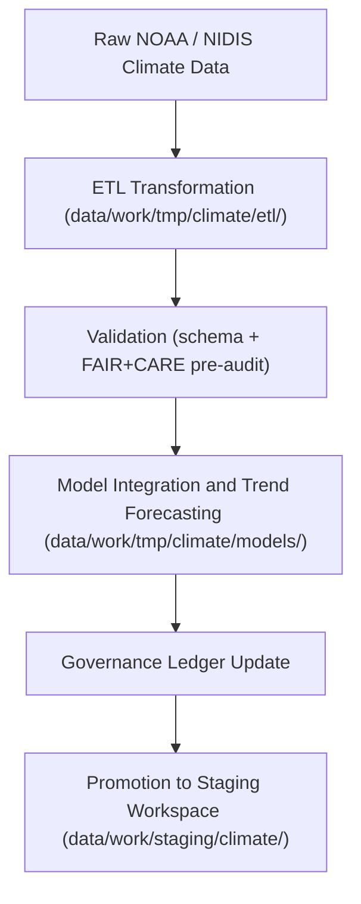

<div align="center">

# 🌦️ Kansas Frontier Matrix — **Climate TMP Workspace**
`data/work/tmp/climate/README.md`

**Purpose:** Temporary workspace for ingesting, processing, and validating climate datasets in the Kansas Frontier Matrix (KFM).  
This layer supports ETL workflows for temperature anomalies, drought indices, precipitation patterns, and climate reanalysis data under FAIR+CARE governance.

[](../../../../docs/standards/faircare-validation.md)
[](../../../../LICENSE)
[](../../../../docs/architecture/repo-focus.md)

</div>

---

## 📚 Overview

The `data/work/tmp/climate/` directory functions as a **transient ETL environment** for all climate and meteorological data processed within the Kansas Frontier Matrix (KFM).  
It hosts intermediate datasets, model outputs, and validation reports for NOAA, NIDIS, and other open climate data sources prior to integration into the staging and processed layers.

### Key Responsibilities:
- Ingest raw climate and weather datasets (temperature, drought, precipitation).  
- Perform normalization, aggregation, and FAIR+CARE ethics pre-audits.  
- Store intermediate ETL artifacts and validation reports for schema alignment.  
- Support AI-driven reanalysis and anomaly detection models.  

All contents in this layer are **temporary** and automatically purged after successful validation and governance registration.

---

## 🗂️ Directory Layout

```plaintext
data/work/tmp/climate/
├── README.md                               # This file — overview of climate TMP workspace
│
├── etl/                                   # Temporary ETL scripts, schema alignment, and preprocessing
│   ├── noaa_climate_ingest.csv
│   ├── drought_monitor_normalized.csv
│   └── metadata.json
│
├── models/                                # AI/ML and reanalysis model outputs
│   ├── temp_anomaly_forecast.parquet
│   ├── climate_trend_model.pkl
│   └── metadata.json
│
├── validation/                            # Schema and FAIR+CARE audit results
│   ├── schema_validation_summary.json
│   ├── faircare_audit_report.json
│   ├── checksums.json
│   └── metadata.json
│
└── logs/                                  # Runtime logs, governance synchronization, and system traces
    ├── etl_run.log
    ├── ai_model_validation.log
    ├── governance_sync.log
    └── metadata.json
```

---

## ⚙️ Climate ETL Workflow



### Workflow Steps:
1. **Ingestion:** Acquire open datasets (NOAA, USDM, NIDIS) for Kansas coverage.  
2. **Transformation:** Apply schema normalization and metadata alignment.  
3. **Validation:** Check schema integrity, checksum accuracy, and FAIR+CARE compliance.  
4. **Modeling:** Generate intermediate reanalysis or anomaly forecasts.  
5. **Governance:** Log results and checksum hashes in provenance ledger.  

---

## 🧩 Example Metadata Record

```json
{
  "id": "climate_tmp_drought_monitor_v9.3.2",
  "pipeline": "src/pipelines/etl/climate_drought_pipeline.py",
  "source_files": [
    "data/raw/noaa/drought_monitor/drought_monitor_2025.csv",
    "data/raw/noaa/temperature_anomalies/kansas_temp_anomalies_2025.csv"
  ],
  "records_processed": 54012,
  "models_generated": ["temp_anomaly_forecast.parquet"],
  "created": "2025-10-28T15:10:00Z",
  "validator": "@kfm-climate-lab",
  "checksum": "sha256:f09c19ea245b62e98f99105b32b8223819c3b6a2...",
  "fairstatus": "in_review",
  "governance_ref": "data/reports/audit/data_provenance_ledger.json"
}
```

---

## 🧠 FAIR+CARE Climate Governance

| Principle | Implementation |
|------------|----------------|
| **Findable** | Climate datasets indexed with temporal and spatial identifiers. |
| **Accessible** | Stored in open formats (CSV, Parquet, JSON). |
| **Interoperable** | Schema aligned with NOAA, NIDIS, and KFM contracts. |
| **Reusable** | Provenance and checksum tracking ensure reproducibility. |
| **Collective Benefit** | Supports open climate science and environmental transparency. |
| **Authority to Control** | FAIR+CARE Council oversees model usage and ethics validation. |
| **Responsibility** | Climate lab validators ensure dataset quality and ethical handling. |
| **Ethics** | Excludes restricted, private, or regionally sensitive data. |

Governance logs stored in:  
`data/reports/audit/data_provenance_ledger.json` and `data/reports/fair/data_care_assessment.json`.

---

## ⚙️ Validation & QA Components

| Report | Description | Output |
|---------|-------------|---------|
| `schema_validation_summary.json` | Confirms field-level schema integrity. | JSON |
| `faircare_audit_report.json` | FAIR+CARE ethical audit report for climate datasets. | JSON |
| `checksums.json` | Validation and checksum registry. | JSON |
| `etl_run.log` | Runtime logs for ETL operations. | Text |
| `ai_model_validation.log` | Model training and inference QA report. | Text |

All validation tasks automated via `climate_tmp_sync.yml`.

---

## ⚖️ Governance & Provenance Integration

| Record | Description |
|---------|-------------|
| `metadata.json` | Captures pipeline context, runtime, and FAIR+CARE status. |
| `data/reports/audit/data_provenance_ledger.json` | Tracks ETL lineage, model creation, and ethics reviews. |
| `data/reports/validation/schema_validation_summary.json` | Stores QA results and schema conformance reports. |
| `releases/v9.3.2/manifest.zip` | Holds all TMP climate checksum records for reproducibility. |

---

## 🧾 Retention Policy

| File Type | Retention Duration | Policy |
|------------|--------------------|--------|
| TMP Climate Data | 7 days | Purged after validation or staging promotion. |
| Model Outputs | 30 days | Retained for reanalysis reproducibility. |
| Logs | 90 days | Archived for governance traceability. |
| Metadata | 365 days | Retained permanently in provenance logs. |

Cleanup and archival automated by `climate_tmp_cleanup.yml`.

---

## 🧾 Internal Use Citation

```text
Kansas Frontier Matrix (2025). Climate TMP Workspace (v9.3.2).
Temporary FAIR+CARE-governed workspace for processing and validating climate datasets including drought, precipitation, and temperature anomalies.
Restricted to internal ETL, validation, and model governance workflows.
```

---

## 🧾 Version Notes

| Version | Date | Notes |
|----------|------|--------|
| v9.3.2 | 2025-10-28 | Integrated FAIR+CARE validation and NOAA–NIDIS harmonization. |
| v9.2.0 | 2024-07-15 | Added AI model logging and checksum governance. |
| v9.0.0 | 2023-01-10 | Established climate TMP workspace for transient ETL data. |

---

<div align="center">

**Kansas Frontier Matrix** · *Climate Science × FAIR+CARE Governance × Provenance Traceability*  
[🔗 Repository](https://github.com/bartytime4life/Kansas-Frontier-Matrix) • [🧭 Docs Portal](../../../../docs/) • [⚖️ Governance Ledger](../../../../docs/standards/governance/)

</div>
