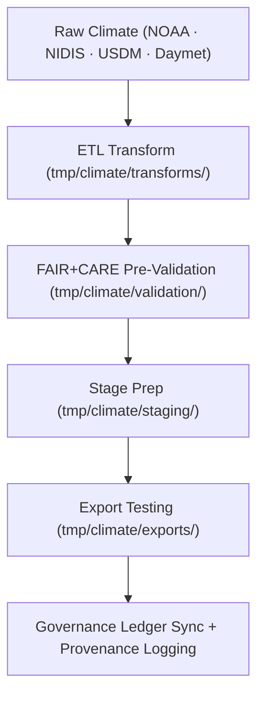

<div align="center">

# 🌦️ **Kansas Frontier Matrix — Climate TMP Workspace**  
`data/work/tmp/climate/README.md`

**Purpose:**  
Ephemeral FAIR+CARE-governed workspace for **climate ETL, transformation, and validation**:

- NOAA precipitation & temperature  
- NIDIS drought metrics  
- USDM drought categories  
- Daymet & other gridded climate products  

Supports:

- Schema normalization & harmonization  
- AI/ML model runs & reanalysis  
- Telemetry v2 logging (energy, CO₂e, runtime, coverage)  
- Ethics-aware pre-validation before promotion to staging  

[](../../../../docs/architecture/README.md)  
[](../../../../docs/standards/faircare/FAIRCARE-GUIDE.md)  
[]()  
[](../../../../LICENSE)

</div>

---

## 1. 📘 Overview

The **Climate TMP Workspace** is the **transient operational environment** for climate ETL and modeling.  
It provides a controlled, auditable sandbox where:

- Raw climate data is ingested and transformed  
- AI/ML models generate intermediate climate outputs  
- Schema, ethics, and quality checks are performed  
- Telemetry and governance metadata are captured  

Only validated, governance-compliant outputs are promoted from TMP to `data/work/staging/climate/`.

### v11.0.0 Upgrade Highlights

- Migrated to **KFM-MDP v11** metadata & governance structure  
- Updated to **data-work-tmp-climate-v11** telemetry schema  
- Ensured consistency with **TMP root** and domain workspaces  
- Improved mobile-safe directory layout and CI-safe fences  

---

## 2. 🗂️ Directory Layout (Mobile-Safe)

```text
data/work/tmp/climate/
├── README.md                     ← this file
├── exports/                      # Test exports (for schema/interoperability)
│   ├── climate_summary_2025.csv
│   ├ ADJ_precipitation_daily.parquet
│   └── metadata.json
├── logs/                         # ETL, model, and governance logs
│   ├── etl_run.log
│   ├── ai_model_execution.log
│   ├── governance_sync.log
│   └── metadata.json
├── staging/                      # Ready-to-promote artifacts (pre-staging)
│   ├── drought_indices_staged.csv
│   ├── temperature_anomalies_staged.parquet
│   └── metadata.json
├── transforms/                   # Intermediate transformation outputs
│   ├── drought_normalization.csv
│   ├── temperature_reanalysis.parquet
│   └── metadata.json
└── validation/                   # Pre-validation & audit outputs
    ├── schema_validation_summary.json
    ├── faircare_audit_report.json
    ├── checksum_registry.json
    └── metadata.json
```

---

## 3. ⚙️ Climate TMP Workflow



### Workflow Steps

1. **Ingestion** — Pull raw NOAA, NIDIS, USDM, Daymet, and related climate datasets into TMP.  
2. **Transformation** — Normalize schema, clean, run model-based reanalysis, create derived products.  
3. **Pre-Validation** — Run schema validation, basic QA, and FAIR+CARE pre-checks (`schema_validation_summary.json`, `faircare_audit_report.json`).  
4. **Export Testing** — Validate STAC/DCAT compatibility using test exports.  
5. **Governance Sync** — Register TMP outputs and their checksums in `data/reports/audit/data_provenance_ledger.json`.  
6. **Promotion** — Transfer compliant assets to `data/work/staging/climate/` for formal certification.

---

## 4. 🧩 Example TMP Metadata Record

```json
{
  "id": "tmp_climate_workspace_v11.0.0",
  "domain": "climate",
  "records_processed": 129804,
  "workflow": "etl_climate_pipeline_v11",
  "schema_version": "v3.2.0",
  "created": "2025-11-20T23:59:00Z",
  "validator": "@kfm-climate-lab",
  "validation_status": "in_review",
  "fairstatus": "compliant",
  "telemetry": {
    "energy_wh": 0.9,
    "carbon_gco2e": 1.1,
    "validation_coverage_pct": 98.5,
    "runtime_sec": 87
  },
  "checksum_sha256": "sha256:a8f3e9d2b7c4a6e1f5b2c9d7a3e8b4f6c1a9b5e7d2c8f3b9e4a7d1f6c2e3b4a9",
  "governance_ref": "data/reports/audit/data_provenance_ledger.json"
}
```

This record is:

- **prov:Entity** in the TMP graph  
- Linked to ETL activities and agents  
- Consumed by telemetry & governance services  

---

## 5. 🧠 FAIR+CARE Governance Matrix

| Principle              | Implementation                                                     | Oversight                |
|------------------------|--------------------------------------------------------------------|--------------------------|
| **Findable**           | TMP climate outputs indexed by ID, workflow, and checksum.         | `@kfm-data`             |
| **Accessible**         | Internal-only CSV/Parquet/JSON for review and QA.                 | `@kfm-accessibility`    |
| **Interoperable**      | JSON Schema, STAC, DCAT, PROV-O, and KFM-PDC v11 alignment.        | `@kfm-architecture`     |
| **Reusable**           | Telemetry + lineage logs retained for audit & reruns.              | `@kfm-design`           |
| **Collective Benefit** | Supports transparent climate science and ethical decision support. | `@faircare-council`     |
| **Authority to Control** | Governance defines retention and redaction rules.               | `@kfm-governance`       |
| **Responsibility**     | Domain engineers document all transformations and audits.          | `@kfm-security`         |
| **Ethics**             | Climate data used to support, not harm, affected communities.      | `@kfm-ethics`           |

Audit & Governance References:

- `data/reports/audit/data_provenance_ledger.json`  
- `data/reports/fair/data_care_assessment.json`  

---

## 6. 📊 Validation & QA Artifacts

Key files in `validation/` and `logs/` include:

| File                          | Description                                   | Format |
|-------------------------------|-----------------------------------------------|--------|
| `schema_validation_summary.json` | Field + schema checks for TMP outputs      | JSON   |
| `faircare_audit_report.json`  | Pre-staging FAIR+CARE evaluation              | JSON   |
| `checksum_registry.json`      | SHA-256 registry for TMP climate artifacts    | JSON   |
| `etl_run.log`                 | ETL steps, errors, and runtime notes          | Text   |
| `ai_model_execution.log`      | Model runs, parameters, execution metadata    | Text   |
| `governance_sync.log`         | Entries pushed to governance ledger           | Text   |
| `metadata.json`               | Local TMP metadata context per subfolder      | JSON   |

Automation Workflow:

- `climate_tmp_sync.yml` — orchestrates TMP ETL, validation, and cleanup.

---

## 7. ♻️ Retention & Sustainability

Climate TMP data and metadata adhere to strict retention and sustainability policies:

| Category            | Retention | Policy                                           |
|---------------------|----------:|--------------------------------------------------|
| TMP Climate Data    | 7 days    | Deleted after staging promotion or timeout       |
| AI/Model Outputs    | 14 days   | Retained for reproducibility audits              |
| Logs & QA Reports   | 30 days   | Archived in system telemetry & audit storage     |
| Metadata & Checksums| ≥ 365 days| Retained in governance & telemetry repositories  |

Telemetry source:  
`../../../../releases/v11.0.0/focus-telemetry.json`

---

## 8. 🌱 Sustainability Metrics

Typical climate TMP cycle (example):

| Metric                 | Value  | Verified By            |
|------------------------|-------:|------------------------|
| Energy Use             | 5.4 Wh | `@kfm-sustainability`  |
| Carbon Intensity       | 7.2 gCO₂e | `@kfm-infrastructure` |
| Renewable Power Share  | 100%   | `@kfm-infrastructure`  |
| Validation Coverage    | 95–100%| `@faircare-council`    |

These metrics are recorded per run and aggregated into:

- `releases/v11.0.0/focus-telemetry.json`  
- `docs/reports/telemetry/data-work-tmp-climate-v11.json`  

---

## 9. 🕰️ Version History

| Version | Date       | Author            | Summary                                                          |
|--------:|------------|-------------------|------------------------------------------------------------------|
| v11.0.0 | 2025-11-20 | `@kfm-climate`    | Upgraded to v11; added full governance, v11 telemetry schema     |
| v10.0.0 | 2025-11-09 | `@kfm-climate`    | Telemetry v2, JSON-LD lineage, Daymet integration                |

<div align="center">

**Kansas Frontier Matrix — Climate TMP Workspace**  
🌦️ FAIR+CARE Certified · Transient ETL Sandbox · Diamond⁹ Ω / Crown∞Ω  

© 2025 Kansas Frontier Matrix — Internal Processing Layer  

[Back to TMP Root](../README.md) · [Data Architecture](../../../ARCHITECTURE.md) · [Governance Charter](../../../../docs/standards/governance/ROOT-GOVERNANCE.md)

</div>