<div align="center">

# 🌦️ Kansas Frontier Matrix — **Climate TMP Workspace**
`data/work/tmp/climate/README.md`

**Purpose:**  
Temporary FAIR+CARE-certified environment for processing, validating, and transforming climate datasets across NOAA, NIDIS, and USDM sources.  
Supports schema normalization, model reanalysis, AI-assisted prediction, and ethics-certified metadata generation prior to staging.

[](../../../../docs/architecture/README.md)
[](../../../../docs/standards/faircare-validation.md)
[]()
[](../../../../LICENSE)

</div>

---

## 📘 Overview

The **Climate TMP Workspace** manages ingestion, transformation, and **FAIR+CARE pre-validation** of short-term climate data.  
It provides computational scaffolding for climate model harmonization, anomaly analysis, and governance-linked metadata prior to staging.

### Core Responsibilities
- Process raw NOAA, NIDIS, and USDM datasets for Kansas climate records.  
- Conduct FAIR+CARE audits for accessibility, attribution, and ethics.  
- Normalize schema/metadata for interoperability.  
- Register provenance and checksums in the governance ledger.  

---

## 🗂️ Directory Layout

```plaintext
data/work/tmp/climate/
├── README.md
├── exports/
│   ├── climate_summary_2025.csv
│   ├── precipitation_daily.parquet
│   └── metadata.json
├── logs/
│   ├── etl_run.log
│   ├── ai_model_execution.log
│   ├── governance_sync.log
│   └── metadata.json
├── staging/
│   ├── drought_indices_staged.csv
│   ├── temperature_anomalies_staged.parquet
│   └── metadata.json
├── transforms/
│   ├── drought_normalization.csv
│   ├── temperature_reanalysis.parquet
│   └── metadata.json
└── validation/
    ├── schema_validation_summary.json
    ├── faircare_audit_report.json
    ├── checksum_registry.json
    └── metadata.json
```

---

## ⚙️ Climate TMP Workflow

```mermaid
flowchart TD
    A["Raw Climate (NOAA · NIDIS · USDM)"] --> B["ETL Transform (tmp/climate/transforms/)"]
    B --> C["FAIR + CARE Pre-Validation (tmp/climate/validation/)"]
    C --> D["Stage Prep (tmp/climate/staging/)"]
    D --> E["Export Testing (tmp/climate/exports/)"]
    E --> F["Governance Ledger Sync + Provenance Logging"]
```



### Steps
1. **Ingestion** — Pull raw NOAA/NIDIS datasets for Kansas domains.  
2. **Transform** — Harmonize under FAIR+CARE schema definitions.  
3. **Validate** — Run ethical + structural integrity audits.  
4. **Export Test** — Check STAC/DCAT interoperability.  
5. **Governance** — Log lineage + checksums to provenance ledger.

---

## 🧩 Example TMP Metadata Record

```json
{
  "id": "climate_tmp_precipitation_summary_v9.7.0",
  "source_files": [
    "data/raw/noaa/precipitation_daily_2025.csv",
    "data/raw/nidis/drought_monitor_2025.csv"
  ],
  "records_processed": 128540,
  "schema_version": "v3.1.1",
  "created": "2025-11-06T23:59:00Z",
  "validator": "@kfm-climate-lab",
  "checksum_sha256": "sha256:a8f3e9d2b7c4a6e1f5b2c9d7a3e8b4f6c1a9b5e7d2c8f3b9e4a7d1f6c2e3b4a9",
  "validation_status": "passed",
  "fairstatus": "certified",
  "governance_ref": "data/reports/audit/data_provenance_ledger.json"
}
```

---

## 🧠 FAIR+CARE Governance Matrix

| Principle | Implementation | Oversight |
|-----------|----------------|-----------|
| **Findable** | Indexed by dataset, checksum, and schema metadata. | `@kfm-data` |
| **Accessible** | Open CSV/Parquet/JSON for review. | `@kfm-accessibility` |
| **Interoperable** | STAC/DCAT + FAIR+CARE-aligned schema & metadata. | `@kfm-architecture` |
| **Reusable** | Checksums, provenance, and audit-ready metadata included. | `@kfm-design` |
| **Collective Benefit** | Enables transparent climate knowledge sharing. | `@faircare-council` |
| **Authority to Control** | Council certifies ethics + reproducibility. | `@kfm-governance` |
| **Responsibility** | Validation teams maintain governance + QA reports. | `@kfm-security` |
| **Ethics** | Ethical clearance applied to all climate datasets. | `@kfm-ethics` |

**Audit refs:**  
`data/reports/fair/data_care_assessment.json` · `data/reports/audit/data_provenance_ledger.json`

---

## ⚙️ Validation & QA Artifacts

| Artifact                      | Description                                   | Format |
|------------------------------|-----------------------------------------------|--------|
| `schema_validation_summary.json` | Schema structure + validation summary      | JSON   |
| `faircare_audit_report.json`     | FAIR+CARE audit outcomes                   | JSON   |
| `checksum_registry.json`         | SHA-256 hash registry during TMP review    | JSON   |
| `etl_run.log`                    | Transformation + harmonization steps       | Text   |
| `metadata.json`                  | Lineage, checksum, and validation metadata | JSON   |

**Automation:** `climate_tmp_sync.yml`

---

## ♻️ Retention & Sustainability

| File Type         | Retention | Policy                                         |
|-------------------|----------:|------------------------------------------------|
| TMP Datasets      | 7 Days    | Purged after validation or staging promotion. |
| AI/Model Outputs  | 14 Days   | Retained for reproducibility audits.          |
| Logs & Reports    | 30 Days   | Archived to governance + telemetry systems.   |
| Metadata Records  | 365 Days  | Kept for provenance lineage.                  |

**Telemetry:** `../../../../releases/v9.7.0/focus-telemetry.json`

---

## 🧾 Internal Citation

```text
Kansas Frontier Matrix (2025). Climate TMP Workspace (v9.7.0).
Temporary FAIR+CARE-certified environment for climate data ingestion, transformation, and validation—ensuring reproducibility, governance compliance, and ethical processing for NOAA, NIDIS, and USDM datasets.
```

---

## 🕰️ Version History

| Version | Date       | Author           | Summary |
|--------:|------------|------------------|---------|
| v9.7.0  | 2025-11-06 | `@kfm-climate`   | Upgraded telemetry schema, clarified STAC/DCAT export tests, sustainability updates. |
| v9.6.0  | 2025-11-03 | `@kfm-climate`   | Added checksum registry + AI audit compliance integration. |

---

<div align="center">

**Kansas Frontier Matrix**  
*Climate Intelligence × FAIR+CARE Ethics × Provenance Governance*  
© 2025 Kansas Frontier Matrix — Internal · FAIR+CARE Certified · Diamond⁹ Ω / Crown∞Ω Ultimate Certified  

[Back to TMP Root](../README.md) · [Governance Charter](../../../../docs/standards/governance/DATA-GOVERNANCE.md)

</div>