<div align="center">

# 🌦️ Kansas Frontier Matrix — **Climate TMP Workspace**
`data/work/tmp/climate/README.md`

**Purpose:** Temporary FAIR+CARE and AI-audited workspace for ingesting, transforming, validating, and exporting climate datasets in the Kansas Frontier Matrix (KFM).  
Supports ETL, reanalysis, and model-driven workflows for temperature, precipitation, drought, and extreme climate indicators sourced from NOAA, NIDIS, and related open-science networks.

[](../../../../docs/standards/faircare-validation.md)
[](../../../../LICENSE)
[](../../../../docs/architecture/repo-focus.md)

</div>

---

## 📚 Overview

The `data/work/tmp/climate/` directory operates as the **transient processing environment** for KFM climate data pipelines.  
It enables reproducible and ethically governed transformations of climate datasets through FAIR+CARE-compliant ETL, pre-validation, and AI-based anomaly detection.

### Core Responsibilities
- Ingest and preprocess climate datasets (NOAA, NIDIS, USDM, CPC).  
- Perform unit normalization, temporal aggregation, and harmonization.  
- Conduct FAIR+CARE audits and pre-validation prior to staging promotion.  
- Execute AI anomaly detection and feature extraction for reanalysis.  
- Register provenance, checksums, and metrics in the governance ledger.  

All temporary datasets and logs are auto-purged following validation or promotion.

---

## 🗂️ Directory Layout

```plaintext
data/work/tmp/climate/
├── README.md
│
├── exports/                                # Test exports for catalog interoperability
│   ├── climate_summary_2025.csv
│   ├── noaa_precipitation_daily.parquet
│   └── metadata.json
│
├── logs/                                   # Runtime and governance trace logs
│   ├── etl_run.log
│   ├── ai_model_execution.log
│   ├── governance_sync.log
│   └── metadata.json
│
├── staging/                                # Pre-validated datasets awaiting promotion
│   ├── drought_indices_staged.csv
│   ├── temperature_anomalies_staged.parquet
│   └── metadata.json
│
├── transforms/                             # ETL transformations and harmonized intermediates
│   ├── drought_normalization.csv
│   ├── temp_anomaly_reanalysis.parquet
│   └── metadata.json
│
└── validation/                             # FAIR+CARE & schema QA artifacts
    ├── schema_validation_summary.json
    ├── faircare_audit_report.json
    ├── ai_anomaly_audit.json
    ├── checksum_registry.json
    └── metadata.json
```

---

## ⚙️ Climate TMP Workflow

```mermaid
flowchart TD
    A["Raw NOAA / NIDIS / USDM Data"] --> B["ETL Transformation (transforms/)"]
    B --> C["FAIR+CARE Pre-Audit & Schema Validation (validation/)"]
    C --> D["Staging Prep (staging/)"]
    D --> E["Export QA (exports/)"]
    E --> F["Governance + Telemetry Synchronization"]
    F --> G["Promotion → data/work/staging/climate/"]
```



### Workflow Description
1. **Ingestion:** Retrieve NOAA/NIDIS/USDM climate data for Kansas domains.  
2. **Transformation:** Normalize temporal frequency, reproject units, and aggregate summaries.  
3. **Validation:** Execute FAIR+CARE audits, AI anomaly checks, and schema validations.  
4. **Staging:** Prepare harmonized datasets for promotion and governance ledger registration.  
5. **Export:** Test interoperability (STAC/DCAT) and publish metadata summaries.  
6. **Governance:** Sync checksum, validation, and ethics logs with the provenance ledger.

---

## 🧩 Example Metadata Record

```json
{
  "id": "climate_tmp_drought_indices_v9.5.0",
  "source_files": [
    "data/raw/noaa/drought_monitor/drought_monitor_2025.csv",
    "data/raw/noaa/temperature_anomalies/kansas_temp_anomalies_2025.csv"
  ],
  "records_processed": 54012,
  "schema_version": "v3.2.0",
  "created": "2025-11-02T16:35:00Z",
  "validator": "@kfm-climate-lab",
  "checksum": "sha256:f09c19ea245b62e98f99105b32b8223819c3b6a2...",
  "ai_anomalies": 0,
  "validation_status": "passed",
  "fairstatus": "compliant",
  "telemetry_link": "releases/v9.5.0/focus-telemetry.json",
  "governance_ref": "data/reports/audit/data_provenance_ledger.json"
}
```

---

## 🧠 FAIR+CARE + AI Climate Governance

| Principle | Implementation |
|------------|----------------|
| **Findable** | Indexed by domain, source, and temporal range. |
| **Accessible** | Stored as interoperable CSV/Parquet under open schema governance. |
| **Interoperable** | Conforms to NOAA, NIDIS, and KFM schema models. |
| **Reusable** | Checksum, provenance, and FAIR+CARE records ensure reproducibility. |
| **Collective Benefit** | Enables equitable access to climate data and derived analytics. |
| **Authority to Control** | FAIR+CARE Council reviews and approves domain ethics audits. |
| **Responsibility** | Climate data maintainers document all transformations and QA outcomes. |
| **Ethics** | Climate-sensitive data validated for non-personal and open reusability. |

Audit and ethics records:  
`data/reports/fair/data_care_assessment.json` • `data/reports/audit/data_provenance_ledger.json`

---

## ⚙️ Validation & QA Artifacts

| Artifact | Description | Format |
|-----------|-------------|--------|
| `schema_validation_summary.json` | Schema & field-level QA results. | JSON |
| `faircare_audit_report.json` | FAIR+CARE ethics validation. | JSON |
| `ai_anomaly_audit.json` | AI-driven anomaly and bias detection report. | JSON |
| `checksum_registry.json` | Cryptographic checksum validation log. | JSON |
| `etl_run.log` | ETL execution and pipeline performance trace. | Text |
| `ai_model_execution.log` | AI/ML model inference tracking. | Text |

All reports automatically produced via **`climate_tmp_validation.yml`** workflow.

---

## ⚖️ Governance & Telemetry Integration

| Record | Description |
|---------|-------------|
| `metadata.json` | Captures session context, schema version, and checksum reference. |
| `data/reports/audit/data_provenance_ledger.json` | Logs lineage, checksum, and FAIR+CARE results. |
| `data/reports/validation/schema_validation_summary.json` | Schema and model QA tracking record. |
| `releases/v9.5.0/focus-telemetry.json` | Telemetry metrics for performance and validation summaries. |

Governance synchronization automated via **`climate_tmp_sync.yml`** in CI/CD pipelines.

---

## 🧾 Retention Policy

| Category | Retention Duration | Policy |
|-----------|--------------------|--------|
| TMP Data | 7 days | Purged after validation or staging promotion. |
| Logs | 30 days | Archived for governance oversight. |
| AI Outputs | 14 days | Retained for audit reproducibility. |
| Metadata | 365 days | Archived permanently for provenance tracking. |

Cleanup tasks managed by **`climate_tmp_cleanup.yml`** automation.

---

## 🧾 Internal Use Citation

```text
Kansas Frontier Matrix (2025). Climate TMP Workspace (v9.5.0).
Temporary FAIR+CARE and AI-audited workspace for climate data ETL, validation, and governance.
Supports NOAA/NIDIS dataset harmonization, model explainability, and ethical open-science data preparation.
Restricted to internal validation and governance operations.
```

---

## 🧾 Version Notes

| Version | Date | Notes |
|----------|------|--------|
| v9.5.0 | 2025-11-02 | Added telemetry integration, AI anomaly auditing, and enhanced FAIR+CARE governance sync. |
| v9.3.2 | 2025-10-28 | Expanded structure with exports, transforms, and staging subdirectories. |
| v9.2.0 | 2024-07-15 | Added checksum registry and AI model tracking. |
| v9.0.0 | 2023-01-10 | Established transient climate TMP workspace for ETL reanalysis. |

---

<div align="center">

**Kansas Frontier Matrix** · *Climate Intelligence × FAIR+CARE Governance × AI Transparency × Provenance Integrity*  
[🔗 Repository](https://github.com/bartytime4life/Kansas-Frontier-Matrix) • [🧭 Docs Portal](../../../../docs/) • [⚖️ Governance Ledger](../../../../docs/standards/governance/)

</div>
