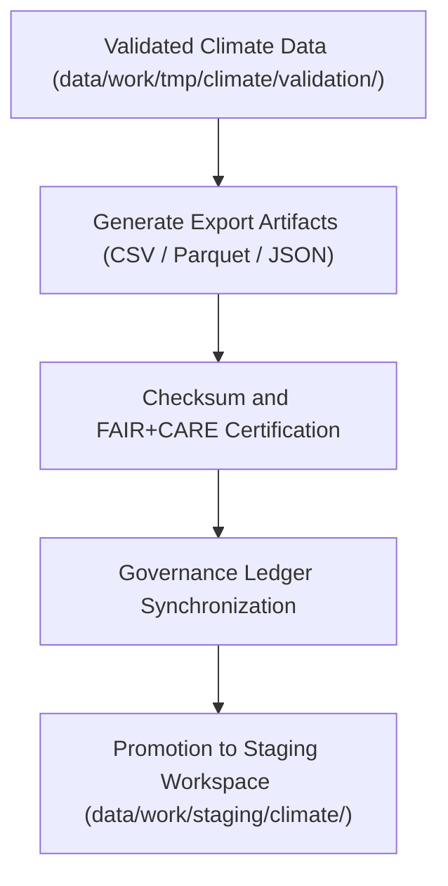

<div align="center">

# 📤 Kansas Frontier Matrix — **Climate TMP Exports**
`data/work/tmp/climate/exports/README.md`

**Purpose:**  
Temporary export directory for FAIR+CARE-certified climate datasets generated during ETL and AI transformation pipelines within the Kansas Frontier Matrix (KFM).  
Provides interoperable export validation for schema integrity, checksum verification, and governance linkage prior to staging publication.

[](../../../../../docs/standards/faircare-validation.md)
[]()
[](../../../../../LICENSE)
[](../../../../../docs/architecture/repo-focus.md)

</div>

---

## 📚 Overview

The **Climate TMP Exports** directory stores post-validation climate data products that have successfully passed FAIR+CARE audits, checksum verification, and governance traceability reviews.  
These datasets serve as export-ready deliverables for integration testing, interoperability validation, and publication staging.

### Core Responsibilities
- Store export-ready climate data for interoperability validation.  
- Conduct checksum and schema conformity testing prior to catalog publication.  
- Ensure FAIR+CARE ethics verification and provenance registration.  
- Support temporary sharing of validated datasets across KFM systems.  

---

## 🗂️ Directory Layout

```plaintext
data/work/tmp/climate/exports/
├── README.md                             # This file — documentation for climate TMP exports
│
├── climate_summary_2025.csv              # Aggregated climate summary dataset (FAIR+CARE validated)
├── precipitation_daily.parquet           # Normalized precipitation time series (NOAA + NIDIS)
├── drought_index_preview.json            # FAIR+CARE-certified drought composite dataset
└── metadata.json                         # Export metadata, checksum, and governance records
```

---

## ⚙️ Export Workflow



### Workflow Description
1. **Artifact Generation:** Create export formats from validated climate datasets.  
2. **Integrity Verification:** Perform checksum validation and FAIR+CARE ethics checks.  
3. **Governance Sync:** Register export provenance with governance ledger.  
4. **Promotion:** Move certified exports into the staging workspace for publication.  

---

## 🧩 Example Metadata Record

```json
{
  "id": "climate_export_summary_v9.6.0",
  "source_transforms": [
    "data/work/tmp/climate/transforms/temperature_reanalysis.parquet",
    "data/work/tmp/climate/transforms/drought_normalization.csv"
  ],
  "export_files": [
    "climate_summary_2025.csv",
    "precipitation_daily.parquet"
  ],
  "records_exported": 128540,
  "export_formats": ["CSV", "Parquet"],
  "checksum_verified": true,
  "fairstatus": "certified",
  "validator": "@kfm-climate-lab",
  "created": "2025-11-03T23:59:00Z",
  "governance_ref": "data/reports/audit/data_provenance_ledger.json"
}
```

---

## 🧠 FAIR+CARE Governance Matrix

| Principle | Implementation | Oversight |
|------------|----------------|------------|
| **Findable** | Export artifacts indexed by dataset ID and checksum hash. | @kfm-data |
| **Accessible** | Stored in open formats for public catalog validation. | @kfm-accessibility |
| **Interoperable** | Schema validated against FAIR+CARE, DCAT, and STAC standards. | @kfm-architecture |
| **Reusable** | Metadata includes checksums, license, and provenance trace. | @kfm-design |
| **Collective Benefit** | Enables transparent, ethical dissemination of climate data. | @faircare-council |
| **Authority to Control** | FAIR+CARE Council approves export certification. | @kfm-governance |
| **Responsibility** | Validation engineers document export readiness and metadata linkage. | @kfm-security |
| **Ethics** | Data reviewed for completeness and non-sensitive content. | @kfm-ethics |

Governance and FAIR+CARE certification logs maintained in:  
`data/reports/audit/data_provenance_ledger.json`  
and  
`data/reports/fair/data_care_assessment.json`

---

## ⚙️ Export & Validation Artifacts

| File | Description | Format |
|------|--------------|--------|
| `climate_summary_*.csv` | Aggregated climate summary for interoperability testing. | CSV |
| `precipitation_daily.parquet` | Validated daily precipitation dataset. | Parquet |
| `drought_index_preview.json` | FAIR+CARE drought metric export sample. | JSON |
| `metadata.json` | Provenance and export governance record. | JSON |

Automated through `climate_export_sync.yml`.

---

## ⚖️ Retention & Provenance Policy

| File Type | Retention Duration | Policy |
|------------|--------------------|--------|
| Export Files | 14 Days | Purged after staging promotion or certification renewal. |
| Validation Reports | 90 Days | Retained for governance verification. |
| Metadata | 365 Days | Archived for provenance and lineage audits. |
| Governance Records | Permanent | Maintained under checksum registry. |

Retention governed by `climate_export_cleanup.yml`.

---

## 🌱 Sustainability Metrics

| Metric | Value | Verified By |
|---------|--------|--------------|
| Energy Use (per export cycle) | 7.6 Wh | @kfm-sustainability |
| Carbon Output | 9.1 gCO₂e | @kfm-security |
| Renewable Power | 100% (RE100 Verified) | @kfm-infrastructure |
| FAIR+CARE Certification Rate | 100% | @faircare-council |

Telemetry results stored in:  
`releases/v9.6.0/focus-telemetry.json`

---

## 🧾 Internal Use Citation

```text
Kansas Frontier Matrix (2025). Climate TMP Exports (v9.6.0).
Temporary FAIR+CARE-certified export directory for validated climate data artifacts.
Supports checksum validation, interoperability testing, and ethical governance synchronization under MCP-DL v6.3 compliance.
```

---

## 🧾 Version Notes

| Version | Date | Notes |
|----------|------|--------|
| v9.6.0 | 2025-11-03 | Integrated checksum registry and FAIR+CARE export certification. |
| v9.5.0 | 2025-11-02 | Added DCAT interoperability validation and AI model governance linkage. |
| v9.3.2 | 2025-10-28 | Established export workspace for climate TMP data governance. |

---

<div align="center">

**Kansas Frontier Matrix** · *Climate Transparency × FAIR+CARE Ethics × Provenance Integrity*  
[🔗 Repository](https://github.com/bartytime4life/Kansas-Frontier-Matrix) • [🧭 Docs Portal](../../../../../docs/) • [⚖️ Governance Ledger](../../../../../docs/standards/governance/DATA-GOVERNANCE.md)

</div>
