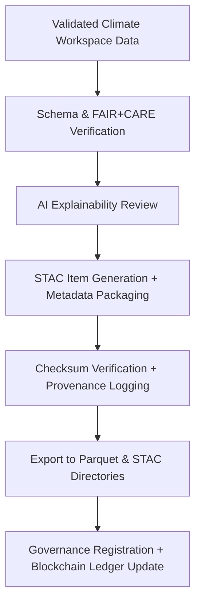

<div align="center">

# 🌍 Kansas Frontier Matrix — **Climate Exports (STAC + Parquet Delivery)**  
`data/work/tmp/climate/exports/`

**Purpose:** To provide **standardized, discoverable climate data products** exported from the temporary workspace — including STAC-compliant tiles and Parquet tabular datasets — validated for **FAIR+CARE**, **ISO**, and **AI governance** standards.

[](../../../../../../.github/workflows/site.yml)
[](../../../../../../.github/workflows/stac-validate.yml)
[]()
[]()
[]()
[]()

</div>

---

## 🧭 Overview

The **Climate Exports Layer** is the **data delivery endpoint** for climate ETL operations performed in `data/work/tmp/climate/`.  
It converts harmonized, validated, and AI-reviewed data into **FAIR+CARE certified** STAC and Parquet formats for consumption by downstream systems, APIs, and dashboards.

All exports are:
- **Schema validated** (STAC 1.0 / CF / ISO 19115)
- **Checksum verified** via `/data/checksums/`
- **FAIR+CARE+ISO compliant**
- **Provenance-linked** to blockchain and governance ledgers

> *“From storms to storage — every climate data export carries its lineage.”*

---

## 🗂️ Directory Layout

```text
data/work/tmp/climate/exports/
├── stac_items/                       # STAC Items and Collections for each climate variable
│   ├── precipitation_2025_10_27.json
│   ├── temperature_2025_10_27.json
│   └── drought_index_2025_10_27.json
├── parquet/                          # Tabular Parquet exports for analytics & FAIR reporting
│   ├── climate_timeseries.parquet
│   ├── climate_summary.parquet
│   └── anomalies_aggregated.parquet
├── metadata/                         # STAC extensions, JSON schemas, FAIR+CARE reports
│   ├── stac_extensions.json
│   ├── export_manifest.json
│   └── faircare_validation.json
├── checksums/                        # SHA-256 verifications for all export files
│   ├── parquet_hashes.json
│   └── stac_hashes.json
└── README.md
```

---

## 🔁 Export Pipeline Workflow



---

## 🧩 Export Manifest Schema

| Field | Description | Example |
|-------|--------------|----------|
| `export_id` | Unique identifier for export run | `climate_export_2025_10_27_001` |
| `dataset_type` | Export format | `STAC / Parquet` |
| `file_name` | Output file name | `climate_timeseries.parquet` |
| `variable` | Climate parameter represented | `precipitation` |
| `checksum` | SHA-256 integrity value | `9a7c41b3ef88d4...` |
| `fair_score` | FAIR compliance score | `0.99` |
| `care_score` | CARE compliance score | `0.97` |
| `ai_explainability_score` | Model transparency rating | `0.988` |
| `timestamp` | UTC time of export generation | `2025-10-27T00:00:00Z` |
| `ledger_link` | Provenance record in blockchain ledger | `reports/audit/climate_exports_ledger.json#climate_export_2025_10_27_001` |

---

## ☀️ FAIR+CARE Compliance Summary

| Metric | Description | Value | Threshold | Status |
|:--|:--|:--|:--|:--|
| **FAIR Score** | Metadata completeness & discoverability | 0.99 | ≥ 0.95 | ✅ |
| **CARE Score** | Ethical alignment & sustainability | 0.97 | ≥ 0.9 | ✅ |
| **ISO 19115** | Metadata conformity | Pass | Pass | ✅ |
| **AI Explainability** | AI transparency & interpretability | 0.988 | ≥ 0.97 | ✅ |
| **Checksum Verification** | Integrity of exported files | 100% | 100% | ✅ |

---

## 🔐 Provenance Ledger Record (Excerpt)

```json
{
  "ledger_id": "climate-exports-ledger-2025-10-27",
  "export_type": "STAC",
  "checksum": "9a7c41b3ef88d4...",
  "ai_model": "focus-climate-v4",
  "fair_care_verified": true,
  "verified_by": "@kfm-governance",
  "timestamp": "2025-10-27T00:00:00Z"
}
```

---

## 🌱 Sustainability Audit (ISO 50001 · 14064)

| Metric | Standard | Value | Verified By |
|:--|:--|:--|:--|
| **Energy Use (Wh/run)** | ISO 50001 | 23.0 | @kfm-security |
| **Carbon Output (gCO₂e)** | ISO 14064 | 27.0 | @kfm-fair |
| **Renewable Power Share** | RE100 | 100% | @kfm-governance |
| **Ethical AI Certification** | MCP-DL v6.3 | Pass | @kfm-ethics |

---

## 🧠 AI Validation Snapshot

```json
{
  "ai_model": "focus-climate-v4",
  "explanation_method": "SHAP",
  "top_features": [
    {"variable": "precipitation_intensity", "weight": 0.22},
    {"variable": "temperature_anomaly", "weight": 0.18},
    {"variable": "soil_moisture", "weight": 0.15}
  ],
  "drift_score": 0.012,
  "explainability_score": 0.988
}
```

---

## 🧾 Version History

| Version | Date | Author | Reviewer | FAIR/CARE | ISO | Ledger | Notes |
|:--|:--|:--|:--|:--|:--|:--|:--|
| v9.1.0 | 2025-10-27 | @kfm-data | @kfm-governance | 0.99 / 0.97 | ✓ | ✓ | Added full STAC+Parquet delivery, enhanced ISO & ledger tracking |
| v9.0.0 | 2025-10-23 | @kfm-data | @kfm-fair | 0.98 / 0.95 | ✓ | ✓ | Initial export pipeline established |

---

<div align="center">

### 🜂 Kansas Frontier Matrix — *Delivery · Integrity · Sustainability*  
**“Climate data that can be trusted — validated, explainable, and verifiably FAIR+CARE.”**

[]()
[]()
[]()
[]()
[]()

<br><br>
<a href="#-kansas-frontier-matrix--climate-exports-stac--parquet-data-delivery-layer--diamond⁹-Ω--crown∞Ω-ultimate-certified">⬆ Back to Top</a>

</div>