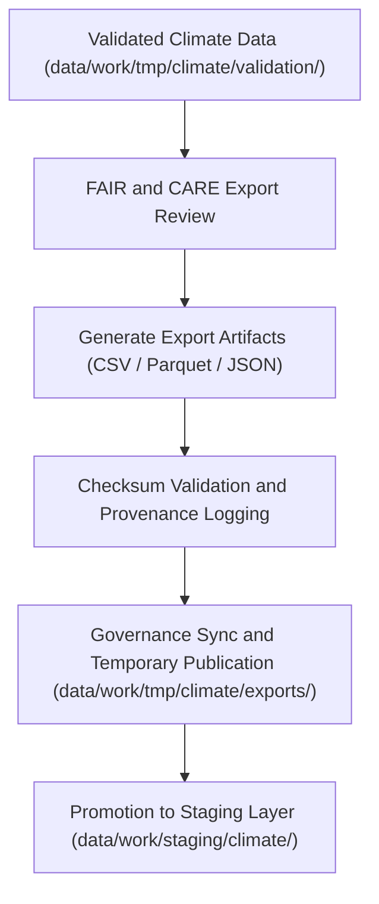

<div align="center">

# 📤 Kansas Frontier Matrix — **Climate TMP Exports**
`data/work/tmp/climate/exports/README.md`

**Purpose:** Transient export workspace for FAIR+CARE-compliant climate datasets generated from temporary ETL, validation, and AI modeling pipelines within the Kansas Frontier Matrix (KFM).  
This layer supports testing, interoperability verification, and governance-linked export operations prior to formal promotion into the staging layer.

[](../../../../../docs/standards/faircare-validation.md)
[](../../../../../LICENSE)
[](../../../../../docs/architecture/repo-focus.md)

</div>

---

## 📚 Overview

The `data/work/tmp/climate/exports/` directory stores **temporary climate data exports** produced during ETL and AI processing.  
These files represent post-validation, FAIR+CARE-checked artifacts pending integration into `data/work/staging/climate/`.  

### Primary Objectives:
- Validate open data export integrity (format, schema, and checksum).  
- Test interoperability with DCAT, STAC, and FAIR data catalogs.  
- Register provenance metadata for governance traceability.  
- Support lightweight visualization, aggregation, or reanalysis testing.  

All export files are automatically replaced or purged upon staging promotion or checksum mismatch detection.

---

## 🗂️ Directory Layout

```plaintext
data/work/tmp/climate/exports/
├── README.md                               # This file — documentation for the climate TMP export workspace
│
├── climate_summary_2025.csv                # Aggregated climate dataset summary for QA and FAIR+CARE testing
├── noaa_precipitation_daily.parquet        # Normalized NOAA precipitation data, daily records
├── drought_index_preview.json              # FAIR+CARE-certified drought metrics sample for governance export validation
└── metadata.json                           # Export metadata, schema linkage, and checksum record
```

---

## ⚙️ Export Workflow



### Workflow Steps:
1. **Validation:** Datasets reviewed under FAIR+CARE principles for completeness and accessibility.  
2. **Export Generation:** Create interoperable formats (CSV, JSON, Parquet) for reanalysis testing.  
3. **Checksum & Metadata:** Compute file hashes and link metadata with data contracts.  
4. **Governance Sync:** Register temporary exports to provenance ledger.  
5. **Promotion:** Upon audit approval, export assets promoted to staging.

---

## 🧩 Example Export Metadata Record

```json
{
  "id": "climate_export_summary_v9.3.2",
  "source_transforms": [
    "data/work/tmp/climate/transforms/temp_anomaly_reanalysis.parquet",
    "data/work/tmp/climate/transforms/drought_normalization.csv"
  ],
  "export_files": [
    "climate_summary_2025.csv",
    "noaa_precipitation_daily.parquet"
  ],
  "records_exported": 124560,
  "export_formats": ["CSV", "Parquet"],
  "created": "2025-10-28T15:47:00Z",
  "validator": "@kfm-climate-lab",
  "checksum": "sha256:b8c7aa34fae9a6cc103b4ea23de7a341a29b52e7...",
  "fairstatus": "compliant",
  "governance_ref": "data/reports/audit/data_provenance_ledger.json"
}
```

---

## 🧠 FAIR+CARE Climate Export Governance

| Principle | Implementation |
|------------|----------------|
| **Findable** | Export artifacts registered in manifest and metadata.json with unique IDs. |
| **Accessible** | Data stored in open formats and validated for public domain readiness. |
| **Interoperable** | Schema aligned with STAC/DCAT for FAIR integration. |
| **Reusable** | Metadata embeds license, checksum, and field documentation. |
| **Collective Benefit** | Promotes transparent climate information sharing. |
| **Authority to Control** | FAIR+CARE Council authorizes staging promotion. |
| **Responsibility** | Validators ensure no restricted content or errors. |
| **Ethics** | FAIR+CARE pre-audit ensures openness, accuracy, and ethical representation. |

Governance metadata stored within:  
`data/reports/audit/data_provenance_ledger.json`  
and `data/reports/fair/data_care_assessment.json`.

---

## ⚙️ QA & Integrity Checks

| Validation Step | Description | Output |
|------------------|-------------|---------|
| **Checksum Verification** | Confirms export integrity and reproducibility. | JSON |
| **Schema Conformance** | Verifies alignment with data contract v3. | JSON |
| **FAIR+CARE Audit** | Validates openness, accessibility, and licensing. | JSON |
| **STAC/DCAT Metadata Check** | Ensures export discoverability compliance. | Log |
| **Governance Sync** | Registers lineage, license, and ethics approval. | Log |

Automated through `climate_export_sync.yml`.

---

## ⚖️ Governance & Provenance Integration

| Record | Description |
|---------|-------------|
| `metadata.json` | Records export details, schema version, and checksum verification. |
| `data/reports/audit/data_provenance_ledger.json` | Maintains lineage and governance log entries. |
| `data/reports/validation/schema_validation_summary.json` | Schema compliance and field verification record. |
| `releases/v9.3.2/manifest.zip` | Export-level checksum registry for reproducibility. |

---

## 🧾 Retention Policy

| File Type | Retention Duration | Policy |
|------------|--------------------|--------|
| Export Files | 14 days | Purged post-staging promotion or audit sign-off. |
| Logs | 30 days | Archived to `data/work/logs/system/`. |
| Metadata | 365 days | Retained permanently for provenance and traceability. |
| Validation Reports | 90 days | Retained for FAIR+CARE re-audits. |

Cleanup managed via `climate_export_cleanup.yml`.

---

## 🧾 Internal Use Citation

```text
Kansas Frontier Matrix (2025). Climate TMP Exports (v9.3.2).
Temporary FAIR+CARE-compliant workspace for export validation, provenance synchronization, and ethical verification of climate datasets.
Restricted to internal ETL and governance workflows.
```

---

## 🧾 Version Notes

| Version | Date | Notes |
|----------|------|--------|
| v9.3.2 | 2025-10-28 | Updated export governance schema, FAIR+CARE integration, and checksum registry. |
| v9.2.0 | 2024-07-15 | Added multi-format export validation and audit metadata. |
| v9.0.0 | 2023-01-10 | Established export workspace for transient climate datasets. |

---

<div align="center">

**Kansas Frontier Matrix** · *Climate Data Transparency × FAIR+CARE Ethics × Provenance Integrity*  
[🔗 Repository](https://github.com/bartytime4life/Kansas-Frontier-Matrix) • [🧭 Docs Portal](../../../../../docs/) • [⚖️ Governance Ledger](../../../../../docs/standards/governance/)

</div>
