<div align="center">

# 📤 **Kansas Frontier Matrix — Climate TMP Exports**  
`data/work/tmp/climate/exports/README.md`

**Purpose:**  
Temporary FAIR+CARE-governed export workspace for **validated climate datasets** generated during TMP climate workflows.  
Exports in this directory have:

- ✅ Passed schema & checksum verification  
- ✅ Passed FAIR+CARE pre-release audits  
- ✅ Logged telemetry v2 (energy, carbon, validation coverage)  
- ✅ Registered provenance references for governance and catalog publication  

[](../../../../../docs/architecture/README.md)  
[](../../../../../docs/standards/faircare/FAIRCARE-GUIDE.md)  
[]()  
[](../../../../../LICENSE)

</div>

---

## 1. 📘 Overview

The **Climate TMP Exports** directory contains **post-validation climate artifacts** that:

- Have been **successfully validated** in `tmp/climate/validation/`  
- Are **export-ready** for interoperability checks and catalog ingestion  
- Carry **telemetry v2**, **checksums**, and **governance lineage**  
- Are candidates for promotion to `data/work/staging/climate/` or publication

Typical contents include:

- CSVs with summary climate indicators  
- Parquet files with harmonized daily or monthly records  
- JSON previews for drought and anomaly layers  
- Companion `metadata.json` describing provenance & telemetry  

---

## 2. 🗂️ Directory Layout (Mobile-Safe)

```text
data/work/tmp/climate/exports/
├── README.md
├── climate_summary_2025.csv
├── precipitation_daily.parquet
├── drought_index_preview.json
└── metadata.json
```

- Additional export files MAY be added (e.g., `*_preview.*`), but MUST be covered by metadata and validation rules.

---

## 3. ⚙️ Export Workflow

```mermaid
flowchart TD
    VAL["Validated Climate (tmp/climate/validation/)"]
      --> GEN["Generate Export Artifacts (CSV · Parquet · JSON)"]
    GEN --> CHECK["Checksum Verification + FAIR+CARE Audit"]
    CHECK --> TELE["Telemetry Sync (energy · carbon · coverage)"]
    TELE --> LEDGER["Governance Ledger Registration"]
    LEDGER --> STAGE["Promotion → Staging (data/work/staging/climate/)"]
```



### Steps

1. **Export Generation**  
   - Create CSV/Parquet/JSON from validated climate transforms.  
   - Normalize schemas for interoperability (STAC/DCAT alignment).

2. **Validation**  
   - Confirm schema & data-contract compliance.  
   - Recompute & verify checksums.  

3. **Telemetry Logging**  
   - Log energy, carbon, runtime, and validation coverage in telemetry.  

4. **Governance Sync**  
   - Record export operation and assets in the governance ledger.  

5. **Promotion**  
   - Move export artifacts to staging or release, once approved.

---

## 4. 🧩 Example Export Metadata Record

```json
{
  "id": "climate_export_summary_v11.0.0",
  "domain": "climate",
  "source_transforms": [
    "data/work/tmp/climate/transforms/temperature_reanalysis.parquet",
    "data/work/tmp/climate/transforms/drought_normalization.csv"
  ],
  "export_files": [
    "climate_summary_2025.csv",
    "precipitation_daily.parquet",
    "drought_index_preview.json"
  ],
  "records_exported": 129820,
  "formats": ["CSV", "Parquet", "JSON"],
  "checksum_verified": true,
  "fairstatus": "certified",
  "validator": "@kfm-climate-lab",
  "telemetry": {
    "energy_wh": 0.7,
    "carbon_gco2e": 1.1,
    "validation_coverage_pct": 100,
    "runtime_sec": 35
  },
  "created": "2025-11-20T23:59:00Z",
  "governance_ref": "data/reports/audit/data_provenance_ledger.json"
}
```

This entry:

- Is used by governance & catalog systems  
- Supports reproducibility & external validation  

---

## 5. 🧠 FAIR+CARE Governance Matrix

| Principle            | Implementation                                             | Oversight             |
|----------------------|------------------------------------------------------------|-----------------------|
| **Findable**         | Exports indexed by dataset ID, schema, and checksum.       | `@kfm-data`          |
| **Accessible**       | Internal CSV/Parquet/JSON available for QA audits.         | `@kfm-accessibility` |
| **Interoperable**    | Schema validated against DCAT/STAC + JSON Schema.          | `@kfm-architecture`  |
| **Reusable**         | Includes provenance, telemetry, and checksum records.      | `@kfm-design`        |
| **Collective Benefit** | Supports trustworthy climate information sharing.        | `@faircare-council`  |
| **Authority to Control** | Council approves export-level use and retention.       | `@kfm-governance`    |
| **Responsibility**   | Validators keep QA & ethics metadata up-to-date.           | `@kfm-security`      |
| **Ethics**           | Verifies that exports are fit for appropriate audiences.   | `@kfm-ethics`        |

Audit References:

- `data/reports/audit/data_provenance_ledger.json`  
- `data/reports/fair/data_care_assessment.json`  

---

## 6. 📊 Export & Validation Artifacts

Key export artifacts:

| File                      | Description                                       | Format  |
|---------------------------|---------------------------------------------------|---------|
| `climate_summary_*.csv`   | Aggregated climate indicators (annual/periodic).  | CSV     |
| `precipitation_daily.parquet` | Harmonized daily precip records.             | Parquet |
| `drought_index_preview.json` | Preview of drought composite metrics.         | JSON    |
| `metadata.json`           | Export-level provenance, telemetry, and schema.   | JSON    |

**Automation workflow:** `climate_export_sync_v2.yml`

---

## 7. ♻️ Retention & Lifecycle Policy

| File Type        | Retention | Policy                                         |
|------------------|----------:|-----------------------------------------------|
| Export Files     | 14 days   | Removed after promotion to staging/release.   |
| Validation Reports | 90 days | Retained for governance/QA verification.      |
| Metadata         | ≥ 365 days| Archived to maintain provenance.              |
| Ledger Entries   | Permanent | Immutable in governance ledger.               |

Telemetry Reference:  
`../../../../../releases/v11.0.0/focus-telemetry.json`

---

## 8. 🌱 Sustainability Metrics

Example export cycle:

| Metric                  | Value  | Verified By           |
|-------------------------|-------:|-----------------------|
| Energy per export cycle | 6.9 Wh | `@kfm-sustainability` |
| Carbon Output           | 8.1 gCO₂e | `@kfm-infrastructure`|
| Renewable Power Share   | 100%   | `@kfm-infrastructure` |
| FAIR+CARE Compliance    | 100%   | `@faircare-council`   |

---

## 9. 🕰️ Version History

| Version | Date       | Author           | Summary                                                      |
|--------:|------------|------------------|--------------------------------------------------------------|
| v11.0.0 | 2025-11-20 | `@kfm-climate`   | Upgraded to v11 preferred formatting; governance & telemetry |
| v10.0.0 | 2025-11-09 | `@kfm-climate`   | Telemetry v2, JSON-LD provenance, DCAT linkage validation    |

<div align="center">

**Kansas Frontier Matrix — Climate TMP Exports**  
📤 FAIR+CARE Certified · Integrity-Verified · Diamond⁹ Ω / Crown∞Ω  

© 2025 Kansas Frontier Matrix — Internal Processing Layer  

[Back to Climate TMP](../README.md) · [Governance Charter](../../../../../docs/standards/governance/ROOT-GOVERNANCE.md)

</div>
