<div align="center">

# 📤 Kansas Frontier Matrix — **Climate TMP Exports**
`data/work/tmp/climate/exports/README.md`

**Purpose:**  
Temporary FAIR+CARE-certified export workspace for validated climate datasets created during ETL and AI transformation workflows.  
Supports **checksum verification, schema validation, and governance registration** before staging and publication.

[](../../../../../docs/architecture/README.md)
[](../../../../../docs/standards/faircare-validation.md)
[]()
[](../../../../../LICENSE)

</div>

---

## 📘 Overview

The **Climate TMP Exports** directory contains post-validation climate data artifacts that have passed **FAIR+CARE ethics audits, checksum verification, and governance traceability checks**.  
These export-ready products are used for interoperability testing, catalog integration, and final certification before publication.

### Core Responsibilities
- Host export-ready climate datasets for testing and validation.  
- Conduct checksum verification and FAIR+CARE ethics certification.  
- Synchronize metadata lineage with the governance ledger.  
- Enable interoperability validation across DCAT/STAC catalogs.  

---

## 🗂️ Directory Layout

```plaintext
data/work/tmp/climate/exports/
├── README.md
├── climate_summary_2025.csv
├── precipitation_daily.parquet
├── drought_index_preview.json
└── metadata.json
```

---

## ⚙️ Export Workflow

```mermaid
flowchart TD
    A["Validated Climate (tmp/climate/validation/)"] --> B["Generate Export Artifacts (CSV · Parquet · JSON)"]
    B --> C["Checksum Verification + FAIR+CARE Ethics Audit"]
    C --> D["Governance Ledger Registration"]
    D --> E["Promotion → Staging Workspace (data/work/staging/climate/)"]
```



### Steps
1. **Artifact Generation** — Create validated export formats.  
2. **Integrity Verification** — Confirm schema compliance & checksum hashes.  
3. **Governance Sync** — Record provenance + lineage in audit ledger.  
4. **Promotion** — Move FAIR+CARE-certified exports to staging.

---

## 🧩 Example Export Metadata Record

```json
{
  "id": "climate_export_summary_v9.7.0",
  "source_transforms": [
    "data/work/tmp/climate/transforms/temperature_reanalysis.parquet",
    "data/work/tmp/climate/transforms/drought_normalization.csv"
  ],
  "export_files": [
    "climate_summary_2025.csv",
    "precipitation_daily.parquet"
  ],
  "records_exported": 128540,
  "formats": ["CSV", "Parquet"],
  "checksum_verified": true,
  "fairstatus": "certified",
  "validator": "@kfm-climate-lab",
  "created": "2025-11-06T23:59:00Z",
  "governance_ref": "data/reports/audit/data_provenance_ledger.json"
}
```

---

## 🧠 FAIR+CARE Governance Matrix

| Principle | Implementation | Oversight |
|-----------|----------------|-----------|
| **Findable** | Exports indexed by dataset ID + checksum hash. | `@kfm-data` |
| **Accessible** | Open CSV/Parquet for catalog validation. | `@kfm-accessibility` |
| **Interoperable** | Schema validated under DCAT, STAC, FAIR+CARE. | `@kfm-architecture` |
| **Reusable** | Includes provenance, checksum, and license metadata. | `@kfm-design` |
| **Collective Benefit** | Enables transparent + ethical climate data sharing. | `@faircare-council` |
| **Authority to Control** | FAIR+CARE Council authorizes certification. | `@kfm-governance` |
| **Responsibility** | Validators document export readiness and lineage. | `@kfm-security` |
| **Ethics** | Ensures non-sensitive, equitable data dissemination. | `@kfm-ethics` |

**Audit refs:**  
`data/reports/audit/data_provenance_ledger.json` · `data/reports/fair/data_care_assessment.json`

---

## ⚙️ Export & Validation Artifacts

| File | Description | Format |
|------|--------------|--------|
| `climate_summary_*.csv` | Aggregated climate summary for interoperability tests. | CSV |
| `precipitation_daily.parquet` | Harmonized precipitation dataset (NOAA/NIDIS). | Parquet |
| `drought_index_preview.json` | FAIR+CARE-certified drought composite. | JSON |
| `metadata.json` | Provenance, checksum, and governance metadata. | JSON |

**Automation:** `climate_export_sync.yml`

---

## ♻️ Retention & Lifecycle Policy

| File Type | Retention | Policy |
|------------|----------:|--------|
| Export Files | 14 Days | Purged after staging promotion. |
| Validation Reports | 90 Days | Retained for governance verification. |
| Metadata | 365 Days | Archived for provenance lineage. |
| Governance Records | Permanent | Stored in audit-ledger checksum registry. |

**Telemetry:** `../../../../../releases/v9.7.0/focus-telemetry.json`

---

## 🌱 Sustainability Metrics

| Metric | Value | Verified By |
|--------|------:|-------------|
| Energy Use (per export cycle) | 7.5 Wh | `@kfm-sustainability` |
| Carbon Output | 8.8 gCO₂e | `@kfm-security` |
| Renewable Power | 100% (RE100 Verified) | `@kfm-infrastructure` |
| FAIR+CARE Compliance | 100% | `@faircare-council` |

---

## 🧾 Internal Citation

```text
Kansas Frontier Matrix (2025). Climate TMP Exports (v9.7.0).
Temporary FAIR+CARE-certified export workspace for validated climate data artifacts under MCP-DL v6.3.
Ensures schema interoperability, checksum integrity, and ethical governance synchronization before staging publication.
```

---

## 🕰️ Version History

| Version | Date       | Author           | Summary |
|--------:|------------|------------------|---------|
| v9.7.0  | 2025-11-06 | `@kfm-climate`   | Upgraded telemetry schema, audit traceability, and retention standards. |
| v9.6.0  | 2025-11-03 | `@kfm-climate`   | Integrated checksum registry and FAIR+CARE export certification. |

---

<div align="center">

**Kansas Frontier Matrix**  
*Climate Transparency × FAIR+CARE Ethics × Provenance Integrity*  
© 2025 Kansas Frontier Matrix — Internal · FAIR+CARE Certified · Diamond⁹ Ω / Crown∞Ω Ultimate Certified  

[Back to Climate TMP](../README.md) · [Governance Charter](../../../../../docs/standards/governance/DATA-GOVERNANCE.md)

</div>