<div align="center">

# 📤 Kansas Frontier Matrix — **Climate TMP Exports**
`data/work/tmp/climate/exports/README.md`

**Purpose:** Transient export workspace for FAIR+CARE-compliant climate datasets generated from temporary ETL, validation, and AI modeling pipelines within the Kansas Frontier Matrix (KFM).  
Facilitates format integrity checks, catalog interoperability tests, and governance-linked export operations prior to promotion into the staging layer.

[](../../../../../docs/standards/faircare-validation.md)
[](../../../../../LICENSE)
[](../../../../../docs/architecture/repo-focus.md)

</div>

---

## 📚 Overview

The `data/work/tmp/climate/exports/` directory stores **temporary climate data exports** produced during ETL, pre-validation, and AI workflows.  
Artifacts here are **post-validation and FAIR+CARE-checked**, awaiting integration into `data/work/staging/climate/` or removal if checksums or audits fail.

### Primary Objectives
- Validate export integrity (format conformance, schema mapping, and checksums).  
- Test interoperability with **DCAT**, **STAC**, and FAIR registries.  
- Register provenance and license metadata for governance traceability.  
- Enable lightweight visualization, aggregation, or reanalysis QA.  
- Emit **telemetry** for throughput, latency, size, and QA metrics.

All export files are replaced or purged automatically at staging promotion or upon checksum mismatch detection.

---

## 🗂️ Directory Layout

```plaintext
data/work/tmp/climate/exports/
├── README.md                               # This file — documentation for climate TMP export workspace
│
├── climate_summary_2025.csv                # Aggregated climate dataset summary for QA and FAIR+CARE testing
├── noaa_precipitation_daily.parquet        # Normalized NOAA precipitation, daily records
├── drought_index_preview.json              # FAIR+CARE-certified drought metrics sample for export validation
└── metadata.json                           # Export metadata, contract linkage, checksum, and telemetry record
```

---

## ⚙️ Export Workflow

```mermaid
flowchart TD
    A["Validated Climate Data (data/work/tmp/climate/validation/)"] --> B["FAIR+CARE Export Review"]
    B --> C["Generate Export Artifacts (CSV / Parquet / JSON)"]
    C --> D["Checksum Validation & Metadata Enrichment"]
    D --> E["Governance Sync & Temporary Publication (exports/)"]
    E --> F["Promotion → Staging (data/work/staging/climate/)"]
```



### Workflow Steps
1. **Validation:** Confirm FAIR+CARE compliance and structural completeness.  
2. **Export Generation:** Produce interoperable formats (CSV, JSON, Parquet) for reanalysis and catalog testing.  
3. **Checksum & Metadata:** Compute SHA-256 hashes; bind to **data_contract_ref** and license.  
4. **Governance:** Register export lineage and ethics sign-off in the provenance ledger.  
5. **Promotion:** Approved exports are moved to staging for certification.

---

## 🧩 Example Export Metadata Record

```json
{
  "id": "climate_export_summary_v9.5.0",
  "source_transforms": [
    "data/work/tmp/climate/transforms/temp_anomaly_reanalysis.parquet",
    "data/work/tmp/climate/transforms/drought_normalization.csv"
  ],
  "export_files": [
    "climate_summary_2025.csv",
    "noaa_precipitation_daily.parquet"
  ],
  "records_exported": 124560,
  "export_formats": ["CSV", "Parquet"],
  "created": "2025-11-02T16:48:00Z",
  "validator": "@kfm-climate-lab",
  "checksum": "sha256:b8c7aa34fae9a6cc103b4ea23de7a341a29b52e7...",
  "fairstatus": "compliant",
  "telemetry_link": "releases/v9.5.0/focus-telemetry.json",
  "governance_ref": "data/reports/audit/data_provenance_ledger.json"
}
```

---

## 🧠 FAIR+CARE Climate Export Governance

| Principle | Implementation |
|------------|----------------|
| **Findable** | Exports registered in manifest & `metadata.json` with unique IDs and telemetry refs. |
| **Accessible** | Open formats validated for public domain readiness and machine access. |
| **Interoperable** | Schema aligned with **STAC/DCAT** for FAIR discoverability. |
| **Reusable** | Embedded license, checksum, and field documentation ensure reproducibility. |
| **Collective Benefit** | Promotes transparent climate information sharing. |
| **Authority to Control** | FAIR+CARE Council authorizes staging promotion. |
| **Responsibility** | Validators ensure no restricted content or structural errors. |
| **Ethics** | Boundary and attribution checks verified; open-source provenance recorded. |

Audit references:  
`data/reports/audit/data_provenance_ledger.json` • `data/reports/fair/data_care_assessment.json`

---

## ⚙️ QA & Integrity Checks

| Validation Step | Description | Output |
|------------------|-------------|---------|
| **Checksum Verification** | Confirms export integrity and reproducibility. | JSON |
| **Schema Conformance** | Verifies alignment with `data_contract_ref` and JSON Schemas. | JSON |
| **FAIR+CARE Audit** | Validates openness, accessibility, and licensing. | JSON |
| **STAC/DCAT Metadata** | Ensures catalog discoverability compliance. | Log |
| **Governance Sync** | Registers lineage, license, and ethics approval. | Log |
| **AI Quality Metrics (Optional)** | Drift/outlier scan of export columns. | JSON |

Automated via **`climate_export_sync.yml`**.

---

## ⚖️ Governance & Provenance Integration

| Record | Description |
|---------|-------------|
| `metadata.json` | Records export context, schema version, checksum, and telemetry pointer. |
| `data/reports/audit/data_provenance_ledger.json` | Maintains export lineage and ethics audit entries. |
| `data/reports/validation/schema_validation_summary.json` | Confirms field-level conformance. |
| `releases/v9.5.0/manifest.zip` | Export-level checksum registry for reproducibility. |

---

## 🧾 Retention Policy

| File Type | Retention Duration | Policy |
|------------|--------------------|--------|
| Export Files | 14 days | Purged post-staging promotion or audit sign-off. |
| Logs | 30 days | Archived to `data/work/logs/system/`. |
| Metadata | 365 days | Retained for provenance and traceability. |
| Validation Reports | 90 days | Retained for FAIR+CARE re-audits. |

Cleanup managed via **`climate_export_cleanup.yml`**.

---

## 🧾 Internal Use Citation

```text
Kansas Frontier Matrix (2025). Climate TMP Exports (v9.5.0).
Temporary FAIR+CARE-verified export workspace for interoperability testing, provenance synchronization, and ethical verification of climate datasets.
Restricted to internal ETL, QA, and governance workflows.
```

---

## 🧾 Version Notes

| Version | Date | Notes |
|----------|------|--------|
| v9.5.0 | 2025-11-02 | Added telemetry hooks, AI quality metrics, and enhanced export governance. |
| v9.3.2 | 2025-10-28 | Updated export governance schema, FAIR+CARE integration, and checksum registry. |
| v9.2.0 | 2024-07-15 | Added multi-format export validation and audit metadata. |
| v9.0.0 | 2023-01-10 | Established export workspace for transient climate datasets. |

---

<div align="center">

**Kansas Frontier Matrix** · *Climate Data Transparency × FAIR+CARE Ethics × Provenance Integrity × Telemetry Traceability*  
[🔗 Repository](https://github.com/bartytime4life/Kansas-Frontier-Matrix) • [🧭 Docs Portal](../../../../../docs/) • [⚖️ Governance Ledger](../../../../../docs/standards/governance/)

</div>
