<div align="center">

# 🔐 Kansas Frontier Matrix — **Climate Export Checksums (Integrity & Provenance Ledger)**  
`data/work/tmp/climate/exports/checksums/`

**Purpose:**  
To ensure **cryptographic verification, reproducibility, and blockchain-backed trust** for all exported climate datasets in the Kansas Frontier Matrix (KFM).  
This directory houses the official **SHA-256 checksum logs, manifests, and validation reports** that confirm the authenticity and lineage of all exported STAC, Parquet, and metadata files.

[]()
[]()
[]()
[]()
[]()

</div>

---

## 🧭 Overview

The **Checksums Layer** is KFM’s **final gate of validation and integrity** before climate exports are registered in the governance ledger.  
Every output file (STAC, Parquet, or Metadata) is hashed using **SHA-256** and recorded with **timestamped, FAIR+CARE-certified provenance**.

Each checksum log:
- Verifies immutability and authenticity of exported datasets  
- Ensures reproducibility through deterministic hash comparison  
- Registers cryptographic fingerprints into **blockchain governance ledgers**  
- Meets ISO 19115 / 14064 metadata traceability standards  
- Enables curator validation and AI-led drift detection for data corruption events  

> *“Integrity isn’t assumed — it’s verified, logged, and immortalized.”*

---

## 🗂️ Directory Layout

```text
data/work/tmp/climate/exports/checksums/
├── parquet_hashes.json                 # Hash registry for Parquet exports
├── stac_hashes.json                    # Hash registry for STAC items and collections
├── metadata_hashes.json                # Hash registry for ISO/FAIR+CARE metadata
├── integrity_manifest.json             # Master manifest of all checksum validations
├── blockchain_verification.json        # Cryptographic signatures + ledger linkages
├── verification_report.json            # FAIR+CARE-aligned validation report
└── README.md
```

---

## 🔁 Checksum Verification Workflow

```mermaid
flowchart TD
    A["Climate Data Exports (STAC + Parquet)"] --> B["Compute SHA-256 Checksums"]
    B --> C["Store in parquet_hashes.json / stac_hashes.json / metadata_hashes.json"]
    C --> D["Aggregate + Cross-Verify → integrity_manifest.json"]
    D --> E["Record Blockchain Signatures → blockchain_verification.json"]
    E --> F["Register Provenance Entry → Governance Ledger"]
```



---

## 🧩 Integrity Manifest Schema

| Field | Description | Example |
|-------|--------------|----------|
| `file_name` | Dataset or metadata file | `climate_timeseries.parquet` |
| `checksum_algorithm` | Algorithm used for verification | `SHA-256` |
| `checksum_value` | Calculated hash | `f4d2a6b98aab9c7d0e...` |
| `file_type` | Type of export | `Parquet / STAC / Metadata` |
| `validation_status` | Verification outcome | `Valid` |
| `verified_by` | Automated or human validator | `@kfm-security` |
| `timestamp` | Verification time (UTC) | `2025-10-27T00:00:00Z` |
| `ledger_reference` | Provenance link | `reports/audit/climate_checksums_ledger.json#file_2025_10_27_001` |

---

## ☀️ Verification Summary Metrics

| Category | Verified Files | Failed | Success Rate | Confidence |
|:--|:--|:--|:--|:--|
| **STAC Exports** | 3 | 0 | 100% | 1.00 |
| **Parquet Datasets** | 3 | 0 | 100% | 1.00 |
| **Metadata Schemas** | 4 | 0 | 100% | 1.00 |
| **Total Integrity Rate** | **10 / 10** | **0** | **100%** | **Verified** |

> ✅ *No hash mismatches detected — all exports verified FAIR+CARE and blockchain integrity.*

---

## 🔐 Blockchain Provenance Record

```json
{
  "ledger_id": "climate-checksums-ledger-2025-10-27",
  "validated_files": [
    "climate_timeseries.parquet",
    "stac_items/precipitation_2025_10_27.json",
    "metadata/faircare_validation.json"
  ],
  "hash_algorithm": "SHA-256",
  "verification_confidence": 1.0,
  "audited_by": "@kfm-security",
  "verified_by": "@kfm-governance",
  "timestamp": "2025-10-27T00:00:00Z"
}
```

---

## 🧠 AI Drift & Corruption Detection

The checksum system integrates with **Focus-AI v4** models to:
- Detect file drift or corruption anomalies  
- Identify unauthorized data changes  
- Predict checksum deviation patterns  
- Notify governance and security maintainers  

### AI Integrity Summary
```json
{
  "ai_model": "focus-security-v4",
  "drift_detected": false,
  "corruption_risk": 0.0001,
  "checksum_integrity": "Verified 100%",
  "explainability_score": 0.993
}
```

---

## 🌱 ISO & FAIR+CARE Compliance

| Standard | Scope | Status | Validator |
|:--|:--|:--|:--|
| **ISO 19115** | Metadata traceability | ✅ | @kfm-fair |
| **ISO 14064** | Sustainability & reporting | ✅ | @kfm-security |
| **FAIR+CARE** | Ethical and reproducible integrity | 100% | @kfm-governance |
| **STAC 1.0** | Spatial metadata consistency | ✅ | @kfm-data |
| **Blockchain Provenance** | Governance linkage & verification | ✅ | @kfm-security |

---

## 🧾 Version History

| Version | Date | Author | Reviewer | FAIR/CARE | ISO | Ledger | Notes |
|:--|:--|:--|:--|:--|:--|:--|:--|
| v9.1.0 | 2025-10-27 | @kfm-security | @kfm-governance | 100% | ✓ | ✓ | Introduced blockchain_verification.json and Focus-AI drift integration |
| v9.0.0 | 2025-10-23 | @kfm-data | @kfm-fair | 99% | ✓ | ✓ | Initial checksum verification manifest |

---

<div align="center">

### 🜂 Kansas Frontier Matrix — *Integrity · Provenance · Trust*  
**“Integrity is not assumed — it’s proven, logged, and ledgered.”**

[]()
[]()
[]()
[]()
[]()

<br><br>
<a href="#-kansas-frontier-matrix--climate-export-checksums-integrity-verification--provenance-ledger-layer--diamond⁹-Ω--crown∞Ω-ultimate-certified">⬆ Back to Top</a>

</div>