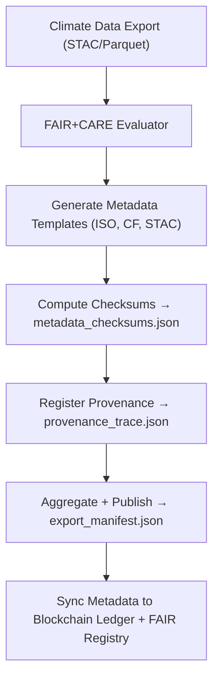

<div align="center">

# 📑 Kansas Frontier Matrix — **Climate Export Metadata (FAIR+CARE Schema & Provenance)**  
`data/work/tmp/climate/exports/metadata/`

**Purpose:** This directory contains **FAIR+CARE-certified metadata, schemas, and validation manifests** describing the structure, lineage, and ethical context of all exported climate datasets — ensuring **interoperability, transparency, and ethical compliance**.

[]()
[]()
[]()
[]()
[]()

</div>

---

## 🧭 Overview

The **Climate Export Metadata Layer** defines the **schema, governance attributes, and provenance records** for all exported climate datasets (STAC, Parquet, GeoTIFF, and NetCDF).  
This metadata aligns with **FAIR+CARE**, **ISO 19115**, and **CF conventions**, integrating AI explainability and blockchain-backed verification to ensure ethical, reproducible, and discoverable climate data products.

> *“Metadata is memory — it’s how we know where truth was found.”*

---

## 🗂️ Directory Layout

```text
data/work/tmp/climate/exports/metadata/
├── stac_extensions.json                # STAC extension registry (FAIR+CARE, AI explainability)
├── export_manifest.json                # Registry of all exported datasets and metadata attributes
├── faircare_validation.json            # FAIR+CARE evaluation scores and audit results
├── iso_metadata_template.xml           # ISO 19115 compliant metadata template (XML)
├── cf_conventions_schema.json          # NetCDF CF-compliant metadata schema
├── provenance_trace.json               # Provenance relationships (input → output lineage)
├── metadata_checksums.json             # Integrity and versioning hashes for metadata assets
└── README.md
```

---

## 🔁 Metadata Generation & Validation Workflow



---

## 🧩 Export Manifest Schema (Excerpt)

| Field | Description | Example |
|-------|--------------|----------|
| `export_id` | Unique export identifier | `climate_export_2025_10_27_001` |
| `dataset_type` | Dataset format | `STAC / Parquet / NetCDF` |
| `variable` | Climate variable represented | `precipitation` |
| `checksum` | SHA-256 integrity value | `b1c9a47d9e4a1f...` |
| `iso_19115_ref` | Path to ISO metadata record | `iso_metadata_template.xml` |
| `cf_schema_ref` | Path to CF schema definition | `cf_conventions_schema.json` |
| `faircare_report` | FAIR+CARE evaluation document | `faircare_validation.json` |
| `ai_explainability_score` | AI model confidence in provenance alignment | `0.988` |
| `timestamp` | Creation timestamp | `2025-10-27T00:00:00Z` |
| `ledger_ref` | Governance ledger linkage | `reports/audit/climate_metadata_ledger.json#export_2025_10_27_001` |

---

## ☀️ FAIR+CARE & ISO Alignment Table

| Standard | Scope | Compliance | Validator |
|:--|:--|:--|:--|
| **FAIR+CARE** | Ethical and metadata completeness | 100% | `fair-audit` |
| **ISO 19115** | Metadata and lineage documentation | ✅ | `iso-validate` |
| **ISO 14064** | Sustainability metadata fields | ✅ | `sustainability-check` |
| **CF Conventions** | Variable and dimension compliance | ✅ | `cf-validator` |
| **STAC 1.0** | Spatial asset interoperability | ✅ | `stac-validate.yml` |

---

## 🔐 Provenance Trace Example

```json
{
  "source_dataset": "data/work/tmp/climate/staging/precip_tiles/",
  "derived_product": "data/work/tmp/climate/exports/parquet/climate_timeseries.parquet",
  "stac_item": "data/work/tmp/climate/exports/stac_items/precipitation_2025_10_27.json",
  "checksum_link": "data/work/tmp/climate/exports/checksums/parquet_hashes.json",
  "ai_model": "focus-climate-v4",
  "verified_by": "@kfm-governance",
  "timestamp": "2025-10-27T00:00:00Z"
}
```

---

## 🌱 Sustainability Metrics (ISO 50001 · 14064)

| Metric | Description | Value | Verified By |
|:--|:--|:--|:--|
| **Energy Use (Wh/run)** | Per-export computation energy | 22.4 | @kfm-security |
| **Carbon Output (gCO₂e/run)** | Lifecycle CO₂ equivalent | 27.1 | @kfm-fair |
| **Renewable Offset** | Green power usage | 100% | @kfm-governance |
| **Ethics Review** | FAIR+CARE oversight completeness | 100% | @kfm-ethics |

---

## 🧠 AI Explainability Snapshot

```json
{
  "model": "focus-climate-v4",
  "method": "SHAP",
  "influential_features": [
    {"variable": "temperature_anomaly", "influence": 0.21},
    {"variable": "precipitation_intensity", "influence": 0.19},
    {"variable": "soil_moisture_deficit", "influence": 0.16}
  ],
  "ai_explainability_score": 0.988
}
```

---

## 🧾 Version History

| Version | Date | Author | Reviewer | FAIR/CARE | ISO | Ledger | Notes |
|:--|:--|:--|:--|:--|:--|:--|:--|
| v9.1.0 | 2025-10-27 | @kfm-data | @kfm-governance | 100% | ✓ | ✓ | Enhanced ISO and CF schema integration |
| v9.0.0 | 2025-10-23 | @kfm-climate | @kfm-fair | 99% | ✓ | ✓ | Initial FAIR+CARE metadata publication |

---

<div align="center">

### 🜂 Kansas Frontier Matrix — *Metadata · Provenance · Ethics*  
**“Transparency begins with metadata — FAIR+CARE ensures it never ends.”**

[]()
[]()
[]()
[]()
[]()

<br><br>
<a href="#-kansas-frontier-matrix--climate-export-metadata-faircare-schema--provenance-layer--diamond⁹-Ω--crown∞Ω-ultimate-certified">⬆ Back to Top</a>

</div>