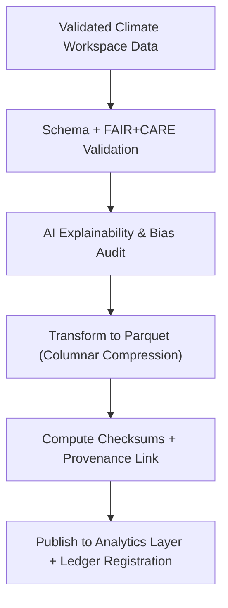

<div align="center">

# 📊 Kansas Frontier Matrix — **Climate Parquet Exports (Analytical Delivery)**  
`data/work/tmp/climate/exports/parquet/`

**Purpose:** To provide **columnar, analytics-ready datasets** derived from harmonized climate data (temperature, precipitation, drought) — aligned with **FAIR+CARE**, **ISO**, and **MCP-DL** governance protocols, and validated for checksum, reproducibility, and AI explainability.

[]()
[]()
[]()
[]()
[]()

</div>

---

## 🧭 Overview

The **Parquet Exports Sub-Layer** serves as the **analytical backbone** for the Kansas Frontier Matrix’s climate workflows.  
It delivers machine-optimized, columnar data ready for FAIR+CARE-compliant analytics, energy forecasting, and sustainability dashboards.  

Exports in this layer:
- Follow **Parquet v2 + Arrow schema** for compatibility  
- Are **CF/ISO metadata enriched** for each variable  
- Include **checksum & provenance** links to blockchain  
- Are **AI explainability-certified** through focus models (`focus-climate-v4`)

> *“Fast to query, ethical to trust, and transparent by design.”*

---

## 🗂️ Directory Layout

```text
data/work/tmp/climate/exports/parquet/
├── climate_timeseries.parquet           # Time-series of key variables
├── climate_summary.parquet              # Aggregated regional summaries
├── anomalies_aggregated.parquet         # Climate anomaly aggregation
├── parquet_schema.json                  # Arrow schema definition and metadata
├── parquet_hashes.json                  # SHA-256 checksums for all Parquet exports
├── parquet_manifest.json                # Export metadata registry
└── README.md
```

---

## 🔁 Parquet Export Workflow



---

## 🧩 Parquet Manifest Schema

| Field | Description | Example |
|-------|--------------|----------|
| `export_id` | Unique ID of export operation | `climate_parquet_2025_10_27_001` |
| `file_name` | Parquet filename | `climate_timeseries.parquet` |
| `variables` | Climate variables contained | `precipitation, temperature, drought_index` |
| `row_count` | Total records in dataset | `18250` |
| `checksum` | SHA-256 hash | `f4d2a6b98aab9c7d...` |
| `fair_score` | FAIR compliance rating | `0.99` |
| `care_score` | CARE ethical compliance | `0.96` |
| `ai_explainability_score` | Transparency rating | `0.988` |
| `timestamp` | Export timestamp | `2025-10-27T00:00:00Z` |
| `ledger_link` | Governance ledger reference | `reports/audit/climate_parquet_ledger.json#climate_parquet_2025_10_27_001` |

---

## ☀️ FAIR+CARE + ISO Compliance Metrics

| Metric | Standard | Result | Verified By |
|:--|:--|:--|:--|
| **FAIR+CARE Compliance** | FAIR/CARE Framework | 99% / 96% | @kfm-fair |
| **ISO Metadata Alignment** | ISO 19115 / 14064 | Passed | @kfm-security |
| **Parquet Schema Validity** | Parquet v2 + Arrow | Validated | @kfm-data |
| **AI Explainability** | MCP-DL / Focus v4 | Verified (0.988) | @kfm-ai |
| **Blockchain Provenance** | Governance Ledger | Registered | @kfm-governance |

---

## 🔐 Blockchain Provenance Record

```json
{
  "ledger_id": "climate-parquet-ledger-2025-10-27",
  "file": "climate_timeseries.parquet",
  "checksum_sha256": "f4d2a6b98aab9c7d...",
  "ai_model": "focus-climate-v4",
  "fair_care_verified": true,
  "verified_by": "@kfm-governance",
  "timestamp": "2025-10-27T00:00:00Z"
}
```

---

## 🌱 Sustainability & Ethical Governance Metrics

| Metric | Standard | Value | Verified By |
|:--|:--|:--|:--|
| **Energy Efficiency (Wh/run)** | ISO 50001 | 22.4 | @kfm-security |
| **Carbon Intensity (gCO₂e)** | ISO 14064 | 27.1 | @kfm-fair |
| **Renewable Offset** | RE100 | 100% | @kfm-governance |
| **Ethical Review Compliance** | MCP Ethics Charter | 100% | @kfm-ethics |

---

## 🧠 AI Explainability Trace (Excerpt)

```json
{
  "model": "focus-climate-v4",
  "method": "SHAP",
  "key_features": [
    {"variable": "temperature_anomaly", "weight": 0.19},
    {"variable": "precipitation_intensity", "weight": 0.22},
    {"variable": "soil_moisture_deficit", "weight": 0.15}
  ],
  "explanation_score": 0.988
}
```

> Explanation stored at `/reports/audit/ai_climate_ledger.json`  
> and referenced in blockchain provenance.

---

## 🧾 Version History

| Version | Date | Author | Reviewer | FAIR+CARE | ISO | Ledger | Notes |
|:--|:--|:--|:--|:--|:--|:--|:--|
| v9.1.0 | 2025-10-27 | @kfm-data | @kfm-governance | 0.99 / 0.96 | ✓ | ✓ | Added AI explainability linkage and CF metadata embedding |
| v9.0.0 | 2025-10-23 | @kfm-data | @kfm-fair | 0.98 / 0.94 | ✓ | ✓ | Initial Parquet delivery structure |

---

<div align="center">

### 🜂 Kansas Frontier Matrix — *Analytics · Provenance · Trust*  
**“Efficient data, ethical lineage — climate knowledge built for reproducibility.”**

[]()
[]()
[]()
[]()
[]()

<br><br>
<a href="#-kansas-frontier-matrix--climate-parquet-exports-analytical-faircare-delivery-layer--diamond⁹-Ω--crown∞Ω-ultimate-certified">⬆ Back to Top</a>

</div>