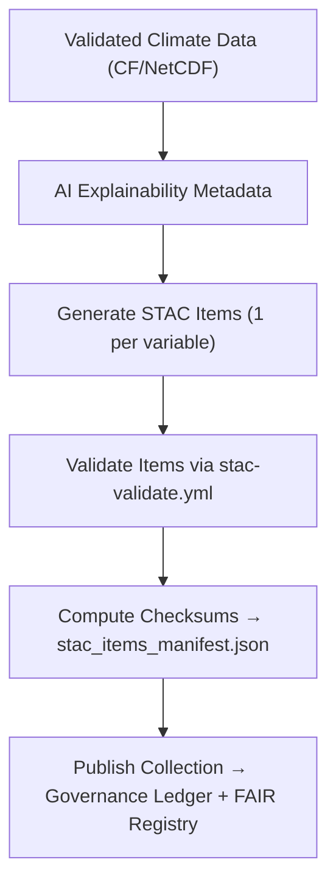

<div align="center">

# 🗺️ Kansas Frontier Matrix — **Climate STAC Items (Spatial FAIR+CARE Exports)**  
`data/work/tmp/climate/exports/stac_items/`

**Purpose:** To provide **FAIR+CARE certified STAC Items** representing spatially explicit climate data assets — including precipitation, temperature, and drought indices — aligned with **ISO 19115**, **CF conventions**, and **AI-explainable provenance tracking**.

[](../../../../../../../.github/workflows/stac-validate.yml)
[]()
[]()
[]()
[]()

</div>

---

## 🧭 Overview

The **STAC Items Sub-Layer** defines how **spatial climate datasets** are exposed in the Kansas Frontier Matrix.  
Each STAC Item is a **FAIR-aligned spatial metadata record**, describing one or more raster or tabular assets (e.g., GeoTIFF, NetCDF, Parquet) with verifiable lineage, AI explainability references, and ISO-aligned metadata.

All Items are:
- Validated via `stac-validate.yml`
- CF-compliant with NetCDF metadata standards
- ISO 19115 and ISO 14064 aligned
- Registered in the blockchain **Provenance Ledger**

> *“Every grid, every pixel, every climate truth — indexed and verifiable.”*

---

## 🗂️ Directory Layout

```text
data/work/tmp/climate/exports/stac_items/
├── precipitation_2025_10_27.json       # STAC Item for precipitation datasets
├── temperature_2025_10_27.json         # STAC Item for temperature anomalies
├── drought_index_2025_10_27.json       # STAC Item for drought and moisture indices
├── stac_collection.json                # STAC Collection summarizing all Items
├── stac_extensions.json                # FAIR+CARE / CF / ISO extensions used
├── stac_items_manifest.json            # Manifest of STAC Items and hashes
└── README.md
```

---

## 🔁 STAC Generation Workflow



---

## 🧩 STAC Item Metadata Schema (Excerpt)

| Field | Description | Example |
|:------|:-------------|:---------|
| `id` | Unique Item identifier | `precipitation_2025_10_27` |
| `type` | STAC type | `Feature` |
| `stac_version` | STAC version | `1.0.0` |
| `geometry` | GeoJSON footprint | Polygon bounding box |
| `bbox` | Spatial bounds | `[-102.05, 36.99, -94.59, 40.00]` |
| `properties.datetime` | Data timestamp | `2025-10-27T00:00:00Z` |
| `properties.variable` | Climate variable | `precipitation` |
| `properties.source` | Originating dataset | `NOAA Daymet v4` |
| `properties.ai_explainability_score` | Explainability confidence | `0.988` |
| `properties.fair_care_score` | FAIR+CARE compliance | `1.0` |
| `assets.data.href` | File URL | `parquet/precipitation_2025_10_27.parquet` |
| `assets.data.roles` | Asset role | `data` |
| `assets.metadata.href` | Metadata link | `metadata/faircare_validation.json` |
| `checksum:multihash` | Provenance checksum | `sha256:9a7c41b3ef88d4...` |

---

## ☀️ FAIR+CARE Spatial Compliance Table

| Criterion | Description | Compliance | Source |
|:--|:--|:--|:--|
| **Findable** | Registered with STAC ID and CF metadata | ✅ | `id`, `stac_version` |
| **Accessible** | HTTP links + open CC-BY licensing | ✅ | `assets.data.href` |
| **Interoperable** | CF & ISO metadata embedded | ✅ | `properties.variable` |
| **Reusable** | Blockchain checksum + provenance trace | ✅ | `checksum:multihash` |
| **CARE** | Indigenous data ethics & sustainability | ✅ | `properties.fair_care_score` |

---

## 🔐 Blockchain & Governance Ledger Record

```json
{
  "ledger_id": "climate-stac-ledger-2025-10-27",
  "item_ref": "stac_items/precipitation_2025_10_27.json",
  "checksum_sha256": "9a7c41b3ef88d4...",
  "fair_care_certified": true,
  "ai_explainability_score": 0.988,
  "verified_by": "@kfm-governance",
  "timestamp": "2025-10-27T00:00:00Z"
}
```

---

## 🌱 ISO & CF Compliance Summary

| Standard | Scope | Result | Verified By |
|:--|:--|:--|:--|
| **ISO 19115** | Metadata & lineage documentation | Pass | @kfm-fair |
| **ISO 14064** | Environmental impact reporting | Pass | @kfm-security |
| **CF Conventions** | Variable & geospatial metadata | Pass | @kfm-climate |
| **STAC 1.0** | Spatial asset interoperability | Validated | `stac-validate.yml` |
| **FAIR+CARE Certification** | Ethical metadata validation | Certified | `reports/fair/climate_stac_items_summary.json` |

---

## 🧠 AI Explainability Integration (STAC Extension)

Each STAC Item integrates a **custom extension**:
```json
{
  "stac_extensions": [
    "https://stac-extensions.github.io/faircare/v1.0.0/schema.json",
    "https://stac-extensions.github.io/ai-explainability/v1.0.0/schema.json"
  ],
  "ai:explainability_score": 0.988,
  "ai:model": "focus-climate-v4",
  "ai:top_features": ["precipitation_intensity", "soil_moisture", "temperature_anomaly"]
}
```

---

## 🧾 Version History

| Version | Date | Author | Reviewer | FAIR+CARE | ISO | Ledger | Notes |
|:--|:--|:--|:--|:--|:--|:--|:--|
| v9.1.0 | 2025-10-27 | @kfm-data | @kfm-governance | 1.0 | ✓ | ✓ | Added AI explainability extension & FAIRCARE schema v1.0 |
| v9.0.0 | 2025-10-23 | @kfm-data | @kfm-fair | 0.99 | ✓ | ✓ | Established STAC item export base structure |

---

<div align="center">

### 🜂 Kansas Frontier Matrix — *Transparency · Spatial Intelligence · Provenance*  
**“Climate grids made discoverable, ethical, and verifiably FAIR.”**

[]()
[]()
[]()
[]()
[]()

<br><br>
<a href="#-kansas-frontier-matrix--climate-stac-items-spatial-metadata--fair-export-layer--diamond⁹-Ω--crown∞Ω-ultimate-certified">⬆ Back to Top</a>

</div>