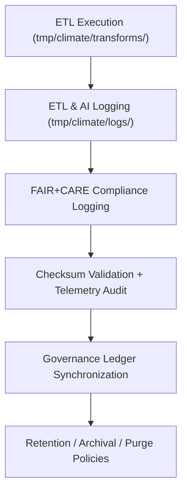

<div align="center">

# 🧾 **Kansas Frontier Matrix — Climate TMP Logs**  
`data/work/tmp/climate/logs/README.md`

**Purpose:**  
Central FAIR+CARE-governed logging workspace for **Climate TMP ETL operations, AI processing, telemetry, and governance sync**.  

This directory captures every significant event during climate TMP workflows, including:

- ETL & transformation runtimes  
- Validation & schema checks  
- Checksum computations  
- FAIR+CARE audit outcomes  
- Governance & ledger sync events  

All logs are **integrity-verified, governed, and aligned with KFM’s MCP-DL v6.3 and KFM-MDP v11**.

[](../../../../../../docs/architecture/README.md)  
[](../../../../../docs/standards/faircare/FAIRCARE-GUIDE.md)  
[]()  
[](../../../../../LICENSE)

</div>

---

## 1. 📘 Overview

The **Climate TMP Logs** directory documents **how** climate data moves through the temporary workspace.  
It is the **authoritative source** for:

- ETL execution traces  
- AI/ML model run logs  
- Governance sync activity  
- Telemetry v2 (energy, carbon, coverage)  

This supports:

- Full reproducibility of transformations  
- Deep audits of climate ETL and AI behavior  
- Ethics, QA, and governance sign-off  
- Consistent integration with PROV-O and the KFM provenance ledger  

### v11.0.0 Upgrade Highlights

- Migrated to v11 governance fields & telemetry schema  
- Ensured mobile-safe code fences & directory layout  
- Aligned `logs` role with TMP and climate domain docs  
- Clarified log retention and risk classification  

---

## 2. 🗂️ Directory Layout (GitHub-Safe)

```text
data/work/tmp/climate/logs/
├── README.md                 ← this file
├── etl_run.log               # ETL & transform runtime logs
├── ai_model_execution.log    # AI/ML run + model metadata logs
├── governance_sync.log       # Governance & ledger sync traces
└── metadata.json             # Log-level metadata, checksums, telemetry
```

- Additional log files MAY be added (e.g., `validation.log`, `error.log`), but MUST be referenced in `metadata.json` and follow governance rules.

---

## 3. ⚙️ Logging Workflow



### Steps

1. **ETL Logging**  
   - Capture start/end times, steps, errors, warning messages.  
   - Record pipeline versions and configurations.

2. **Ethics & Compliance Logging**  
   - Log FAIR+CARE audits, decisions, and any redaction actions.  

3. **Checksum & Telemetry Logging**  
   - Log checksum results and telemetry metrics (energy, carbon, coverage).  

4. **Governance Sync Logging**  
   - Track what was written to `data/reports/audit/data_provenance_ledger.json`.  

5. **Archival/Purge**  
   - Apply retention rules and archive or delete logs as per governance policy.  

---

## 4. 🧩 Example Log Metadata Record

```json
{
  "id": "climate_tmp_log_precipitation_v11.0.0",
  "component": "etl_tmp_climate_pipeline",
  "domain": "climate",
  "records_processed": 129820,
  "workflow": "etl_climate_pipeline_v11",
  "validation_errors": 0,
  "checksum_verified": true,
  "fairstatus": "compliant",
  "telemetry": {
    "energy_watt_hours": 0.7,
    "carbon_grams_co2e": 1.0,
    "validation_coverage_pct": 100,
    "runtime_sec": 58
  },
  "created": "2025-11-20T23:59:00Z",
  "log_files": [
    "etl_run.log",
    "ai_model_execution.log",
    "governance_sync.log"
  ],
  "checksum_sha256": "sha256:b7a3c9f2d8e4a5f9b1d7a2e6c5f8b9a3e4d1a2c5b6f9e7a8b3c4a1d2e8b7a5c6",
  "governance_ref": "data/reports/audit/data_provenance_ledger.json"
}
```

This structure is **machine-readable**, fully aligned with **KFM-PDC v11**, and serves as a PROV-O `prov:Entity`.

---

## 5. 🧠 FAIR+CARE Governance Matrix

| Principle              | Implementation                                                        | Oversight             |
|------------------------|------------------------------------------------------------------------|-----------------------|
| **Findable**           | Logs indexed by domain, workflow, and event IDs.                      | `@kfm-data`          |
| **Accessible**         | Logs exposed internally via controlled read-only interfaces.          | `@kfm-accessibility` |
| **Interoperable**      | Log metadata aligned with PROV-O, DCAT, and KFM log schemas.         | `@kfm-architecture`  |
| **Reusable**           | Log context + telemetry enables reruns and detailed audits.           | `@kfm-design`        |
| **Collective Benefit** | Logging supports trustworthy climate & ETL governance.                | `@faircare-council`  |
| **Authority to Control** | Council sets log retention and access policies.                     | `@kfm-governance`    |
| **Responsibility**     | Engineers and pipelines must record key events and metadata.          | `@kfm-security`      |
| **Ethics**             | Logs screened for PII and culturally sensitive content; no raw PII.   | `@kfm-ethics`        |

Audit & Governance References:

- `data/reports/fair/data_care_assessment.json`  
- `data/reports/audit/data_provenance_ledger.json`  

---

## 6. 🧾 Log Artifacts

| File                    | Description                                       | Format |
|-------------------------|---------------------------------------------------|--------|
| `etl_run.log`           | Step-by-step ETL and transform execution log      | Text   |
| `ai_model_execution.log`| AI/ML model runs, parameters, metrics, warnings   | Text   |
| `governance_sync.log`   | Entries and errors syncing to governance ledger   | Text   |
| `metadata.json`         | High-level metadata: checksums, telemetry, config | JSON  |

**Automation:** `climate_tmp_log_sync.yml` orchestrates log rotation, validation, and upload.

---

## 7. ♻️ Retention & Sustainability Policy

| Log Type              | Retention | Policy                                                   |
|-----------------------|----------:|----------------------------------------------------------|
| ETL Runtime Logs      | 30 days   | Rotated; archived if linked to incidents.                |
| AI Execution Logs     | 90 days   | Retained for model & ethics review.                      |
| Governance Sync Logs  | 365 days  | Kept for compliance & audit.                             |
| Metadata (summaries)  | ≥ 365 days| Archived in governance & telemetry repositories.         |

Telemetry Reference:  
`../../../../../releases/v11.0.0/focus-telemetry.json`

---

## 8. 🌱 Sustainability Metrics

Per TMP climate logging cycle (example):

| Metric                     | Value  | Verified By            |
|----------------------------|-------:|------------------------|
| Energy (logging only)      | 0.7 Wh | `@kfm-sustainability`  |
| Carbon Output              | 1.0 gCO₂e | `@kfm-infrastructure` |
| Logging Overhead (%)       | < 3%   | `@kfm-architecture`    |
| FAIR+CARE Logging Coverage | 100%   | `@faircare-council`    |

Values are also aggregated into:  
`releases/v11.0.0/focus-telemetry.json`

---

## 9. 🕰️ Version History

| Version | Date       | Author            | Summary                                                   |
|--------:|------------|-------------------|-----------------------------------------------------------|
| v11.0.0 | 2025-11-20 | `@kfm-climate`    | Upgraded to v11; added governance fields & TMP alignment |
| v10.0.0 | 2025-11-09 | `@kfm-climate`    | Telemetry v2 + JSON-LD lineage + audit log improvements  |

<div align="center">

**Kansas Frontier Matrix — Climate TMP Logs**  
🧾 FAIR+CARE Certified · Governance & Telemetry Backbone · Diamond⁹ Ω / Crown⁹ Ω  

© 2025 Kansas Frontier Matrix — Internal Governance Data  

[Back to Climate TMP](../README.md) · [Governance Charter](../../../../../docs/standards/governance/ROOT-GOVERNANCE.md)

</div>
