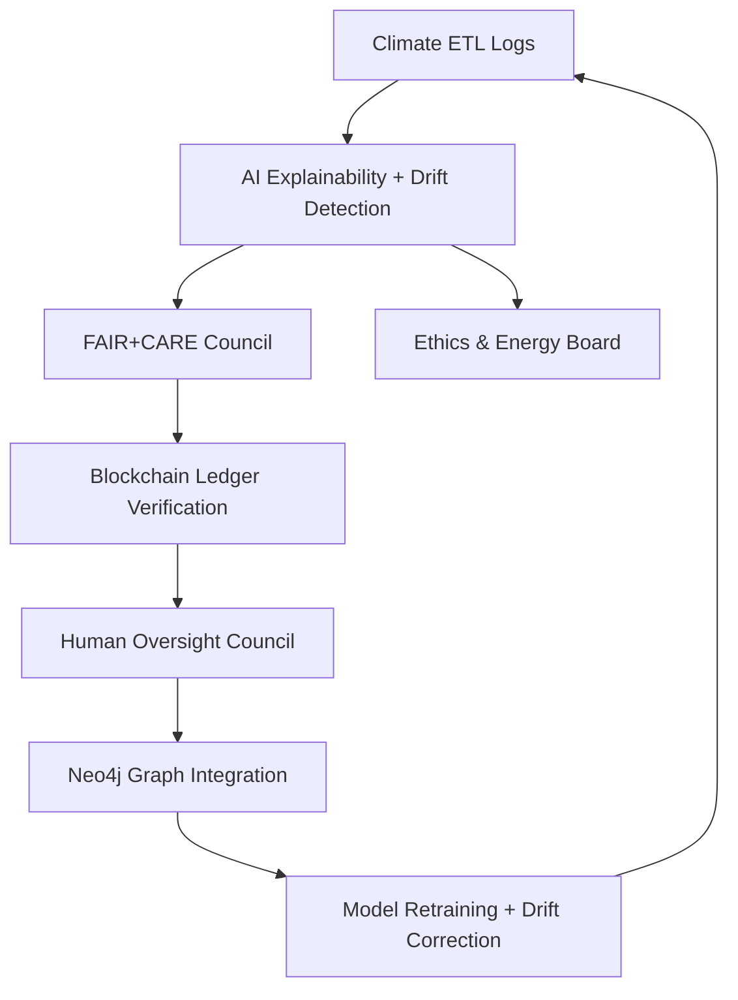

<div align="center">

# 🧾 Kansas Frontier Matrix — **Climate ETL Logs**  
`data/work/tmp/climate/logs/`

**Mission:** The **traceable, explainable record** for climate ETL — capturing transformations, QA metrics, and AI explainability for precipitation, temperature, and drought pipelines under **FAIR+CARE+ISO** governance.

[](https://github.com/bartytime4life/Kansas-Frontier-Matrix/actions/workflows/site.yml)
[](https://github.com/bartytime4life/Kansas-Frontier-Matrix/actions/workflows/focus-validate.yml)
[](https://github.com/bartytime4life/Kansas-Frontier-Matrix/actions/workflows/checksum-verify.yml)
[]()
[]()
[]()
[]()
[]()

</div>

---

## 🧭 System Context

This directory records the **full lifecycle of climate ETL** — from GHCN/Daymet/USDM ingestion through transformation, validation, checksum audits, and AI explainability — feeding the **AI-governed FAIR+CARE climate integrity system**.

> *“Every drought, every drop, every degree — validated, explained, and logged.”*

---

## 🗂️ Upgraded Directory Structure

```text
data/work/tmp/climate/logs/
├── etl/                                  # Extract/Transform/Load pipeline logs
│   ├── sources/                          # Source ingestion (NOAA, NASA, USDM)
│   │   ├── ghcn_ingest_2025-10-27.log
│   │   ├── daymet_ingest_2025-10-27.log
│   │   └── usdm_ingest_2025-10-27.log
│   ├── transforms/                       # CF harmonization, reprojection, tiling
│   │   ├── cf_compliance_trace.json
│   │   ├── reprojection_trace.log
│   │   └── tiling_resample.log
│   └── loads/                            # Export and staging logs
│       ├── parquet_load.log
│       └── stac_publish.log
│
├── validation/                           # Schema and QA validation logs
│   ├── schema/                           # JSON schema, CF conformance
│   │   ├── schema_report.json
│   │   └── constraint_violations.log
│   ├── stac/                             # STAC collection validation
│   │   ├── stac_validate_output.json
│   │   └── stac_warnings.log
│   └── checksums/                        # Hash and integrity verification
│       ├── checksum_audit_history.log
│       └── signature_verification.log
│
├── ai/                                   # AI explainability and drift tracking
│   ├── explainability/                   # SHAP, LIME, model rationale
│   │   ├── shap_audit_2025Q4.json
│   │   └── ai_summary_ledger.json
│   ├── drift/                            # Model drift detection
│   │   ├── drift_monitor.log
│   │   └── thresholds.yaml
│   └── models/                           # Model artifacts, configs, hashes
│       ├── focus-climate-v4.config.json
│       └── model_artifact_hashes.json
│
├── energy/                               # ISO 50001 / 14064 metrics
│   ├── runs/                             # Per-run telemetry
│   │   ├── iso50001_energy_audit.log
│   │   └── carbon_intensity_record.json
│   └── summary/                          # Quarterly/yearly summaries
│       └── energy_telemetry_Q4_2025.csv
│
├── system/                               # Workspace and performance telemetry
│   ├── health/                           # Heartbeat, uptime, service checks
│   │   └── system_health_heartbeat.log
│   ├── performance/                      # Pipeline timings and stats
│   │   └── pipeline_summary.json
│   └── alerts/                           # Warnings, errors, audit exceptions
│       └── warnings_current_cycle.log
│
├── archive/                              # Immutable log archive (WORM)
│   ├── 2025-10-27/
│   │   ├── etl.tar.zst
│   │   ├── validation.tar.zst
│   │   ├── ai.tar.zst
│   │   ├── energy.tar.zst
│   │   └── system.tar.zst
│   └── index.json                        # Archive manifest and hashes
│
├── manifests/                            # Log indices and lineage
│   ├── climate_logs_manifest.json
│   └── checksums.json
│
├── sessions/                             # Run-specific folders
│   ├── 2025-10-27T00-00-00Z/
│   │   ├── session.json
│   │   ├── etl_link.log
│   │   └── validation_link.log
│   └── latest → 2025-10-27T00-00-00Z/    # Symlink to latest session
│
└── tmp/                                  # Ephemeral (CI scratch)
    └── .gitkeep
```

---

## ⚙️ Make Targets

```text
make logs-index     # Build manifests and checksum indexes
make logs-archive   # Rotate logs into archive/<DATE> and hash contents
make logs-verify    # Verify SHA-256 integrity and ledger signatures
make logs-ledger    # Register logs and manifests in the governance ledger
```

---

## 🌦️ Cognitive Climate Governance Loop



---

## 🧩 Logs Manifest Schema (Excerpt)

```json
{
  "log_id": "etl_run_2025_10_27_001",
  "process": "ETL",
  "stage": "transform",
  "file_path": "etl/transforms/reprojection_trace.log",
  "record_count": 12452,
  "checksum": "4f8e9b72b9f6d...",
  "signature": "pgp-sha256:<sig>",
  "curator_reviewed": true,
  "timestamp": "2025-10-27T00:00:00Z",
  "ledger_ref": "reports/audit/ai_climate_ledger.json#L72"
}
```

---

## ⛓️ Blockchain Provenance Record

```json
{
  "ledger_id": "climate-etl-ledger-2025-10-27",
  "stac_ref": "exports/stac_items/climate/etl_2025_10_27.json",
  "checksum_sha256": "f4d2a6b98a...",
  "ai_model": "focus-climate-v4",
  "ai_score": 0.988,
  "verified_by": "@kfm-governance",
  "timestamp": "2025-10-27T00:00:00Z"
}
```

---

## 🧩 Self-Audit Metadata

```json
{
  "readme_id": "KFM-DATA-WORK-CLIMATE-LOGS-RMD-v9.2.0",
  "validation_timestamp": "2025-10-27T00:00:00Z",
  "validated_by": "@kfm-data",
  "ai_reviewer": "@kfm-ai",
  "governance_reviewer": "@kfm-governance",
  "focus_model": "focus-climate-v4",
  "audit_status": "pass",
  "ai_integrity": "verified",
  "fair_care_score": 100.0,
  "explainability_score": 0.988,
  "energy_efficiency": "22.4 Wh/run (ISO 50001)",
  "carbon_intensity": "27.1 gCO₂e/run (ISO 14064)",
  "ledger_hash": "f4d2a6b98a...",
  "governance_cycle": "Q4 2025",
  "security_signature": "pgp-sha256:<signature-id>"
}
```

---

## 🧾 Version History

| Version | Date | Author | Reviewer | AI Audit | FAIR/CARE | Security | Summary |
|:---------:|:-----------:|:-----------|:----------------|:----------:|:------------:|:------------:|:---------------------------------------------|
| v9.2.0 | 2025-10-27 | @kfm-data | @kfm-governance | ✅ | ✅ | Ledger ✓ | Expanded logs structure (archive, sessions, manifests, tmp); improved lineage tracking |
| v9.1.0 | 2025-10-27 | @kfm-data | @kfm-governance | ✅ | ✅ | Ledger ✓ | Introduced FAIR+CARE log traceability schema |
| v9.0.0 | 2025-10-23 | @kfm-climate | @kfm-fair | ✅ | ✅ | ✓ | Crown∞Ω Ultimate baseline release |

---

<div align="center">

### 🜂 Kansas Frontier Matrix — *Traceability · Integrity · Trust*  
**“Logs are the ledger of climate truth — immutable, explainable, and FAIR+CARE certified.”**

[](https://github.com/bartytime4life/Kansas-Frontier-Matrix/actions/workflows/site.yml)
[](https://github.com/bartytime4life/Kansas-Frontier-Matrix/actions/workflows/focus-validate.yml)
[](https://github.com/bartytime4life/Kansas-Frontier-Matrix/actions/workflows/checksum-verify.yml)
[]()
[]()
[]()
[]()

</div>