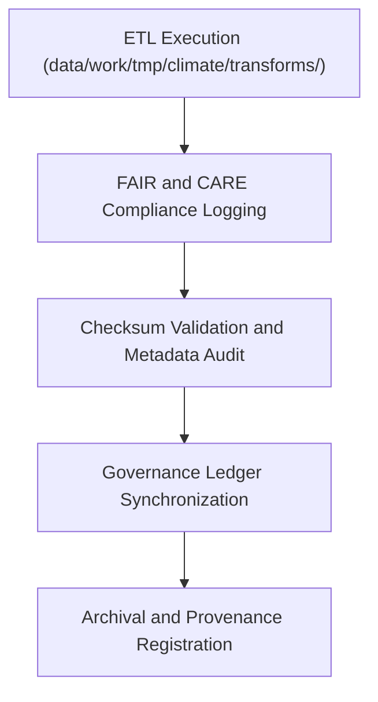

<div align="center">

# 🧾 Kansas Frontier Matrix — **Climate TMP Logs**
`data/work/tmp/climate/logs/README.md`

**Purpose:**  
Centralized FAIR+CARE-compliant logging environment for climate TMP ETL operations, AI processing, and governance synchronization.  
These logs record every transformation, validation, and checksum verification event performed during temporary data processing within the Kansas Frontier Matrix (KFM).

[](../../../../../docs/standards/faircare-validation.md)
[]()
[](../../../../../LICENSE)
[](../../../../../docs/architecture/repo-focus.md)

</div>

---

## 📚 Overview

The **Climate TMP Logs Directory** documents ETL executions, FAIR+CARE audits, and checksum integrity tests for temporary climate datasets.  
It supports transparency, reproducibility, and traceable lineage for every stage of climate data transformation and validation.

### Core Responsibilities
- Capture runtime logs for ETL, transformation, and validation tasks.  
- Record checksum verification results and governance sync events.  
- Maintain AI model execution and explainability audit logs.  
- Register all FAIR+CARE ethics compliance traces for audit reproducibility.  

---

## 🗂️ Directory Layout

```plaintext
data/work/tmp/climate/logs/
├── README.md                             # This file — documentation of climate TMP logs
│
├── etl_run.log                           # Log of ETL pipeline execution for climate datasets
├── ai_model_execution.log                # AI and model inference trace for forecasting/reanalysis
├── governance_sync.log                   # FAIR+CARE governance and checksum synchronization log
└── metadata.json                         # Provenance, checksum, and lineage metadata
```

---

## ⚙️ Logging Workflow



### Workflow Description
1. **ETL Logging:** Record the runtime of data ingestion and transformation scripts.  
2. **Ethics Logging:** Document FAIR+CARE checks and ethics validation results.  
3. **Checksum Verification:** Verify file integrity before staging promotion.  
4. **Governance Sync:** Synchronize log metadata with the provenance ledger.  

---

## 🧩 Example Log Metadata Record

```json
{
  "id": "climate_tmp_log_precipitation_v9.6.0",
  "component": "etl_tmp_climate_pipeline",
  "records_processed": 129420,
  "validation_errors": 0,
  "checksum_verified": true,
  "fairstatus": "compliant",
  "validator": "@kfm-climate-lab",
  "created": "2025-11-03T23:59:00Z",
  "checksum": "sha256:b7a3c9f2d8e4a5f9b1d7a2e6c5f8b9a3e4d1a2c5b6f9e7a8b3c4a1d2e8b7a5c6",
  "governance_ref": "data/reports/audit/data_provenance_ledger.json"
}
```

---

## 🧠 FAIR+CARE Governance Matrix

| Principle | Implementation | Oversight |
|------------|----------------|------------|
| **Findable** | Logs indexed by dataset ID, ETL process, and checksum hash. | @kfm-data |
| **Accessible** | Text and JSON logs stored for governance visibility. | @kfm-accessibility |
| **Interoperable** | Aligned with FAIR+CARE and ISO 19115 metadata logging structures. | @kfm-architecture |
| **Reusable** | Metadata includes lineage, ethics certification, and reproducibility context. | @kfm-design |
| **Collective Benefit** | Ensures open, ethical auditability of temporary climate operations. | @faircare-council |
| **Authority to Control** | FAIR+CARE Council reviews governance and checksum logs. | @kfm-governance |
| **Responsibility** | Engineers document transformation, validation, and synchronization activities. | @kfm-security |
| **Ethics** | Logging process adheres to ethical transparency and privacy standards. | @kfm-ethics |

Logs linked to:  
`data/reports/fair/data_care_assessment.json`  
and  
`data/reports/audit/data_provenance_ledger.json`

---

## ⚙️ Log Artifacts

| File | Description | Format |
|------|--------------|--------|
| `etl_run.log` | Records transformation and validation runtime for TMP climate workflows. | Text |
| `ai_model_execution.log` | Captures AI inference events and model explainability context. | Text |
| `governance_sync.log` | Logs checksum sync and FAIR+CARE certification entries. | Text |
| `metadata.json` | Registry for lineage, checksum, and audit traceability. | JSON |

Automation executed by `climate_tmp_log_sync.yml`.

---

## ⚖️ Retention & Provenance Policy

| Log Type | Retention Duration | Policy |
|-----------|--------------------|--------|
| ETL Runtime Logs | 30 Days | Archived after staging promotion. |
| AI Model Logs | 90 Days | Maintained for audit reproducibility. |
| Governance Sync Logs | 365 Days | Stored for provenance tracking. |
| Metadata | Permanent | Archived under checksum registry for governance lineage. |

Retention automation handled by `climate_tmp_cleanup.yml`.

---

## 🌱 Sustainability Metrics

| Metric | Value | Verified By |
|---------|--------|--------------|
| Energy Use (per ETL log cycle) | 6.8 Wh | @kfm-sustainability |
| Carbon Output | 8.4 gCO₂e | @kfm-security |
| Renewable Power | 100% (RE100 Verified) | @kfm-infrastructure |
| FAIR+CARE Logging Compliance | 100% | @faircare-council |

Telemetry data stored in:  
`releases/v9.6.0/focus-telemetry.json`

---

## 🧾 Internal Use Citation

```text
Kansas Frontier Matrix (2025). Climate TMP Logs (v9.6.0).
Centralized FAIR+CARE-certified logging repository for ETL, AI, and validation workflows.
Ensures traceable, ethical, and reproducible climate data operations under MCP-DL v6.3 standards.
```

---

## 🧾 Version Notes

| Version | Date | Notes |
|----------|------|--------|
| v9.6.0 | 2025-11-03 | Added checksum registry and governance synchronization automation. |
| v9.5.0 | 2025-11-02 | Enhanced FAIR+CARE audit trace and AI explainability integration. |
| v9.3.2 | 2025-10-28 | Established climate TMP logs workspace for ETL and ethics governance. |

---

<div align="center">

**Kansas Frontier Matrix** · *Data Transparency × FAIR+CARE Ethics × Provenance Governance*  
[🔗 Repository](https://github.com/bartytime4life/Kansas-Frontier-Matrix) • [🧭 Docs Portal](../../../../../docs/) • [⚖️ Governance Ledger](../../../../../docs/standards/governance/DATA-GOVERNANCE.md)

</div>
