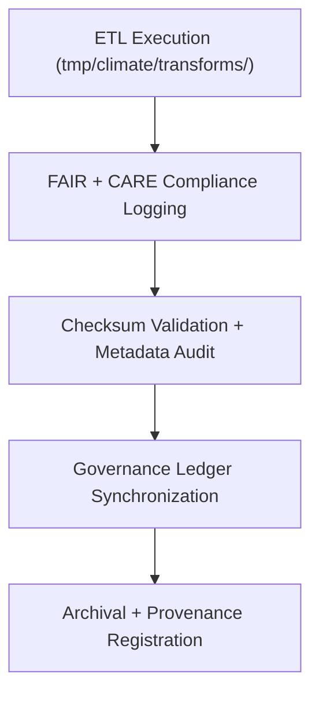

<div align="center">

# 🧾 Kansas Frontier Matrix — **Climate TMP Logs**
`data/work/tmp/climate/logs/README.md`

**Purpose:**  
Central FAIR+CARE-compliant logging workspace for **climate TMP ETL operations, AI processing, and governance synchronization**.  
Captures every transformation, validation, and checksum event performed during temporary climate data processing in KFM.

[](../../../../../docs/architecture/README.md)
[](../../../../../docs/standards/faircare-validation.md)
[]()
[](../../../../../LICENSE)

</div>

---

## 📘 Overview

The **Climate TMP Logs Directory** documents ETL executions, FAIR+CARE audits, and checksum integrity tests for temporary climate datasets.  
It supports transparency, reproducibility, and traceable lineage for every stage of climate data transformation and validation.

### Core Responsibilities
- Record ETL runtime traces, transformations, and validation tasks.  
- Track checksum verification results and governance sync events.  
- Maintain AI model execution + explainability audit traces.  
- Register FAIR+CARE ethics compliance logs for audit reproducibility.  

---

## 🗂️ Directory Layout

```plaintext
data/work/tmp/climate/logs/
├── README.md
├── etl_run.log
├── ai_model_execution.log
├── governance_sync.log
└── metadata.json
```

---

## ⚙️ Logging Workflow



### Steps
1. **ETL Logging** — Record runtime of ingestion & transformation scripts.  
2. **Ethics Logging** — Document FAIR+CARE checks and outcomes.  
3. **Checksums** — Verify integrity prior to staging promotion.  
4. **Governance** — Sync log metadata to provenance ledger.

---

## 🧩 Example Log Metadata Record

```json
{
  "id": "climate_tmp_log_precipitation_v9.7.0",
  "component": "etl_tmp_climate_pipeline",
  "records_processed": 129420,
  "validation_errors": 0,
  "checksum_verified": true,
  "fairstatus": "compliant",
  "validator": "@kfm-climate-lab",
  "created": "2025-11-06T23:59:00Z",
  "checksum_sha256": "sha256:b7a3c9f2d8e4a5f9b1d7a2e6c5f8b9a3e4d1a2c5b6f9e7a8b3c4a1d2e8b7a5c6",
  "governance_ref": "data/reports/audit/data_provenance_ledger.json"
}
```

---

## 🧠 FAIR+CARE Governance Matrix

| Principle | Implementation | Oversight |
|-----------|----------------|-----------|
| **Findable** | Logs indexed by dataset ID, ETL process, checksum. | `@kfm-data` |
| **Accessible** | Text/JSON logs retained for audit visibility. | `@kfm-accessibility` |
| **Interoperable** | Logging aligned to FAIR+CARE + ISO 19115 structures. | `@kfm-architecture` |
| **Reusable** | Provenance + integrity context preserved. | `@kfm-design` |
| **Collective Benefit** | Ensures open, ethical auditing of TMP operations. | `@faircare-council` |
| **Authority to Control** | Council reviews governance + checksum logs. | `@kfm-governance` |
| **Responsibility** | Engineers document transformation, validation, and sync. | `@kfm-security` |
| **Ethics** | Logs screened for sensitive and personal data. | `@kfm-ethics` |

**Audit refs:**  
`data/reports/fair/data_care_assessment.json` · `data/reports/audit/data_provenance_ledger.json`

---

## ⚙️ Log Artifacts

| File | Description | Format |
|------|-------------|--------|
| `etl_run.log` | TMP climate ETL + validation runtime trace | Text |
| `ai_model_execution.log` | AI inference + explainability audit | Text |
| `governance_sync.log` | Checksum + ledger synchronization record | Text |
| `metadata.json` | Lineage + checksum + audit registry | JSON |

**Automation:** `climate_tmp_log_sync.yml`

---

## ♻️ Retention & Sustainability Policy

| Log Type | Retention | Policy |
|----------|----------:|--------|
| ETL Runtime Logs | 30 Days | Archived after staging promotion. |
| AI Model Logs | 90 Days | Retained for audit reproducibility. |
| Governance Sync Logs | 365 Days | Stored for provenance tracking. |
| Metadata | Permanent | Archived in checksum registry. |

**Telemetry:** `../../../../../releases/v9.7.0/focus-telemetry.json`

---

## 🌱 Sustainability Metrics

| Metric | Value | Verified By |
|--------|------:|-------------|
| Energy Use (per log cycle) | 6.8 Wh | `@kfm-sustainability` |
| Carbon Output | 8.4 gCO₂e | `@kfm-security` |
| Renewable Power | 100% (RE100) | `@kfm-infrastructure` |
| FAIR+CARE Logging Compliance | 100% | `@faircare-council` |

---

## 🧾 Internal Citation

```text
Kansas Frontier Matrix (2025). Climate TMP Logs (v9.7.0).
FAIR+CARE-certified logging workspace for ETL, AI, and validation workflows—ensuring transparent, checksum-verified, and ethically reproducible climate data operations.
```

---

<div align="center">

**Kansas Frontier Matrix**  
*Data Transparency × FAIR+CARE Ethics × Provenance Governance*  
© 2025 Kansas Frontier Matrix — Internal · FAIR+CARE Certified · Diamond⁹ Ω / Crown∞Ω Ultimate Certified  

[Back to Climate TMP](../README.md) · [Governance Charter](../../../../../docs/standards/governance/DATA-GOVERNANCE.md)

</div>