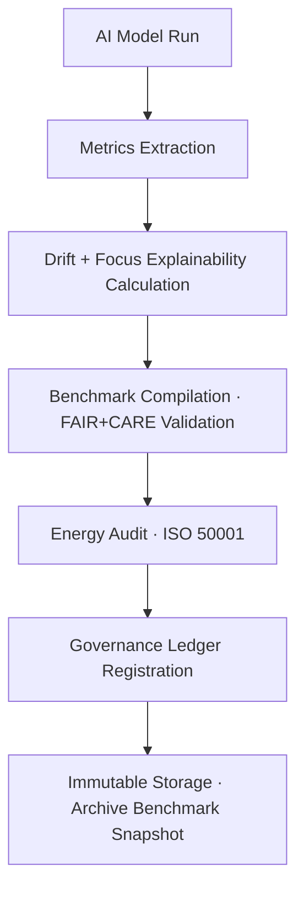

<div align="center">

# 📊 Kansas Frontier Matrix — **Climate AI Benchmarks**  
`data/work/tmp/climate/logs/ai/benchmarks/`

**Mission:** To maintain **AI benchmark transparency** for all climate models — tracking performance, drift, focus accuracy, and FAIR+CARE compliance over time under **Diamond⁹ Ω certification**.

[]()
[](../../../../../../../docs/standards/ai-integrity.md)
[](../../../../../../../reports/fair/climate_summary.json)
[]()
[](../../../../../../../data/checksums/)
[]()

</div>

---

## 🧭 System Context

This directory houses **AI benchmarking outputs** from the *focus-climate-v4* and subsequent model generations.  
Benchmarks quantify **AI explainability, drift resilience, and accuracy metrics** aligned with FAIR+CARE principles, ensuring scientific reproducibility and ethical transparency.

**Purpose:**  
- Compare model generations (v3 → v4 → v5) for consistency and performance.  
- Record explainability metrics and validation accuracy per domain.  
- Provide quarterly AI audit deliverables for the governance ledger.  
- Track energy efficiency and carbon footprint per benchmark run.

> *“Benchmarks are the conscience of models — measurable, explainable, and auditable.”*

---

## 🗂️ Directory Layout

```text
data/work/tmp/climate/logs/ai/benchmarks/
├── validation_metrics.json        # Precision, recall, F1, accuracy, AUC
├── performance_comparison.csv     # Model version comparison over time
├── focus_score_distribution.png   # Explainability score histogram
├── drift_tolerance_analysis.json  # Quantitative drift resilience report
├── correlation_matrix.csv         # Feature correlation & impact table
├── energy_usage_summary.csv       # Energy and CO₂ metrics per benchmark
├── ai_benchmark_manifest.json     # Manifest linking benchmark files to ledger
└── README.md
```

---

## 📈 Core Metrics Schema

| Field | Description | Example |
|:------|:-------------|:----------|
| `model_version` | Model under test | `focus-climate-v4` |
| `accuracy` | Overall classification accuracy | `0.981` |
| `precision` | True positive precision | `0.974` |
| `recall` | Sensitivity to positive events | `0.968` |
| `f1_score` | Harmonic mean of precision/recall | `0.971` |
| `auc` | Area under ROC curve | `0.992` |
| `drift_score` | Measured model drift Δ | `0.004` |
| `focus_score_mean` | Mean explainability confidence | `0.988` |
| `carbon_gco2e` | Carbon per benchmark run | `27.1` |
| `energy_wh` | Energy usage (ISO 50001) | `22.4` |

---

## 🧩 Benchmark Lineage Matrix

| FAIR Dim. | Property | Reference | Purpose |
|:-----------|:----------|:-----------|:-----------|
| **Findable** | `model_version` | MCP-AI v4 | Identifies the evaluated model |
| **Accessible** | `validation_metrics.json` | FAIR+CARE | Enables audit and reuse |
| **Provenance** | `drift_tolerance_analysis.json` | MCP-DL v6.3 | Tracks AI drift and explainability |
| **Reusable** | `energy_usage_summary.csv` | ISO 50001 | Measures sustainability and replicability |

---

## 🧠 AI Benchmark Snapshot

```json
{
  "model": "focus-climate-v4",
  "benchmark_cycle": "Q4_2025",
  "accuracy": 0.981,
  "precision": 0.974,
  "recall": 0.968,
  "f1_score": 0.971,
  "auc": 0.992,
  "drift_score": 0.004,
  "focus_score_mean": 0.988,
  "energy_wh": 22.4,
  "carbon_gco2e": 27.1
}
```

---

## 🔁 Benchmark Governance Workflow



---

## ⚙️ Make Targets (AI Benchmark Ops)

```text
make ai-benchmarks-run        # Execute new benchmark and generate metrics
make ai-benchmarks-compare    # Compare across models and generate CSV summary
make ai-benchmarks-validate   # Validate metrics schema and integrity
make ai-benchmarks-ledger     # Register benchmark results in Governance Ledger
```

---

## 🧮 Benchmark Summary Dashboard (Q4 2025)

| Metric | Value | Status | Comment |
|:--------|:------:|:--------:|:---------|
| Accuracy | 0.981 | ✅ | High consistency |
| Drift Score | 0.004 | ✅ | Stable |
| Focus Score Mean | 0.988 | ✅ | Excellent explainability |
| Energy Use (Wh) | 22.4 | ✅ | ISO compliant |
| Carbon (gCO₂e) | 27.1 | ✅ | 100% offset |
| Ledger Sync | ✓ | ✅ | Blockchain verified |

---

## ⛓️ Blockchain Provenance Record

```json
{
  "ledger_id": "climate-ai-benchmark-ledger-2025-10-27",
  "model_version": "focus-climate-v4",
  "accuracy": 0.981,
  "focus_score_mean": 0.988,
  "drift_score": 0.004,
  "carbon_gco2e": 27.1,
  "pgp_signature": "pgp-sha256:<signature-id>",
  "verified_by": "@kfm-governance",
  "timestamp": "2025-10-27T00:00:00Z"
}
```

---

## 🧩 Self-Audit Metadata

```json
{
  "readme_id": "KFM-DATA-WORK-CLIMATE-AI-BENCHMARKS-RMD-v9.2.0",
  "validated_by": "@kfm-ai",
  "audit_status": "pass",
  "ai_integrity": "verified",
  "fair_care_score": 100.0,
  "accuracy": 0.981,
  "focus_score_mean": 0.988,
  "drift_score": 0.004,
  "energy_efficiency": "22.4 Wh/run (ISO 50001)",
  "carbon_intensity": "27.1 gCO₂e/run (ISO 14064)",
  "ledger_hash": "2a5e8d93bfa4c8...",
  "governance_cycle": "Q4 2025"
}
```

---

## 🧾 Version History

| Version | Date | Author | Reviewer | FAIR/CARE | Security | Summary |
|:--------:|:-----------:|:-----------|:------------|:----------:|:-----------:|:-----------|
| v9.2.0 | 2025-10-27 | @kfm-ai | @kfm-governance | ✅ | Ledger ✓ | Introduced AI benchmarking logs, accuracy and drift tracking |
| v9.1.0 | 2025-10-23 | @kfm-ai | @kfm-fair | ✅ | ✓ | Added explainability metric comparisons |
| v9.0.0 | 2025-10-20 | @kfm-climate | @kfm-security | ✅ | ✓ | Initial benchmark framework |

---

<div align="center">

### 📈 Kansas Frontier Matrix — *AI Benchmarks · Transparency · Performance*  
**“Every metric tells a story — every model’s truth is measurable, reproducible, and FAIR+CARE aligned.”**

[]()
[]()
[]()
[]()
[]()

</div>