<div align="center">

# 🧠 Kansas Frontier Matrix — **Climate AI Explainability Logs**  
`data/work/tmp/climate/logs/ai/explainability/`

**Mission:** Provide transparent, reproducible, and explainable insights into AI decision-making within the Kansas Frontier Matrix climate intelligence pipeline — ensuring FAIR+CARE accountability across every prediction.

[]()
[](../../../../../../../docs/standards/ai-integrity.md)
[](../../../../../../../reports/fair/climate_summary.json)
[](../../../../../../../data/checksums/)
[]()

</div>

---

## 🧭 System Context

This directory captures **AI explainability artifacts** for *focus-climate-v4* and successor models.  
Explainability logs form the backbone of **AI transparency**, allowing researchers to understand *why* a model made its predictions.

**Core Objectives:**
- Record variable importance per prediction (SHAP/LIME outputs).  
- Summarize model reasoning across datasets.  
- Quantify explainability performance (`focus_score_mean`).  
- Register results into the immutable Governance Ledger.

> *“An explainable model is not just smart — it’s accountable.”*

---

## 🗂️ Directory Layout

```text
data/work/tmp/climate/logs/ai/explainability/
├── shap_audit_2025Q4.json            # Global SHAP importance and model insights
├── lime_local_importance.json        # Local explainability scores (per prediction)
├── ai_summary_ledger.json            # Merged explainability registry for all runs
├── variable_contributions.csv        # Aggregated variable influence across datasets
├── feature_importance_ranking.json   # Top variables by domain and correlation
├── explainability_over_time.csv      # Temporal variation of focus scores
├── explanation_visualization.png     # Visual representation of SHAP impacts
└── README.md
```

---

## 🧩 Explainability Lineage Matrix

| Field | FAIR Dim. | Property | Reference | Purpose |
|:------|:-----------|:----------|:------------|:----------|
| `focus_model` | Findable | `properties.model` | MCP-AI v4 | Identify model responsible for output |
| `feature` | Accessible | `properties.variable` | CF | Track feature-level impact |
| `influence` | Provenance | `properties.explainability` | MCP-DL | Quantify each variable’s contribution |
| `focus_score_mean` | Provenance | `properties.quality.focus` | FAIR+CARE | Aggregate explainability score |
| `drift_correlation` | Reusable | `properties.drift.correlation` | AI-Coherence | Detect correlations between drift and importance |

---

## 🧠 SHAP Explainability Snapshot

```json
{
  "model": "focus-climate-v4",
  "method": "SHAP",
  "key_features": [
    {"variable": "precipitation_intensity", "influence": 0.23},
    {"variable": "temperature_anomaly", "influence": 0.19},
    {"variable": "soil_moisture_deficit", "influence": 0.15},
    {"variable": "solar_radiation", "influence": 0.10},
    {"variable": "vapor_pressure_deficit", "influence": 0.08}
  ],
  "focus_score_mean": 0.988,
  "variance": 0.004,
  "timestamp": "2025-10-27T00:00:00Z"
}
```

> Logged under `shap_audit_2025Q4.json` and cross-linked with `ai_summary_ledger.json`.

---

## 📊 Explainability Visualization Example

```mermaid
graph LR
A[SHAP Input Features] --> B[Global Variable Importance]
B --> C[Explainability Score Aggregation]
C --> D[AI Summary Ledger Registration]
D --> E[Governance Review · FAIR+CARE Council]
```



---

## ⚙️ Make Targets (Explainability Ops)

```text
make ai-explainability-run       # Generate SHAP and LIME explainability reports
make ai-explainability-summary   # Merge per-run artifacts into ai_summary_ledger.json
make ai-explainability-validate  # Validate schema and thresholds per MCP-DL v6.3
make ai-explainability-ledger    # Register explainability artifacts in Governance Ledger
```

---

## 📈 Focus Score Trends (Q1–Q4 2025)

| Quarter | Mean Focus Score | Variance | Stability | Action |
|:--------:|:----------------:|:----------:|:------------:|:---------:|
| Q1 2025 | 0.982 | 0.006 | Stable | None |
| Q2 2025 | 0.985 | 0.005 | Stable | None |
| Q3 2025 | 0.987 | 0.004 | Stable | None |
| Q4 2025 | 0.988 | 0.004 | Certified | Publish to Ledger |

---

## ⛓️ Blockchain Provenance Record

```json
{
  "ledger_id": "climate-ai-explainability-ledger-2025-10-27",
  "focus_model": "focus-climate-v4",
  "focus_score_mean": 0.988,
  "variance": 0.004,
  "top_features": ["precipitation_intensity", "temperature_anomaly", "soil_moisture_deficit"],
  "carbon_gco2e": 27.1,
  "pgp_signature": "pgp-sha256:<signature-id>",
  "verified_by": "@kfm-governance",
  "timestamp": "2025-10-27T00:00:00Z"
}
```

---

## 🧮 Governance Dashboard (Q4 2025)

| Metric | Value | Status | Verified By |
|:---------|:------:|:---------:|:-------------|
| Focus Score Mean | 0.988 | ✅ Certified | @kfm-ai |
| Drift Correlation | 0.12 | ✅ Acceptable | @kfm-fair |
| FAIR Compliance | 100% | ✅ | @kfm-governance |
| Carbon gCO₂e | 27.1 | ✅ ISO 14064 | @kfm-security |
| Ledger Integrity | ✓ | ✅ | @kfm-ledger |

---

## 🧩 Self-Audit Metadata

```json
{
  "readme_id": "KFM-DATA-WORK-CLIMATE-AI-EXPLAINABILITY-RMD-v9.2.0",
  "validated_by": "@kfm-ai",
  "audit_status": "pass",
  "focus_score_mean": 0.988,
  "variance": 0.004,
  "ai_integrity": "verified",
  "fair_care_score": 100.0,
  "carbon_intensity": "27.1 gCO₂e/run (ISO 14064)",
  "energy_efficiency": "22.4 Wh/run (ISO 50001)",
  "ledger_hash": "b7f9a612ae14f9...",
  "governance_cycle": "Q4 2025"
}
```

---

## 🧾 Version History

| Version | Date | Author | Reviewer | FAIR/CARE | Ledger | Summary |
|:--------:|:-----------:|:-----------|:-----------|:----------:|:----------:|:-----------|
| v9.2.0 | 2025-10-27 | @kfm-ai | @kfm-governance | ✅ | Ledger ✓ | Added comprehensive SHAP/LIME explainability tracking, focus score ledger |
| v9.1.0 | 2025-10-23 | @kfm-ai | @kfm-security | ✅ | ✓ | Integrated explainability variance analysis |
| v9.0.0 | 2025-10-20 | @kfm-climate | @kfm-fair | ✅ | ✓ | Baseline explainability schema established |

---

<div align="center">

### 🧠 Kansas Frontier Matrix — *Transparency · Accountability · Insight*  
**“Every decision must explain itself — because understanding the ‘why’ is as vital as predicting the ‘what.’”**

[]()
[]()
[]()
[]()
[]()

</div>