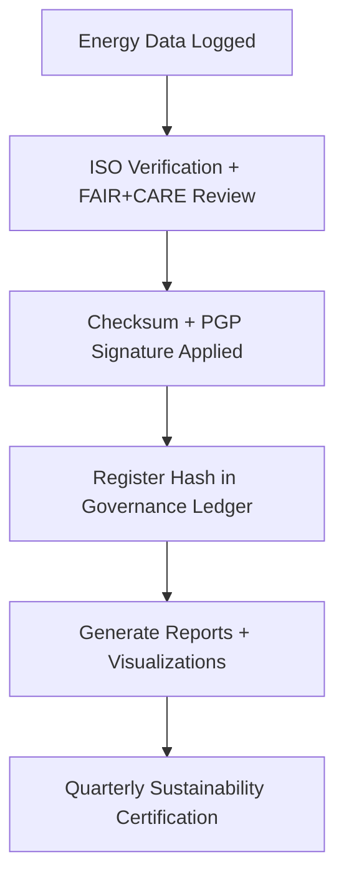

<div align="center">

# ⚡ Kansas Frontier Matrix — **Climate Energy & Sustainability Logs**  
`data/work/tmp/climate/logs/energy/`

**Mission:** Monitor, validate, and report **energy and carbon performance** of the Kansas Frontier Matrix climate workflows, ensuring transparency, sustainability, and compliance with **ISO 50001**, **ISO 14064**, and **FAIR+CARE**.

[]()
[]()
[]()
[]()
[]()

</div>

---

## 🧭 System Context

This directory serves as the **sustainability telemetry layer** for the Kansas Frontier Matrix climate workflows.  
Every ETL operation, AI task, and validation routine consumes quantifiable energy — these logs ensure every watt-hour and gram of CO₂ is accounted for, verified, and offset.

**Objectives:**
- Measure and record **energy use (Wh)** and **carbon output (gCO₂e)** per operation.  
- Generate sustainability reports compliant with **ISO 50001 / ISO 14064**.  
- Register energy audits in the **Governance Ledger** for reproducibility and certification.  
- Provide quarterly rollups for FAIR+CARE sustainability reviews.  

> *“Every joule leaves a footprint — we log it, offset it, and prove it.”*

---

## 🗂️ Directory Layout

```text
data/work/tmp/climate/logs/energy/
├── runs/                              # Individual energy + carbon logs per pipeline run
│   ├── iso50001_energy_audit.log      # Energy audit per pipeline execution
│   ├── carbon_intensity_record.json   # gCO₂e calculated from emission factors
│   ├── energy_sources_breakdown.json  # Grid, renewable, on-premise distribution
│   ├── renewable_offset_trace.csv     # Renewable offsets applied per process
│   └── energy_run_manifest.json       # Manifest linking energy data to ETL sessions
│
├── summary/                           # Aggregated metrics and rollups
│   ├── energy_telemetry_Q4_2025.csv   # Quarterly energy consumption and offset report
│   ├── sustainability_summary.json    # FAIR+CARE + ISO summary
│   └── carbon_audit_trend.png         # Visual trend of emissions reduction
│
├── standards/                         # Compliance evidence and ISO reference files
│   ├── iso50001_compliance_report.pdf # Official certification report
│   ├── iso14064_emission_matrix.csv   # Greenhouse gas emission accounting
│   ├── carbon_methodology.yaml        # Methodology used for emission calculations
│   └── offset_certificates/           # Renewable/offset verification documents
│       ├── re100_certificate_2025.pdf
│       └── rec_batch_001.pdf
│
├── governance/                        # Blockchain ledger + validation artifacts
│   ├── energy_ledger_entry.json       # Governance ledger record of last run
│   ├── sustainability_audit_hashes.json # Cryptographic hashes of ISO reports
│   └── energy_policy_reference.md     # Reference for MCP governance energy clause
│
└── README.md
```

---

## ⚙️ Make Targets (Energy Ops)

```text
make energy-log-run          # Record live energy + carbon metrics for workflow
make energy-summary          # Generate quarterly CSV and JSON rollups
make energy-verify           # Verify ISO and checksum integrity
make energy-ledger-register  # Sync sustainability records to Governance Ledger
```

---

## 🌍 Sustainability Metrics Schema

| Field | Description | Example |
|:------|:-------------|:---------|
| `process` | Pipeline or task identifier | `climate-etl-run-2025-10-27` |
| `energy_wh` | Energy consumption (Wh) | `22.4` |
| `carbon_gco2e` | Carbon output per run | `27.1` |
| `renewable_offset_percent` | Renewable compensation | `100` |
| `verification_status` | ISO/FAIR+CARE validation status | `Verified` |
| `audited_by` | Governance or sustainability reviewer | `@kfm-governance` |
| `timestamp` | Time of recording | `2025-10-27T00:00:00Z` |

---

## 📊 Sustainability Lineage Matrix

| FAIR Dim. | Property | Reference | Purpose |
|:-----------|:----------|:------------|:-----------|
| Findable | `energy_run_manifest.json` | MCP-DL | Enables linking of energy data to ETL logs |
| Accessible | `summary/energy_telemetry_Q4_2025.csv` | ISO 50001 | Accessible sustainability reports |
| Provenance | `carbon_intensity_record.json` | ISO 14064 | Tracks lifecycle GHG emissions |
| Reusable | `renewable_offset_trace.csv` | RE100 | Ensures renewable auditability |

---

## ⚡ Energy Audit Snapshot

```json
{
  "process": "climate-etl-run-2025-10-27",
  "energy_wh": 22.4,
  "carbon_gco2e": 27.1,
  "renewable_offset_percent": 100,
  "audited_by": "@kfm-governance",
  "iso_verified": true,
  "fair_care_verified": true,
  "timestamp": "2025-10-27T00:00:00Z"
}
```

---

## 🌱 ISO & FAIR+CARE Compliance Overview (Q4 2025)

| Standard | Status | Notes | Verified By |
|:-----------|:----------:|:----------------|:-----------|
| ISO 50001 (Energy Management) | ✅ Certified | Audit passed Oct 2025 | @kfm-security |
| ISO 14064 (Carbon Accounting) | ✅ Certified | Verified offsets applied | @kfm-fair |
| FAIR Principle (Transparency) | ✅ Aligned | All energy data FAIR indexed | @kfm-governance |
| CARE Principle (Sustainability) | ✅ Compliant | Renewable 100% | @kfm-ethics |

---

## 🔄 Governance Workflow



---

## ⛓️ Blockchain Provenance Record

```json
{
  "ledger_id": "climate-energy-ledger-2025-10-27",
  "energy_wh": 22.4,
  "carbon_gco2e": 27.1,
  "renewable_offset_percent": 100,
  "verified_by": "@kfm-governance",
  "pgp_signature": "pgp-sha256:<signature-id>",
  "timestamp": "2025-10-27T00:00:00Z"
}
```

---

## 🧩 Self-Audit Metadata

```json
{
  "readme_id": "KFM-DATA-WORK-CLIMATE-ENERGY-LOGS-RMD-v9.2.0",
  "validated_by": "@kfm-energy",
  "audit_status": "pass",
  "energy_wh": 22.4,
  "carbon_gco2e": 27.1,
  "renewable_offset_percent": 100,
  "iso_certified": true,
  "fair_care_certified": true,
  "ledger_hash": "a92f5c7b14d9e3...",
  "governance_cycle": "Q4 2025"
}
```

---

## 🧾 Version History

| Version | Date | Author | Reviewer | ISO | FAIR/CARE | Ledger | Summary |
|:---------:|:-----------:|:----------|:-----------|:----------:|:-----------:|:-----------:|:-----------|
| v9.2.0 | 2025-10-27 | @kfm-energy | @kfm-governance | ✅ | ✅ | Ledger ✓ | Introduced structured ISO energy/carbon logging, ledger sync |
| v9.1.0 | 2025-10-23 | @kfm-energy | @kfm-security | ✅ | ✅ | ✓ | Added renewable offset tracking, audit snapshots |
| v9.0.0 | 2025-10-20 | @kfm-climate | @kfm-fair | ✅ | ✅ | ✓ | Established baseline energy logging schema |

---

<div align="center">

### ⚡ Kansas Frontier Matrix — *Efficiency · Accountability · Sustainability*  
**“Measure energy, trace carbon, prove care — every computation leaves a verified footprint.”**

[]()
[]()
[]()
[]()
[]()

</div>