<div align="center">

# 🔋 Kansas Frontier Matrix — **Climate Energy Run Logs**  
`data/work/tmp/climate/logs/energy/runs/`

**Mission:** Record and validate **per-run energy and carbon telemetry** for all ETL, AI, and validation operations in the Kansas Frontier Matrix — ensuring compliance with **ISO 50001**, **ISO 14064**, and **FAIR+CARE sustainability** standards.

[]()
[]()
[]()
[]()
[]()

</div>

---

## 🧭 System Context

The **Climate Energy Run Logs** directory stores **granular sustainability telemetry** generated during each climate ETL and AI execution cycle.  
These logs capture detailed per-run **energy consumption (Wh)**, **carbon emissions (gCO₂e)**, and **renewable offset ratios**, providing auditable and ISO-compliant data for governance verification.

**Purpose:**
- Quantify and log **energy usage per data/AI pipeline**.
- Generate **carbon accounting** for each process.
- Maintain **checksum-verified, immutable run records**.
- Feed into the **Governance Ledger** for transparency and FAIR+CARE validation.

> *“Every run consumes energy — every watt-hour is logged, explained, and offset.”*

---

## 🗂️ Directory Layout

```text
data/work/tmp/climate/logs/energy/runs/
├── iso50001_energy_audit.log        # Per-run audit of energy consumption
├── carbon_intensity_record.json     # CO₂ emissions for each run
├── energy_sources_breakdown.json    # Breakdown of grid vs renewable energy
├── renewable_offset_trace.csv       # Applied offsets from RE100 and REC credits
├── process_efficiency.json          # Efficiency metrics per run (ETL, AI, Validation)
├── energy_run_manifest.json         # Manifest linking run IDs to governance ledger
└── README.md
```

---

## ⚙️ Energy Logging Process (Automated)

```text
make energy-log-run        # Record energy and CO₂ data for current workflow
make energy-verify-run     # Validate ISO thresholds and FAIR+CARE standards
make energy-ledger-sync    # Register energy metrics in governance ledger
make energy-offset-update  # Apply renewable offsets and recalculate CO₂ balance
```

---

## 📊 Energy Run Metrics Schema

| Field | Description | Example |
|:------|:-------------|:----------|
| `run_id` | Unique identifier for workflow | `etl-run-2025-10-27T00-00-00Z` |
| `process` | Operation type | `ETL` |
| `energy_wh` | Energy consumed (Wh) | `22.4` |
| `carbon_gco2e` | Carbon output (gCO₂e) | `27.1` |
| `renewable_offset_percent` | Renewable compensation (%) | `100` |
| `iso_50001_verified` | ISO 50001 compliance flag | `true` |
| `iso_14064_verified` | ISO 14064 compliance flag | `true` |
| `checksum` | File integrity hash | `f4d2a6b98a...` |
| `verified_by` | Reviewer | `@kfm-governance` |
| `timestamp` | Time of recording | `2025-10-27T00:00:00Z` |

---

## 🧩 Sustainability Lineage Matrix

| FAIR Dim. | Property | ISO / Standard | Purpose |
|:-----------|:----------|:----------------|:-----------|
| **Findable** | `run_id` | FAIR+CARE | Identify and cross-link energy telemetry |
| **Accessible** | `energy_run_manifest.json` | ISO 50001 | Ensure auditable traceability |
| **Provenance** | `carbon_intensity_record.json` | ISO 14064 | Carbon accountability per process |
| **Reusable** | `renewable_offset_trace.csv` | RE100 | Promote transparent offset verification |

---

## ⚡ Example Energy Run Snapshot

```json
{
  "run_id": "ai-focus-run-2025-10-27",
  "process": "AI Explainability",
  "energy_wh": 22.4,
  "carbon_gco2e": 27.1,
  "renewable_offset_percent": 100,
  "iso_50001_verified": true,
  "iso_14064_verified": true,
  "checksum": "f4d2a6b98a...",
  "verified_by": "@kfm-governance",
  "timestamp": "2025-10-27T00:00:00Z"
}
```

---

## 🔄 Workflow Overview

```mermaid
flowchart TD
A[ETL/AI Run Initiated] --> B[Energy & CO₂ Tracking Started]
B --> C[ISO Threshold Validation]
C --> D[Offset Application · Renewable Credit Sync]
D --> E[Checksum + PGP Signature]
E --> F[Register with Governance Ledger]
F --> G[Quarterly Energy Summary → FAIR+CARE Council]
```



---

## ⛓️ Blockchain Provenance Record

```json
{
  "ledger_id": "climate-energy-run-ledger-2025-10-27",
  "process": "ETL",
  "energy_wh": 22.4,
  "carbon_gco2e": 27.1,
  "renewable_offset_percent": 100,
  "iso_verified": true,
  "checksum": "f4d2a6b98a...",
  "pgp_signature": "pgp-sha256:<signature-id>",
  "verified_by": "@kfm-governance",
  "timestamp": "2025-10-27T00:00:00Z"
}
```

---

## 🧮 Governance Dashboard (Q4 2025)

| Metric | Value | Status | Verified By |
|:---------|:-------:|:----------:|:-------------|
| Avg Energy / Run (Wh) | 22.4 | ✅ | @kfm-security |
| Avg Carbon / Run (gCO₂e) | 27.1 | ✅ | @kfm-fair |
| Renewable Offset (%) | 100 | ✅ | @kfm-governance |
| ISO Compliance | 100% | ✅ | @kfm-energy |
| Ledger Sync | ✓ | ✅ | Blockchain verified |

---

## 🧩 Self-Audit Metadata

```json
{
  "readme_id": "KFM-DATA-WORK-CLIMATE-ENERGY-RUNS-RMD-v9.3.0",
  "validated_by": "@kfm-energy",
  "audit_status": "pass",
  "iso_50001_certified": true,
  "iso_14064_certified": true,
  "average_energy_wh": 22.4,
  "average_carbon_gco2e": 27.1,
  "renewable_offset_percent": 100,
  "ledger_hash": "b7f9a612ae14f9...",
  "governance_cycle": "Q4 2025"
}
```

---

## 🧾 Version History

| Version | Date | Author | Reviewer | ISO | FAIR/CARE | Ledger | Summary |
|:----------:|:-----------:|:-----------|:------------|:----------:|:-----------:|:-----------:|:-----------|
| v9.3.0 | 2025-10-27 | @kfm-energy | @kfm-governance | ✅ | ✅ | Ledger ✓ | Introduced detailed per-run ISO + FAIR+CARE logging schema |
| v9.2.0 | 2025-10-25 | @kfm-energy | @kfm-security | ✅ | ✅ | ✓ | Added renewable breakdown and offset trace logging |
| v9.1.0 | 2025-10-23 | @kfm-climate | @kfm-fair | ✅ | ✅ | ✓ | Initial baseline for energy telemetry runs |

---

<div align="center">

### 🔋 Kansas Frontier Matrix — *Efficiency · Accountability · Verification*  
**“Every computation carries a footprint — and every footprint deserves to be measured and offset.”**

[]()
[]()
[]()
[]()
[]()

</div>