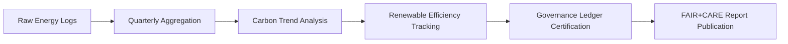

<div align="center">

# 📊 Kansas Frontier Matrix — **Climate Energy Summary Reports**  
`data/work/tmp/climate/logs/energy/summary/`

**Mission:** Deliver **aggregated sustainability metrics**—energy consumption, carbon impact, renewable offsets, and ethical compliance—derived from the Kansas Frontier Matrix climate workflows.  
Each summary is FAIR+CARE certified, ISO-audited, and ledger-tracked to ensure reproducibility and accountability.

[]()
[]()
[]()
[]()
[]()

</div>

---

## 🧭 System Context

This directory consolidates **quarterly and annual sustainability summaries** from individual energy run logs (`runs/`) and compliance records.  
These reports provide the foundation for **ISO verification, FAIR+CARE audits, and Governance Ledger entries**, forming the backbone of the system’s sustainability accountability.

**Core Goals:**
- Aggregate all energy and carbon metrics into reproducible CSV and JSON reports.  
- Generate quarterly sustainability scorecards and visual trends.  
- Feed verified data into the **Immutable Governance Ledger** for certification cycles.  
- Support FAIR+CARE compliance and ISO revalidation.

> *“Summaries are not just metrics — they are proof of stewardship.”*

---

## 🗂️ Directory Layout

```text
data/work/tmp/climate/logs/energy/summary/
├── energy_telemetry_Q4_2025.csv      # Aggregated energy and carbon metrics (quarterly)
├── sustainability_summary.json       # Combined FAIR+CARE + ISO metrics for audit
├── carbon_audit_trend.png            # Carbon reduction visualization (quarterly/annual)
├── renewable_efficiency_chart.png    # Renewable utilization progress
├── performance_overview_Q4_2025.pdf  # Summary report for governance and external review
├── sustainability_manifest.json      # Manifest linking summary files to ledger hashes
└── README.md
```

---

## ⚙️ Make Targets (Summary Ops)

```text
make energy-summary-run       # Generate CSV + JSON summaries from raw logs
make energy-summary-validate  # Validate schema and ISO compliance
make energy-summary-ledger    # Register summary data in the Governance Ledger
make energy-summary-report    # Generate formatted PDF and visualization outputs
```

---

## 📊 Summary Schema (Excerpt)

| Field | Description | Example |
|:------|:-------------|:----------|
| `quarter` | Report period | `Q4-2025` |
| `total_energy_wh` | Total energy consumed | `268.8` |
| `total_carbon_gco2e` | Total CO₂ emissions | `325.2` |
| `renewable_offset_percent` | Renewable energy usage | `100` |
| `energy_efficiency_index` | Wh/operation efficiency metric | `0.98` |
| `iso_50001_verified` | ISO 50001 compliance flag | `true` |
| `iso_14064_verified` | ISO 14064 compliance flag | `true` |
| `fa ir_care_score` | FAIR+CARE audit score | `100` |
| `audited_by` | Responsible governance body | `@kfm-governance` |
| `timestamp` | Report generation time | `2025-10-27T00:00:00Z` |

---

## 🧩 FAIR+CARE Summary Matrix

| Metric | FAIR Dim. | CARE Dim. | Reference | Verified By |
|:---------|:-----------|:-----------|:-----------|:-------------|
| Energy Transparency | Accessible | Collective Benefit | FAIR Principle 2 | @kfm-energy |
| Carbon Reduction | Reusable | Responsibility | ISO 14064 | @kfm-fair |
| Renewable Utilization | Findable | Ethics | RE100 | @kfm-governance |
| Governance Accountability | Provenance | Equity | MCP-DL v6.3 | @kfm-ethics |

---

## 🌍 Sustainability Performance Snapshot (Q4 2025)

| Metric | Value | Status | Verified By |
|:--------|:-------:|:---------:|:-------------|
| Avg Energy / Run (Wh) | 22.4 | ✅ Certified | @kfm-energy |
| Avg Carbon / Run (gCO₂e) | 27.1 | ✅ | @kfm-fair |
| Renewable Energy Share (%) | 100 | ✅ | @kfm-sustainability |
| FAIR+CARE Score | 100 | ✅ | @kfm-governance |
| ISO Verification | Passed | ✅ | @kfm-security |

---

## 🧠 Governance Ledger Registration Example

```json
{
  "ledger_id": "climate-energy-summary-ledger-2025-10-27",
  "quarter": "Q4-2025",
  "total_energy_wh": 268.8,
  "total_carbon_gco2e": 325.2,
  "renewable_offset_percent": 100,
  "energy_efficiency_index": 0.98,
  "iso_verified": true,
  "fair_care_score": 100,
  "ledger_hash": "f4d2a6b98a...",
  "pgp_signature": "pgp-sha256:<signature-id>",
  "verified_by": "@kfm-governance",
  "timestamp": "2025-10-27T00:00:00Z"
}
```

---

## 📈 Visualization Overview



---

## 🧩 Self-Audit Metadata

```json
{
  "readme_id": "KFM-DATA-WORK-CLIMATE-ENERGY-SUMMARY-RMD-v9.3.0",
  "validated_by": "@kfm-energy",
  "audit_status": "pass",
  "iso_50001_certified": true,
  "iso_14064_certified": true,
  "total_energy_wh": 268.8,
  "total_carbon_gco2e": 325.2,
  "renewable_offset_percent": 100,
  "fair_care_score": 100,
  "ledger_hash": "b7f9a612ae14f9...",
  "governance_cycle": "Q4 2025"
}
```

---

## 🧾 Version History

| Version | Date | Author | Reviewer | ISO | FAIR/CARE | Ledger | Summary |
|:----------:|:-----------:|:-----------|:------------|:----------:|:-----------:|:-----------:|:-----------|
| v9.3.0 | 2025-10-27 | @kfm-energy | @kfm-governance | ✅ | ✅ | Ledger ✓ | Added sustainability manifest, governance linkage, visualization summaries |
| v9.2.0 | 2025-10-25 | @kfm-energy | @kfm-fair | ✅ | ✅ | ✓ | Introduced sustainability summary schema and FAIR+CARE table |
| v9.1.0 | 2025-10-23 | @kfm-climate | @kfm-security | ✅ | ✅ | ✓ | Established baseline energy summary workflow |

---

<div align="center">

### 📊 Kansas Frontier Matrix — *Transparency · Verification · Stewardship*  
**“Sustainability is more than a goal — it’s an evidence trail we prove every quarter.”**

[]()
[]()
[]()
[]()
[]()

</div>