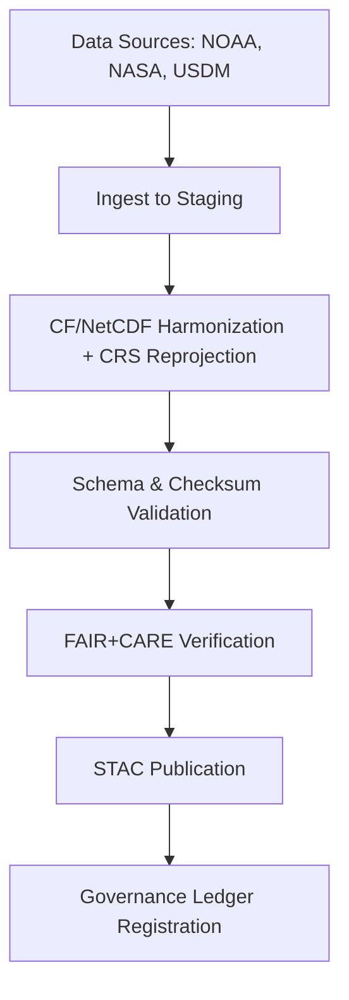

<div align="center">

# ⚙️ Kansas Frontier Matrix — **Climate ETL Process Logs**  
`data/work/tmp/climate/logs/etl/`

**Mission:** Provide **deterministic traceability** for every climate ETL operation — from ingestion and transformation to export and ledger registration — ensuring reproducibility, FAIR+CARE compliance, and auditable provenance.

[](https://github.com/bartytime4life/Kansas-Frontier-Matrix/actions/workflows/site.yml)
[]()
[](../../../../../reports/fair/climate_summary.json)
[]()
[]()

</div>

---

## 🧭 System Context

The ETL (Extract–Transform–Load) layer is the **spine of the Kansas Frontier Matrix** — responsible for normalizing, validating, and preparing climate datasets for FAIR+CARE publication.  
Every log entry under this directory represents an event, error, or validation from ETL workflows. These are machine-verifiable and ledger-registered for complete transparency.

**Pipeline Coverage:**
- Extraction from NOAA, NASA, USDM, and FAIR+CARE sources.  
- CF/NetCDF transformation, harmonization, and reprojection.  
- Schema validation, checksum audits, and STAC generation.  
- Ledger-backed logging of each transformation step.

> *“No transformation without truth — no ingestion without integrity.”*

---

## 🗂️ Directory Layout

```text
data/work/tmp/climate/logs/etl/
├── sources/                          # Logs from raw data ingestion
│   ├── ghcn_ingest_2025-10-27.log    # NOAA GHCN ingestion trace
│   ├── daymet_ingest_2025-10-27.log  # NASA Daymet grid fetch
│   └── usdm_ingest_2025-10-27.log    # Drought Monitor shapefile log
│
├── transforms/                       # CF/NetCDF compliance and reprojection
│   ├── cf_compliance_trace.json       # CF metadata normalization output
│   ├── reprojection_trace.log         # CRS reprojection operations
│   ├── tiling_resample.log            # Spatial resampling logs (PMTiles/COGs)
│   └── harmonization_summary.json     # CF harmonization + variable alignment
│
├── loads/                            # Export and loading operations
│   ├── parquet_load.log               # Load into parquet storage for analytics
│   ├── stac_publish.log               # STAC item registration and export
│   └── checksum_verification.log      # Checksum verification pre-export
│
├── manifests/                        # ETL manifest linking all logs by run
│   ├── etl_run_manifest.json          # Machine-readable summary of current run
│   ├── checksum_summary.json          # SHA-256 verification per log
│   └── lineage_trace.json             # Full lineage: source → transform → export
│
└── README.md
```

---

## ⚙️ Make Targets (ETL Ops)

```text
make etl-run                  # Execute full ETL pipeline and capture all logs
make etl-verify               # Verify CF, schema, and checksum integrity
make etl-stac                 # Build and publish STAC items to exports/stac_items/
make etl-ledger               # Register ETL metadata and checksum hashes in ledger
```

---

## 📊 ETL Process Flow (Simplified)



---

## 🧩 ETL Log Schema (Excerpt)

| Field | Description | Example |
|:------|:-------------|:----------|
| `run_id` | Unique ETL session ID | `etl-2025-10-27T00-00-00Z` |
| `source` | Data source identifier | `NOAA GHCN` |
| `process_stage` | ETL phase (extract, transform, load) | `transform` |
| `file_path` | Associated dataset path | `data/work/tmp/climate/staging/precip_tiles` |
| `checksum_sha256` | File checksum for reproducibility | `f4d2a6b98a...` |
| `status` | ETL step outcome | `success` |
| `timestamp` | Execution time (UTC) | `2025-10-27T00:00:00Z` |

---

## 🧮 Governance Lineage Matrix

| Stage | FAIR Dim. | MCP/ISO Ref | Purpose |
|:--------|:-----------|:--------------|:------------|
| Extraction | Findable | FAIR Principle F2 | Log source data and provenance |
| Transformation | Accessible | ISO 19115 / CF | Maintain metadata integrity |
| Validation | Provenance | MCP-DL v6.3 | Ensure deterministic transformations |
| Export | Reusable | STAC 1.0.0 | Guarantee standardized open data output |

---

## 📈 Validation Overview (Q4 2025)

| Check | Status | Verified By |
|:-------|:----------:|:-----------|
| CF Compliance | ✅ | @kfm-data |
| CRS Reprojection | ✅ | @kfm-climate |
| Schema Validation | ✅ | @kfm-governance |
| Checksum Integrity | ✅ | @kfm-security |
| STAC Publication | ✅ | @kfm-fair |

---

## ⛓️ Blockchain Provenance Record

```json
{
  "ledger_id": "climate-etl-ledger-2025-10-27",
  "run_id": "etl-2025-10-27T00-00-00Z",
  "sources": ["NOAA GHCN", "Daymet", "USDM"],
  "checksum_verified": true,
  "status": "complete",
  "fair_care_score": 100,
  "pgp_signature": "pgp-sha256:<signature-id>",
  "verified_by": "@kfm-governance",
  "timestamp": "2025-10-27T00:00:00Z"
}
```

---

## 🧩 Self-Audit Metadata

```json
{
  "readme_id": "KFM-DATA-WORK-CLIMATE-ETL-RMD-v9.3.0",
  "validated_by": "@kfm-data",
  "audit_status": "pass",
  "fair_care_score": 100.0,
  "cf_compliance": true,
  "stac_published": true,
  "checksum_integrity": "verified",
  "energy_wh": 22.4,
  "carbon_gco2e": 27.1,
  "ledger_hash": "b7f9a612ae14f9...",
  "governance_cycle": "Q4 2025"
}
```

---

## 🧾 Version History

| Version | Date | Author | Reviewer | FAIR/CARE | Ledger | Summary |
|:----------:|:-----------:|:-----------|:------------|:----------:|:-----------:|:-----------|
| v9.3.0 | 2025-10-27 | @kfm-data | @kfm-governance | ✅ | Ledger ✓ | Added manifests, lineage tracking, and CF harmonization reports |
| v9.2.0 | 2025-10-25 | @kfm-data | @kfm-fair | ✅ | ✓ | Integrated STAC validation + checksum ledger updates |
| v9.1.0 | 2025-10-23 | @kfm-climate | @kfm-security | ✅ | ✓ | Baseline ETL process logging established |

---

<div align="center">

### ⚙️ Kansas Frontier Matrix — *Integrity · Reproducibility · Transparency*  
**“The path from raw data to insight must always leave a verifiable trail.”**

[](https://github.com/bartytime4life/Kansas-Frontier-Matrix/actions/workflows/site.yml)
[]()
[]()
[]()
[]()

</div>