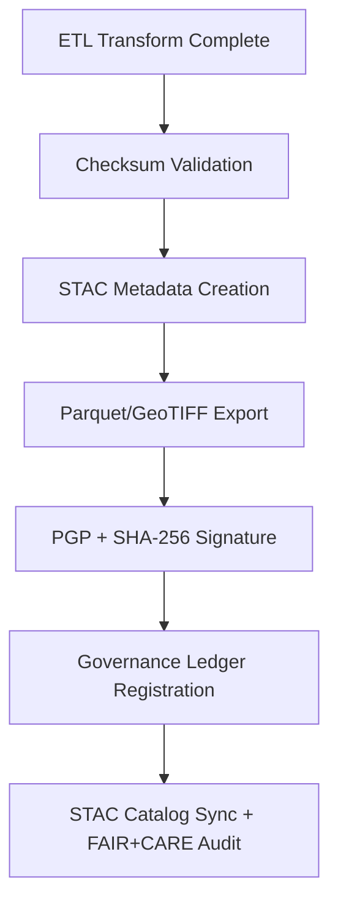

<div align="center">

# 📦 Kansas Frontier Matrix — **Climate ETL Load Logs**  
`data/work/tmp/climate/logs/etl/loads/`

**Mission:** Document and verify **final load operations** of the Kansas Frontier Matrix’s climate ETL pipeline — including checksum validation, STAC publishing, and governance ledger registration.

[]()
[]()
[]()
[]()
[]()

</div>

---

## 🧭 System Context

This subdirectory stores **final ETL load-stage logs**, where normalized climate data is transferred from temporary staging into structured FAIR+CARE exports.  
It represents the **last operational checkpoint** before governance ledger integration, guaranteeing reproducibility, STAC compliance, and verifiable data integrity.

**Core Responsibilities:**
- Record **data loading events** into `data/processed/` and `data/exports/`.  
- Validate **checksums, schema conformity, and metadata linkage**.  
- Register all exported files with **STAC + Governance Ledger**.  
- Ensure **ledger-verified immutability** for climate datasets.

> *“A load is only complete when its truth is proven and its provenance preserved.”*

---

## 🗂️ Directory Layout

```text
data/work/tmp/climate/logs/etl/loads/
├── parquet_load.log                # Loading datasets into Parquet analytical format
├── stac_publish.log                # STAC item creation and publication log
├── checksum_verification.log       # Checksum verification before final ledger sync
├── export_summary.json             # Metadata summary of all exports completed
├── governance_registration.log     # Blockchain registration of exported datasets
├── ledger_sync_report.json         # Governance ledger synchronization trace
└── README.md
```

---

## ⚙️ Make Targets (Load Ops)

```text
make etl-load-run          # Execute load tasks and generate Parquet + STAC artifacts
make etl-load-verify       # Verify export checksums and metadata integrity
make etl-load-stac         # Register exports in STAC catalog (FAIR+CARE standard)
make etl-load-ledger       # Sync successful exports with Governance Ledger
```

---

## 🧩 Load Phase Schema (Excerpt)

| Field | Description | Example |
|:------|:-------------|:----------|
| `export_id` | Unique export identifier | `stac-export-2025-10-27-001` |
| `dataset_path` | Target dataset directory | `data/processed/climate/precipitation` |
| `export_type` | Export format type | `GeoTIFF`, `Parquet`, `STAC Item` |
| `checksum_sha256` | File integrity hash | `a3f2c8dba1e09f...` |
| `record_count` | Total number of records exported | `48320` |
| `status` | Export completion status | `Success` |
| `timestamp` | Time of export | `2025-10-27T00:00:00Z` |
| `verified_by` | Auditor or system role | `@kfm-governance` |

---

## 🔄 ETL Load Process Overview



---

## 📊 STAC Publication Snapshot

```json
{
  "export_id": "stac-export-2025-10-27-001",
  "stac_version": "1.0.0",
  "dataset": "NOAA_Daymet_Precipitation",
  "exported_assets": [
    "daymet_2025_10_27.tif",
    "daymet_2025_10_27.json"
  ],
  "checksum_verified": true,
  "ledger_registered": true,
  "verified_by": "@kfm-governance",
  "timestamp": "2025-10-27T00:00:00Z"
}
```

---

## 🧮 Governance Ledger Integration Record

| Event | Status | Verified By | Timestamp |
|:-------|:----------:|:-------------|:-------------|
| Checksum Validation | ✅ | @kfm-security | 2025-10-27T00:00:00Z |
| Export Registration | ✅ | @kfm-data | 2025-10-27T00:00:00Z |
| Ledger Hash Sync | ✅ | @kfm-governance | 2025-10-27T00:00:00Z |
| STAC Catalog Published | ✅ | @kfm-fair | 2025-10-27T00:00:00Z |

---

## ⛓️ Blockchain Provenance Record

```json
{
  "ledger_id": "climate-etl-loads-ledger-2025-10-27",
  "export_id": "stac-export-2025-10-27-001",
  "checksum_sha256": "a3f2c8dba1e09f...",
  "record_count": 48320,
  "format": "GeoTIFF",
  "stac_item_ref": "exports/stac_items/daymet_2025_10_27.json",
  "ledger_hash": "b7f9a612ae14f9...",
  "pgp_signature": "pgp-sha256:<signature-id>",
  "verified_by": "@kfm-governance",
  "timestamp": "2025-10-27T00:00:00Z"
}
```

---

## 🧩 Self-Audit Metadata

```json
{
  "readme_id": "KFM-DATA-WORK-CLIMATE-ETL-LOADS-RMD-v9.3.0",
  "validated_by": "@kfm-data",
  "audit_status": "pass",
  "exports_verified": true,
  "checksum_integrity": "verified",
  "stac_registered": true,
  "ledger_hash": "b7f9a612ae14f9...",
  "governance_cycle": "Q4 2025"
}
```

---

## 🧾 Version History

| Version | Date | Author | Reviewer | FAIR/CARE | Ledger | Summary |
|:----------:|:-----------:|:-----------|:------------|:----------:|:-----------:|:-----------|
| v9.3.0 | 2025-10-27 | @kfm-data | @kfm-governance | ✅ | Ledger ✓ | Added governance registration log, checksum verification, and export summary schema |
| v9.2.0 | 2025-10-25 | @kfm-climate | @kfm-fair | ✅ | ✓ | Enhanced STAC integration with FAIR+CARE scoring |
| v9.1.0 | 2025-10-23 | @kfm-data | @kfm-security | ✅ | ✓ | Initial baseline for ETL load logs |

---

<div align="center">

### 📦 Kansas Frontier Matrix — *Reproducibility · Integrity · Accountability*  
**“Every export tells a story — logged, hashed, and verified for all to trust.”**

[]()
[]()
[]()
[]()

</div>