<div align="center">

# 🧾 Kansas Frontier Matrix — **Climate ETL Manifests**  
`data/work/tmp/climate/logs/etl/manifests/`

**Mission:** Serve as the **canonical ledger of provenance** for every Kansas Frontier Matrix ETL process — recording ingestion lineage, transformation traceability, checksum validation, and governance registration for FAIR+CARE certification.

[]()
[]()
[]()
[]()
[]()

</div>

---

## 🧭 System Context

The ETL manifests capture **complete pipeline metadata**, including inputs, transformations, exports, and ledger registration.  
Each manifest provides **machine-verifiable lineage**, ensuring the entire ETL process is deterministic, traceable, and reproducible across environments.

**Responsibilities:**
- Record all **ingest, transform, and load** events for every run.  
- Store **checksums, timestamps, and PGP signatures** for provenance integrity.  
- Maintain cross-links to STAC, FAIR, and Governance Ledger references.  
- Provide auditable, JSON-based provenance for FAIR+CARE reproducibility.  

> *“If it’s not in the manifest, it didn’t happen — provenance is truth made permanent.”*

---

## 🗂️ Directory Layout

```text
data/work/tmp/climate/logs/etl/manifests/
├── etl_run_manifest.json           # Complete index of ETL runs and metadata
├── checksum_summary.json           # Checksum validation results per stage
├── lineage_trace.json              # Source → Transform → Export lineage graph
├── validation_summary.json         # FAIR+CARE and schema validation status
├── governance_registration.json    # Governance ledger registration events
├── manifest_audit_report.pdf       # Human-readable audit summary
└── README.md
```

---

## ⚙️ Make Targets (Manifest Ops)

```text
make etl-manifest-build        # Generate ETL manifests with lineage + checksums
make etl-manifest-verify       # Verify integrity and schema compliance
make etl-manifest-ledger       # Register manifest hashes in Governance Ledger
make etl-manifest-audit        # Produce human-readable FAIR+CARE provenance report
```

---

## 🧩 Manifest Schema (Excerpt)

| Field | Description | Example |
|:------|:-------------|:----------|
| `run_id` | Unique identifier for ETL process | `etl-2025-10-27T00-00-00Z` |
| `sources` | Data inputs used in run | `["NOAA GHCN", "Daymet", "USDM"]` |
| `process_stages` | ETL stages executed | `["extract", "transform", "load"]` |
| `checksum_summary` | SHA-256 hashes for key artifacts | `{"transform": "b7f9a6..."}` |
| `stac_exports` | STAC item or collection paths | `exports/stac_items/daymet_2025_10_27.json` |
| `ledger_registered` | Boolean for Governance Ledger sync | `true` |
| `verified_by` | Validator ID or org | `@kfm-governance` |
| `timestamp` | Manifest creation time | `2025-10-27T00:00:00Z` |

---

## 🧬 ETL Provenance Flow (FAIR+CARE Lineage)

```mermaid
graph TD
A[Source Ingest: NOAA, NASA, USDM] --> B[Transformation · CF Compliance · QA/QC]
B --> C[Checksum + FAIR Validation]
C --> D[STAC Export + Load Stage]
D --> E[Manifest Creation · Governance Hash]
E --> F[Immutable Registration in Blockchain Ledger]
```



---

## 📊 Manifest Validation Dashboard (Q4 2025)

| Checkpoint | Status | Verified By | Notes |
|:-------------|:-----------:|:-------------|:-----------|
| Source Ingestion | ✅ | @kfm-data | NOAA/Daymet validated |
| Transformation | ✅ | @kfm-climate | CF-compliant & harmonized |
| Schema Validation | ✅ | @kfm-fair | FAIR+CARE alignment |
| Checksum Verification | ✅ | @kfm-security | SHA-256 verified |
| Ledger Registration | ✅ | @kfm-governance | Immutable + signed |

---

## ⛓️ Blockchain Provenance Record

```json
{
  "ledger_id": "climate-etl-manifest-ledger-2025-10-27",
  "run_id": "etl-2025-10-27T00-00-00Z",
  "checksum_verified": true,
  "stac_exports": ["exports/stac_items/daymet_2025_10_27.json"],
  "ledger_registered": true,
  "fair_care_validated": true,
  "pgp_signature": "pgp-sha256:<signature-id>",
  "ledger_hash": "f4d2a6b98a...",
  "verified_by": "@kfm-governance",
  "timestamp": "2025-10-27T00:00:00Z"
}
```

---

## 🧮 FAIR+CARE Provenance Matrix

| FAIR Dim. | CARE Dim. | Property | Reference | Purpose |
|:------------|:-----------|:-----------|:------------|:-----------|
| **Findable** | Collective Benefit | `run_id` | FAIR Principle F1 | Identify ETL lineage |
| **Accessible** | Responsibility | `checksum_summary.json` | FAIR Principle A2 | Guarantee data integrity |
| **Interoperable** | Ethics | `stac_exports` | FAIR Principle I3 | Promote open integration |
| **Reusable** | Equity | `governance_registration.json` | FAIR Principle R1 | Ensure long-term accountability |

---

## 🧩 Self-Audit Metadata

```json
{
  "readme_id": "KFM-DATA-WORK-CLIMATE-ETL-MANIFESTS-RMD-v9.3.0",
  "validated_by": "@kfm-governance",
  "audit_status": "pass",
  "checksums_verified": true,
  "stac_exports_registered": true,
  "ledger_registration": "complete",
  "fair_care_validated": true,
  "ledger_hash": "b7f9a612ae14f9...",
  "governance_cycle": "Q4 2025"
}
```

---

## 🧾 Version History

| Version | Date | Author | Reviewer | FAIR/CARE | Ledger | Summary |
|:----------:|:-----------:|:-----------|:------------|:----------:|:-----------:|:-----------|
| v9.3.0 | 2025-10-27 | @kfm-data | @kfm-governance | ✅ | Ledger ✓ | Added governance manifest schema, checksum summary, lineage trace |
| v9.2.0 | 2025-10-25 | @kfm-climate | @kfm-fair | ✅ | ✓ | Enhanced STAC provenance and FAIR+CARE validation |
| v9.1.0 | 2025-10-23 | @kfm-data | @kfm-security | ✅ | ✓ | Baseline manifest tracking introduced |

---

<div align="center">

### 🧾 Kansas Frontier Matrix — *Lineage · Integrity · Accountability*  
**“Data integrity is not just recorded — it’s proven, signed, and forever traceable.”**

[]()
[]()
[]()
[]()
[]()

</div>