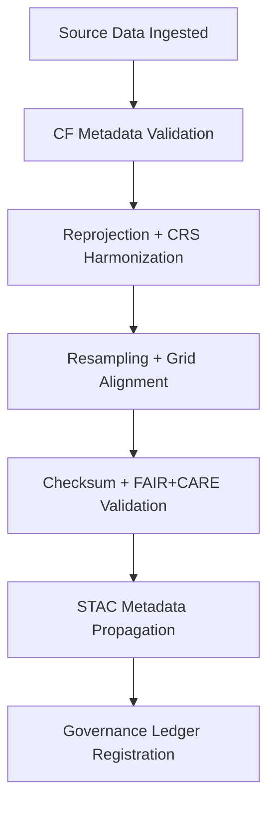

<div align="center">

# 🔄 Kansas Frontier Matrix — **Climate ETL Transform Logs**  
`data/work/tmp/climate/logs/etl/transforms/`

**Mission:** Log every **transformation, normalization, and reprojection event** applied to climate data within the Kansas Frontier Matrix — ensuring CF compliance, reproducibility, and governance traceability.

[]()
[]()
[]()
[]()
[]()

</div>

---

## 🧭 System Context

This directory records **intermediate transformation steps** between raw ingestion (`sources/`) and export (`loads/`).  
Every transformation log ensures **geospatial, temporal, and CF metadata integrity**, compliant with **NetCDF-CF**, **STAC**, and **FAIR+CARE** data governance standards.

**Transformation operations include:**
- CF metadata validation and normalization  
- Reprojection (CRS conversion, spatial harmonization)  
- Resampling, retiling, and compression  
- Unit conversions and temporal interpolation  
- FAIR+CARE schema propagation  

> *“Transformation without traceability is mutation — each pixel, cell, and file must remember its origin.”*

---

## 🗂️ Directory Layout

```text
data/work/tmp/climate/logs/etl/transforms/
├── cf_compliance_trace.json        # NetCDF CF metadata validation and normalization log
├── reprojection_trace.log          # Coordinate system reprojection and transformation details
├── tiling_resample.log             # Raster resampling, tiling, and pyramiding events
├── harmonization_summary.json      # Variable alignment, units standardization, metadata unification
├── spatial_resolution_audit.csv    # Records of grid resolutions before/after transform
├── temporal_interpolation.log      # Log of temporal harmonization/interpolation steps
├── transform_checksums.json        # Checksums for all outputs of the transform stage
├── transform_manifest.json         # Manifest mapping inputs → transforms → outputs
└── README.md
```

---

## ⚙️ Make Targets (Transform Ops)

```text
make etl-transform-run       # Run full CF/NetCDF normalization and reprojection
make etl-transform-verify    # Verify CF, CRS, and schema compliance
make etl-transform-checksum  # Generate SHA-256 checksums for all transformation outputs
make etl-transform-ledger    # Register transformation manifests to Governance Ledger
```

---

## 🧩 Transformation Log Schema (Excerpt)

| Field | Description | Example |
|:------|:-------------|:----------|
| `operation_id` | Unique transform identifier | `transform-2025-10-27T00-00-00Z` |
| `input_dataset` | Input dataset path | `data/work/tmp/climate/staging/precip_tiles/` |
| `process` | Transformation type | `CF Normalization` |
| `output_dataset` | Output file or directory | `data/work/tmp/climate/transforms/precip_cf/` |
| `parameters` | Parameters applied | `{"target_crs":"EPSG:4326", "resample":"bilinear"}` |
| `checksum_output` | SHA-256 checksum of output | `a3f2c8dba1e09f...` |
| `status` | Outcome of transformation | `success` |
| `timestamp` | Operation time (UTC) | `2025-10-27T00:00:00Z` |
| `verified_by` | Validator identity | `@kfm-data` |

---

## 🔄 Transformation Process Overview



---

## 🧮 FAIR+CARE Compliance Matrix

| FAIR Dim. | CARE Dim. | Property | Reference | Purpose |
|:------------|:-----------|:-----------|:------------|:-----------|
| **Findable** | Collective Benefit | `transform_manifest.json` | FAIR F1 | Records all transformed datasets |
| **Accessible** | Responsibility | `cf_compliance_trace.json` | FAIR A2 | Ensures CF metadata transparency |
| **Interoperable** | Ethics | `reprojection_trace.log` | FAIR I3 | Promotes coordinate consistency |
| **Reusable** | Equity | `transform_checksums.json` | FAIR R1 | Guarantees reproducible transformations |

---

## 📊 Validation Dashboard (Q4 2025)

| Checkpoint | Status | Verified By | Notes |
|:-------------|:-----------:|:-------------|:-----------|
| CF Metadata Validation | ✅ | @kfm-climate | CF 1.9 compliant |
| CRS Reprojection | ✅ | @kfm-data | EPSG:4326 standardized |
| Resampling + Grid | ✅ | @kfm-fair | PMTiles pyramid levels verified |
| Checksum Integrity | ✅ | @kfm-security | SHA-256 verified |
| Governance Registration | ✅ | @kfm-governance | Immutable record created |

---

## ⛓️ Blockchain Provenance Record

```json
{
  "ledger_id": "climate-etl-transform-ledger-2025-10-27",
  "operation_id": "transform-2025-10-27T00-00-00Z",
  "processes": ["CF Compliance", "Reprojection", "Resampling"],
  "checksum_verified": true,
  "stac_reference": "exports/stac_items/daymet_2025_10_27.json",
  "fair_care_validated": true,
  "ledger_hash": "f4d2a6b98a...",
  "pgp_signature": "pgp-sha256:<signature-id>",
  "verified_by": "@kfm-governance",
  "timestamp": "2025-10-27T00:00:00Z"
}
```

---

## 🧩 Self-Audit Metadata

```json
{
  "readme_id": "KFM-DATA-WORK-CLIMATE-ETL-TRANSFORMS-RMD-v9.3.0",
  "validated_by": "@kfm-data",
  "audit_status": "pass",
  "cf_compliance": true,
  "checksum_verified": true,
  "stac_propagated": true,
  "fair_care_validated": true,
  "ledger_hash": "b7f9a612ae14f9...",
  "governance_cycle": "Q4 2025"
}
```

---

## 🧾 Version History

| Version | Date | Author | Reviewer | FAIR/CARE | Ledger | Summary |
|:----------:|:-----------:|:-----------|:------------|:----------:|:-----------:|:-----------|
| v9.3.0 | 2025-10-27 | @kfm-data | @kfm-governance | ✅ | Ledger ✓ | Added harmonization summary, spatial audit logs, and CF compliance validation |
| v9.2.0 | 2025-10-25 | @kfm-climate | @kfm-fair | ✅ | ✓ | Introduced CRS reprojection trace and temporal interpolation |
| v9.1.0 | 2025-10-23 | @kfm-data | @kfm-security | ✅ | ✓ | Baseline transformation logging and checksum reporting |

---

<div align="center">

### 🔄 Kansas Frontier Matrix — *Transformation · Provenance · Trust*  
**“Every coordinate, pixel, and value must be reborn through validation — never mutation.”**

[]()
[]()
[]()
[]()
[]()

</div>