<div align="center">

# 🕓 Kansas Frontier Matrix — **Processing Session 2025-10-27T00-00-00Z**  
`data/work/tmp/climate/logs/sessions/2025-10-27T00-00-00Z/`

**Mission:** Document the **complete execution record** for the Kansas Frontier Matrix climate pipeline on October 27 2025 00:00 UTC — linking ETL, validation, AI explainability, and energy telemetry under FAIR+CARE governance.

[]()
[]()
[]()
[]()
[]()

</div>

---

## 🧭 Session Overview

This folder contains the **full provenance record** for the ETL + AI processing session executed at  
**2025-10-27 00:00 UTC**, covering NOAA GHCN, NASA Daymet, and USDM datasets.

**Scope:**
- Extracted 3 climate sources (GHCN v5, Daymet v4, USDM v3).  
- Transformed ~12 GB NetCDF + GeoTIFF grids → CF/FAIR compliant formats.  
- Validated STAC 1.0 items and AI explainability metrics (`focus-climate-v4`).  
- Registered all outputs and energy telemetry into the Governance Ledger.

> *“A session is the heartbeat of provenance — everything reproducible, nothing hidden.”*

---

## 🗂️ Files in This Session

```text
data/work/tmp/climate/logs/sessions/2025-10-27T00-00-00Z/
├── session.json                 # Core session metadata
├── etl_link.log                 # Link to ETL process logs
├── validation_link.log          # Link to validation results
├── ai_focus_trace.json          # AI explainability + drift metrics
├── performance_summary.json     # Runtime performance & timing
├── environment_snapshot.yaml    # Software versions, env vars, hardware spec
├── energy_audit_ref.json        # Reference to energy/ISO telemetry
├── governance_signature.asc     # PGP-signed ledger verification file
├── manifest_checksums.json      # SHA-256 for all session outputs
└── README.md
```

---

## ⚙️ Key Parameters

| Parameter | Value |
|:-----------|:-----------|
| Session ID | 2025-10-27T00-00-00Z |
| Executor | @kfm-data |
| Mode | Automated (CI/CD) |
| ETL Status | ✅ Success |
| Validation Status | ✅ Passed |
| AI Focus Score (Mean) | 0.988 |
| FAIR+CARE Score | 100 % |
| Energy Use (Wh) | 22.4 |
| Carbon Output (gCO₂e) | 27.1 |
| Governance Ledger Sync | ✅ Complete |

---

## 🧩 Provenance Graph

```mermaid
graph TD
A[Session Start: 2025-10-27T00-00-00Z] --> B[ETL Extraction + CF Transformation]
B --> C[Validation · FAIR+CARE · STAC]
C --> D[AI Explainability · Drift Detection]
D --> E[Checksum + PGP Signing]
E --> F[Governance Ledger Registration]
F --> G[Session Archive + Symbolic Link → latest]
```



---

## 🧮 Session Summary

```json
{
  "session_id": "2025-10-27T00-00-00Z",
  "etl_status": "success",
  "validation_status": "passed",
  "ai_focus_score": 0.988,
  "fair_care_score": 100,
  "energy_wh": 22.4,
  "carbon_gco2e": 27.1,
  "checksum_verified": true,
  "ledger_registered": true,
  "pgp_signature": "pgp-sha256:<signature-id>",
  "timestamp": "2025-10-27T00:00:00Z",
  "verified_by": "@kfm-governance"
}
```

---

## 📈 Performance & Telemetry Snapshot

| Metric | Value | Notes |
|:---------|:-------:|:----------|
| Total Runtime | 00:23:41 | End-to-end execution |
| CPU Utilization | 73 % | Consistent with baseline |
| Memory Use | 64 % | Optimized caching enabled |
| Disk IO | 129 MB/s | Stable throughput |
| Renewable Offset | 100 % | RE100 alignment verified |

---

## ⛓️ Blockchain Provenance Record

```json
{
  "ledger_id": "climate-session-ledger-2025-10-27",
  "session_id": "2025-10-27T00-00-00Z",
  "checksum_verified": true,
  "ai_focus_score": 0.988,
  "energy_wh": 22.4,
  "carbon_gco2e": 27.1,
  "ledger_hash": "b7f9a612ae14f9...",
  "verified_by": "@kfm-governance",
  "timestamp": "2025-10-27T00:00:00Z"
}
```

---

## 🧩 Self-Audit Metadata

```json
{
  "readme_id": "KFM-DATA-WORK-CLIMATE-SESSION-2025-10-27-RMD-v9.3.0",
  "validated_by": "@kfm-data",
  "audit_status": "pass",
  "checksum_integrity": "verified",
  "stac_validated": true,
  "fair_care_validated": true,
  "ledger_registered": true,
  "energy_wh": 22.4,
  "carbon_gco2e": 27.1,
  "governance_cycle": "Q4 2025"
}
```

---

## 🧾 Version History

| Version | Date | Author | Reviewer | FAIR/CARE | Ledger | Summary |
|:---------:|:-----------:|:-----------|:-----------|:----------:|:-----------:|:-----------|
| v9.3.0 | 2025-10-27 | @kfm-data | @kfm-governance | ✅ | Ledger ✓ | Recorded full provenance and telemetry for 2025-10-27 session |
| v9.2.0 | 2025-10-25 | @kfm-climate | @kfm-fair | ✅ | ✓ | Enhanced AI focus trace integration |
| v9.1.0 | 2025-10-23 | @kfm-data | @kfm-security | ✅ | ✓ | Initial session metadata schema |

---

<div align="center">

### 🕓 Kansas Frontier Matrix — *Reproducibility · Accountability · Transparency*  
**“Each session is a chapter in Kansas’s climate story — verifiable, FAIR, and forever preserved.”**

[]()
[]()
[]()
[]()

</div>