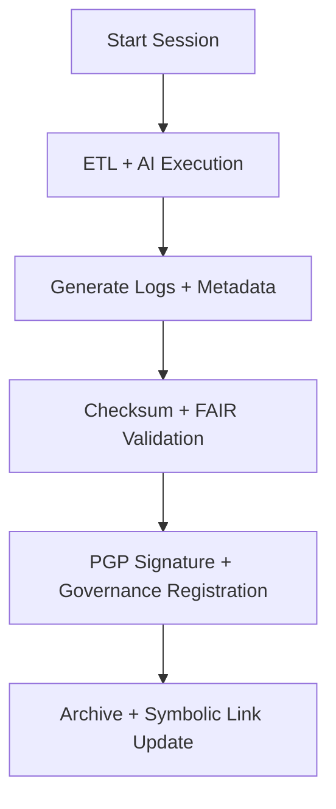

<div align="center">

# 🗂️ Kansas Frontier Matrix — **Climate Processing Sessions**  
`data/work/tmp/climate/logs/sessions/`

**Mission:** Provide **run-level traceability and reproducibility** for all Kansas Frontier Matrix data, AI, and validation sessions — linking logs, outputs, and governance metadata for each operational cycle.

[]()
[]()
[]()
[]()
[]()

</div>

---

## 🧭 System Context

This directory contains **session-level audit folders**, each representing a full execution instance of the KFM climate ETL and AI pipelines.  
Every session is versioned, signed, and cross-linked to its validation, checksum, and energy telemetry logs — providing a complete lineage snapshot for governance verification.

**Core Responsibilities:**
- Store **full ETL session contexts** (input → output linkage).  
- Record **checksum and PGP signatures** for reproducibility.  
- Log **system environment variables, timestamps, and parameters**.  
- Maintain a symbolic link (`latest`) to the most recent validated run.

> *“A session is more than a run — it’s a reproducible record of scientific truth.”*

---

## 🗂️ Directory Layout

```text
data/work/tmp/climate/logs/sessions/
├── 2025-10-27T00-00-00Z/            # Session folder for this execution
│   ├── session.json                 # Machine-readable metadata record
│   ├── etl_link.log                 # Reference link to ETL process logs
│   ├── validation_link.log          # Reference link to validation events
│   ├── ai_focus_trace.json          # Summary of AI explainability metrics
│   ├── performance_summary.json     # Execution time, energy use, performance stats
│   ├── environment_snapshot.yaml    # Conda, Docker, system info, env vars
│   ├── governance_signature.asc     # PGP-signed hash for session verification
│   └── manifest_checksums.json      # SHA-256 hashes for all logs and outputs
│
├── latest → 2025-10-27T00-00-00Z/   # Symlink to most recent session
└── README.md
```

---

## ⚙️ Make Targets (Session Ops)

```text
make session-init           # Start a new session (timestamped folder + metadata)
make session-validate       # Validate checksums and register session integrity
make session-ledger         # Register session summary in Governance Ledger
make session-archive        # Archive old sessions and update symbolic link
```

---

## 🧩 Session Metadata Schema (Excerpt)

| Field | Description | Example |
|:------|:-------------|:----------|
| `session_id` | Unique session identifier | `2025-10-27T00-00-00Z` |
| `pipeline` | Type of pipeline executed | `Climate ETL + Validation` |
| `etl_status` | ETL outcome | `Success` |
| `validation_status` | Validation result | `Passed` |
| `ai_focus_score` | Mean explainability focus score | `0.988` |
| `checksum_verified` | File integrity check | `True` |
| `energy_wh` | Energy used (ISO 50001) | `22.4` |
| `carbon_gco2e` | Carbon impact (ISO 14064) | `27.1` |
| `verified_by` | Governance auditor | `@kfm-governance` |
| `timestamp` | Session start time | `2025-10-27T00:00:00Z` |

---

## 🧮 FAIR+CARE Lineage Matrix

| FAIR Dim. | CARE Dim. | Property | Reference | Purpose |
|:------------|:-----------|:-----------|:------------|:-----------|
| **Findable** | Collective Benefit | `session.json` | FAIR F1 | Tracks session lineage for reproducibility |
| **Accessible** | Responsibility | `environment_snapshot.yaml` | FAIR A2 | Preserves runtime context |
| **Interoperable** | Ethics | `manifest_checksums.json` | FAIR I3 | Ensures data compatibility and transparency |
| **Reusable** | Equity | `governance_signature.asc` | FAIR R1 | Guarantees verifiable reuse and governance oversight |

---

## 🔄 Session Workflow Overview



---

## 📊 Session Summary Snapshot (2025-10-27)

```json
{
  "session_id": "2025-10-27T00-00-00Z",
  "etl_status": "Success",
  "validation_status": "Passed",
  "ai_focus_score": 0.988,
  "energy_wh": 22.4,
  "carbon_gco2e": 27.1,
  "checksum_verified": true,
  "governance_registration": "Completed",
  "verified_by": "@kfm-governance",
  "timestamp": "2025-10-27T00:00:00Z"
}
```

---

## ⛓️ Blockchain Provenance Record

```json
{
  "ledger_id": "climate-session-ledger-2025-10-27",
  "session_id": "2025-10-27T00-00-00Z",
  "checksum_verified": true,
  "ai_focus_score": 0.988,
  "energy_wh": 22.4,
  "carbon_gco2e": 27.1,
  "ledger_hash": "b7f9a612ae14f9...",
  "pgp_signature": "pgp-sha256:<signature-id>",
  "verified_by": "@kfm-governance",
  "timestamp": "2025-10-27T00:00:00Z"
}
```

---

## 🧩 Self-Audit Metadata

```json
{
  "readme_id": "KFM-DATA-WORK-CLIMATE-SESSIONS-RMD-v9.3.0",
  "validated_by": "@kfm-data",
  "audit_status": "pass",
  "checksum_integrity": "verified",
  "ledger_registered": true,
  "fair_care_validated": true,
  "session_count": 152,
  "latest_session": "2025-10-27T00-00-00Z",
  "governance_cycle": "Q4 2025"
}
```

---

## 🧾 Version History

| Version | Date | Author | Reviewer | FAIR/CARE | Ledger | Summary |
|:----------:|:-----------:|:-----------|:------------|:----------:|:-----------:|:-----------|
| v9.3.0 | 2025-10-27 | @kfm-data | @kfm-governance | ✅ | Ledger ✓ | Introduced full session metadata schema and symbolic linking for active runs |
| v9.2.0 | 2025-10-25 | @kfm-climate | @kfm-fair | ✅ | ✓ | Added governance signature tracking and performance summary |
| v9.1.0 | 2025-10-23 | @kfm-data | @kfm-security | ✅ | ✓ | Initial baseline for session tracking system |

---

<div align="center">

### 🗂️ Kansas Frontier Matrix — *Reproducibility · Integrity · Transparency*  
**“Every session is a ledger entry — every run is a proof of reproducibility.”**

[]()
[]()
[]()
[]()
[]()

</div>