<div align="center">

# 🧮 Kansas Frontier Matrix — **Climate Temporary Logs**  
`data/work/tmp/climate/logs/tmp/`

**Mission:** Provide a **sandboxed logging area** for ephemeral, debug, and scratch files generated during ETL, AI, or validation cycles in the Kansas Frontier Matrix — with governance-controlled retention and checksum verification for temporary data handling.

[]()
[]()
[]()
[]()
[]()

</div>

---

## 🧭 System Context

This directory hosts **short-lived, automatically purged logs and intermediate debug outputs** created during temporary ETL and AI pipeline executions.  
It ensures temporary artifacts are isolated, encrypted where needed, and lifecycle-managed under **MCP-DL v6.3** and **ISO 27001** compliance.

**Use Cases:**
- ETL and AI intermediate step debugging.  
- FAIR+CARE schema and checksum validation dry runs.  
- Controlled retention for ephemeral validation data.  
- Secure sandbox for CI/CD and governance pre-checks.  

> *“Even the temporary deserves integrity — logs may vanish, but their traces remain auditable.”*

---

## 🗂️ Directory Layout

```text
data/work/tmp/climate/logs/tmp/
├── debug_session_2025-10-27.log      # Temporary debug trace for ETL/AI session
├── validation_dryrun_output.json     # FAIR+CARE schema validation test log
├── checksum_sandbox_report.log       # Sandbox checksum verification report
├── tmp_manifest.json                 # Index of temporary logs and metadata
├── cleanup_schedule.yaml             # Rules defining retention and purge intervals
├── governance_purge_log.json         # Governance record of deletion cycles
└── README.md
```

---

## ⚙️ Make Targets (Temporary Ops)

```text
make tmp-log-init          # Initialize temporary logging sandbox
make tmp-log-validate      # Validate temporary FAIR+CARE schema outputs
make tmp-log-purge         # Securely remove temporary logs after governance sign-off
make tmp-log-ledger        # Record purge summary in Governance Ledger
```

---

## 🧩 Temporary Log Schema (Excerpt)

| Field | Description | Example |
|:------|:-------------|:----------|
| `tmp_id` | Temporary operation identifier | `tmp-session-2025-10-27T00-00-00Z` |
| `origin` | Source process or subsystem | `ETL Validation` |
| `file_name` | Temporary log or artifact name | `validation_dryrun_output.json` |
| `checksum` | File integrity verification hash | `f4d2a6b98a...` |
| `size_kb` | File size in kilobytes | `184.2` |
| `expiration` | Scheduled cleanup date | `2025-10-30T00:00:00Z` |
| `retention_policy` | Lifecycle management rule | `3-day auto purge` |
| `verified_by` | User or process verifying log integrity | `@kfm-data` |
| `timestamp` | Creation timestamp | `2025-10-27T00:00:00Z` |

---

## 🧮 FAIR+CARE Lifecycle Governance Matrix

| FAIR Dim. | CARE Dim. | Property | Reference | Purpose |
|:------------|:-----------|:-----------|:------------|:-----------|
| **Findable** | Collective Benefit | `tmp_manifest.json` | FAIR F1 | Tracks all ephemeral logs generated |
| **Accessible** | Responsibility | `cleanup_schedule.yaml` | FAIR A2 | Defines secure deletion policies |
| **Interoperable** | Ethics | `validation_dryrun_output.json` | FAIR I3 | Supports validation pre-runs |
| **Reusable** | Equity | `governance_purge_log.json` | FAIR R1 | Ensures governance oversight on purge actions |

---

## 🔄 Temporary Log Lifecycle

```mermaid
flowchart TD
A[Temporary Log Created] --> B[Checksum Verification + FAIR Validation]
B --> C[Usage in Validation/Debug Cycle]
C --> D[Marked for Purge · Cleanup Schedule]
D --> E[PGP-Signed Purge Record Created]
E --> F[Governance Ledger Registration]
```



---

## 📊 Governance Retention Overview (Q4 2025)

| Log Category | Retention Policy | Auto-Purge | Ledger Logged | Verified By |
|:---------------|:----------------:|:-------------:|:----------------:|:--------------:|
| Debug Logs | 3 days | ✅ | ✅ | @kfm-data |
| Validation Dry Runs | 7 days | ✅ | ✅ | @kfm-governance |
| Checksum Sandbox | 24 hrs | ✅ | ✅ | @kfm-security |
| System Temp Files | Immediate | ✅ | ✅ | @kfm-architecture |

---

## ⛓️ Blockchain Provenance Record

```json
{
  "ledger_id": "climate-tmp-logs-ledger-2025-10-27",
  "tmp_id": "tmp-session-2025-10-27T00-00-00Z",
  "checksum_verified": true,
  "retention_policy": "3-day auto purge",
  "purge_confirmed": true,
  "ledger_hash": "b7f9a612ae14f9...",
  "pgp_signature": "pgp-sha256:<signature-id>",
  "verified_by": "@kfm-security",
  "timestamp": "2025-10-27T00:00:00Z"
}
```

---

## 🧩 Self-Audit Metadata

```json
{
  "readme_id": "KFM-DATA-WORK-CLIMATE-TMP-LOGS-RMD-v9.3.0",
  "validated_by": "@kfm-governance",
  "audit_status": "pass",
  "checksum_integrity": "verified",
  "retention_policy": "auto",
  "purge_verified": true,
  "ledger_hash": "b7f9a612ae14f9...",
  "governance_cycle": "Q4 2025"
}
```

---

## 🧾 Version History

| Version | Date | Author | Reviewer | FAIR/CARE | Ledger | Summary |
|:----------:|:-----------:|:-----------|:------------|:----------:|:-----------:|:-----------|
| v9.3.0 | 2025-10-27 | @kfm-data | @kfm-governance | ✅ | Ledger ✓ | Added governance purge tracking, checksum sandbox, lifecycle schema |
| v9.2.0 | 2025-10-25 | @kfm-security | @kfm-fair | ✅ | ✓ | Integrated cleanup scheduling and ephemeral log manifests |
| v9.1.0 | 2025-10-23 | @kfm-data | @kfm-security | ✅ | ✓ | Initial baseline for temporary debug logs |

---

<div align="center">

### 🧮 Kansas Frontier Matrix — *Integrity · Ephemerality · Governance*  
**“Even fleeting data deserves stewardship — every log begins with transparency and ends with trust.”**

[]()
[]()
[]()
[]()
[]()

</div>