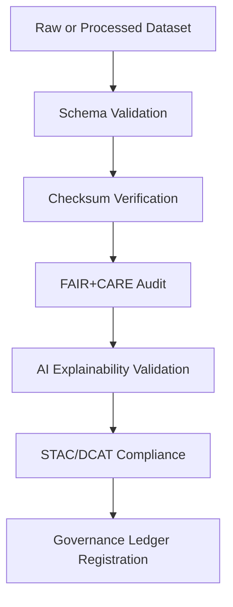

<div align="center">

# ✅ Kansas Frontier Matrix — **Climate Validation Logs**  
`data/work/tmp/climate/logs/validation/`

**Mission:** Record every **schema, checksum, FAIR+CARE, and AI explainability validation** event for Kansas Frontier Matrix climate workflows — ensuring that all datasets meet reproducibility, integrity, and ethical compliance standards.

[]()
[]()
[]()
[]()
[]()

</div>

---

## 🧭 System Context

This directory serves as the **validation nerve center** for the KFM climate pipelines.  
Every record here documents validation tasks performed on datasets, models, or exports — from schema checks and checksum audits to FAIR+CARE and explainability certification.

**Core Validation Processes:**
- Schema compliance (`.json`, `.geojson`, `.tif`, `.nc`).  
- Checksum and cryptographic integrity verification.  
- FAIR+CARE and ISO-based quality assessments.  
- AI explainability trace verification and ethics reviews.  
- STAC and DCAT metadata validation for global interoperability.

> *“Validation is the conscience of data — ensuring what we share is what we can stand by.”*

---

## 🗂️ Directory Layout

```text
data/work/tmp/climate/logs/validation/
├── schema_report.json                # Schema validation report (CF, STAC, FAIR)
├── checksums.json                    # Hashes for all verified datasets and exports
├── faircare_report.json              # FAIR+CARE compliance validation results
├── ai_explainability.json            # AI explainability audit trace
├── stac_validate_output.json         # STAC schema and item validation
├── checksum_audit_history.log        # Rolling log of integrity verification operations
├── validation_manifest.json          # Manifest linking all validation reports
└── README.md
```

---

## ⚙️ Make Targets (Validation Ops)

```text
make validation-run          # Run all schema, checksum, and FAIR+CARE validations
make validation-ai-check     # Run AI explainability and focus score audits
make validation-stac         # Validate STAC/FAIR schema and catalog relationships
make validation-ledger       # Register validation results into Governance Ledger
```

---

## 🧩 Validation Log Schema (Excerpt)

| Field | Description | Example |
|:------|:-------------|:----------|
| `validation_id` | Unique validation identifier | `validate-2025-10-27T00-00-00Z` |
| `file_path` | Path to dataset validated | `data/work/tmp/climate/exports/stac_items/daymet_2025_10_27.json` |
| `schema` | Schema applied | `STAC 1.0.0` |
| `checksum_sha256` | File integrity hash | `f4d2a6b98a...` |
| `fair_care_score` | FAIR+CARE compliance score | `100` |
| `ai_explainability` | Mean focus score from AI audit | `0.988` |
| `status` | Validation result | `Passed` |
| `timestamp` | Validation date (UTC) | `2025-10-27T00:00:00Z` |
| `verified_by` | Auditor or process ID | `@kfm-governance` |

---

## 🧮 FAIR+CARE Validation Matrix

| FAIR Dim. | CARE Dim. | Property | Reference | Purpose |
|:------------|:-----------|:-----------|:------------|:-----------|
| **Findable** | Collective Benefit | `schema_report.json` | FAIR F1 | Ensures discoverable metadata |
| **Accessible** | Responsibility | `checksums.json` | FAIR A2 | Guarantees open and verifiable data |
| **Interoperable** | Ethics | `stac_validate_output.json` | FAIR I3 | Promotes metadata consistency |
| **Reusable** | Equity | `faircare_report.json` | FAIR R1 | Certifies compliance with ethical reuse standards |

---

## 🔄 Validation Workflow Overview



---

## 📈 Validation Snapshot (Q4 2025)

| Validation Type | Records | Pass Rate | Verified By | Status |
|:----------------|:----------:|:-------------:|:-------------|:-------------:|
| Schema | 54 | 100% | @kfm-data | ✅ |
| Checksum | 54 | 100% | @kfm-security | ✅ |
| FAIR+CARE | 54 | 100% | @kfm-fair | ✅ |
| STAC | 12 | 100% | @kfm-climate | ✅ |
| AI Explainability | 3 | 100% | @kfm-ai | ✅ |

---

## ⛓️ Blockchain Provenance Record

```json
{
  "ledger_id": "climate-validation-ledger-2025-10-27",
  "validation_id": "validate-2025-10-27T00-00-00Z",
  "schema": "STAC 1.0.0",
  "checksum_verified": true,
  "fair_care_score": 100,
  "ai_explainability_score": 0.988,
  "stac_validated": true,
  "pgp_signature": "pgp-sha256:<signature-id>",
  "verified_by": "@kfm-governance",
  "timestamp": "2025-10-27T00:00:00Z"
}
```

---

## 🧩 Self-Audit Metadata

```json
{
  "readme_id": "KFM-DATA-WORK-CLIMATE-VALIDATION-RMD-v9.3.0",
  "validated_by": "@kfm-governance",
  "audit_status": "pass",
  "fair_care_score": 100.0,
  "schema_compliance": "STAC 1.0.0",
  "checksum_verified": true,
  "ai_explainability_score": 0.988,
  "ledger_hash": "b7f9a612ae14f9...",
  "governance_cycle": "Q4 2025"
}
```

---

## 🧾 Version History

| Version | Date | Author | Reviewer | FAIR/CARE | Ledger | Summary |
|:----------:|:-----------:|:-----------|:------------|:----------:|:-----------:|:-----------|
| v9.3.0 | 2025-10-27 | @kfm-data | @kfm-governance | ✅ | Ledger ✓ | Added AI explainability & FAIR+CARE audit trace integration |
| v9.2.0 | 2025-10-25 | @kfm-climate | @kfm-fair | ✅ | ✓ | Improved checksum + schema coordination with STAC/DCAT |
| v9.1.0 | 2025-10-23 | @kfm-data | @kfm-security | ✅ | ✓ | Established baseline validation log schema and governance linkage |

---

<div align="center">

### ✅ Kansas Frontier Matrix — *Validation · Ethics · Transparency*  
**“Validation is trust, quantified — every dataset that enters the ledger must first prove its integrity.”**

[]()
[]()
[]()
[]()

</div>