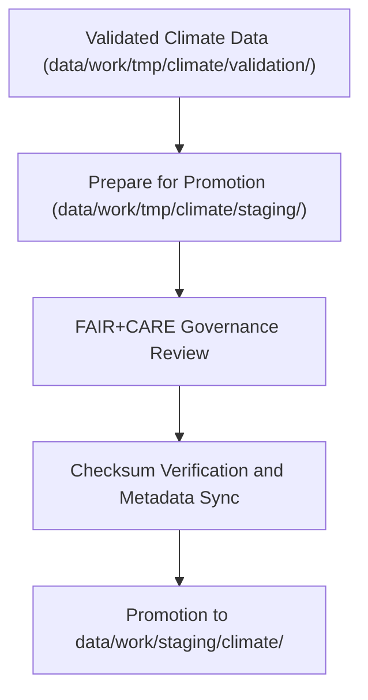

<div align="center">

# 📦 Kansas Frontier Matrix — **Climate TMP Staging Workspace**
`data/work/tmp/climate/staging/README.md`

**Purpose:** Transitional workspace for validated and FAIR+CARE-compliant climate data within the Kansas Frontier Matrix (KFM).  
This layer bridges temporary ETL outputs and the formal `data/work/staging/climate/` repository, enabling reproducible data flow with full governance and provenance traceability.

[](../../../../../docs/standards/faircare-validation.md)
[](../../../../../LICENSE)
[](../../../../../docs/architecture/repo-focus.md)

</div>

---

## 📚 Overview

The `data/work/tmp/climate/staging/` directory contains **temporary, validated climate datasets** awaiting promotion to KFM’s main staging layer.  
It acts as a quality-controlled holding zone, ensuring each dataset meets schema standards, FAIR+CARE ethics requirements, and provenance continuity before being published or processed further.

### Core Functions:
- Store FAIR+CARE-audited climate datasets post-validation.  
- Maintain temporary but traceable files ready for governance sign-off.  
- Provide structured inputs for `data/work/staging/climate/`.  
- Record lineage, checksums, and metadata synchronization logs.  

All files in this workspace are **intermediate** and automatically promoted or purged once verified by automated governance workflows.

---

## 🗂️ Directory Layout

```plaintext
data/work/tmp/climate/staging/
├── README.md                              # This file — overview of climate TMP staging workspace
│
├── drought_indices_staged.csv             # Drought monitor dataset normalized and ready for promotion
├── temperature_anomalies_staged.parquet   # Temperature anomalies harmonized and schema validated
├── climate_composite_staged.json          # Combined Kansas climate summary (FAIR+CARE-certified)
└── metadata.json                          # Governance and provenance metadata for staging transition
```

---

## ⚙️ Staging Workflow



### Workflow Steps:
1. **Validation Completion:** Only datasets passing all FAIR+CARE pre-audits enter this staging layer.  
2. **Checksum & Provenance:** Each file cross-checked against validation outputs and governance manifest.  
3. **Review:** FAIR+CARE Council confirms compliance and documentation completeness.  
4. **Promotion:** Certified files transferred to permanent staging repository.  
5. **Cleanup:** Temporary artifacts deleted upon successful handoff.

---

## 🧩 Example Metadata Record

```json
{
  "id": "climate_tmp_staging_drought_monitor_v9.3.2",
  "source_files": [
    "data/work/tmp/climate/validation/faircare_audit_report.json",
    "data/work/tmp/climate/transforms/drought_normalization.csv"
  ],
  "staged_outputs": [
    "drought_indices_staged.csv"
  ],
  "records_staged": 3204,
  "created": "2025-10-28T16:02:00Z",
  "validator": "@kfm-climate-lab",
  "checksum": "sha256:4ab9bcb3ac42fd21705e2cbb3272e99b8c1a4e2b...",
  "fairstatus": "certified",
  "governance_ref": "data/reports/audit/data_provenance_ledger.json"
}
```

---

## 🧠 FAIR+CARE Governance in Climate TMP Staging

| Principle | Implementation |
|------------|----------------|
| **Findable** | All staged files registered with schema metadata and FAIR+CARE status. |
| **Accessible** | Stored in accessible CSV, Parquet, and JSON formats. |
| **Interoperable** | Schema aligned with KFM’s data contract and STAC/DCAT metadata. |
| **Reusable** | Provenance metadata links every file to its ETL and validation sources. |
| **Collective Benefit** | Guarantees ethical, transparent, and open data handoff processes. |
| **Authority to Control** | FAIR+CARE Council approves staging promotion. |
| **Responsibility** | Validators ensure proper field mappings and data integrity. |
| **Ethics** | All staged outputs cleared for ethical compliance. |

Governance confirmations logged within:  
`data/reports/audit/data_provenance_ledger.json`  
and `data/reports/fair/data_care_assessment.json`.

---

## ⚙️ Validation & QA Integration

| Report | Description | Output |
|---------|-------------|---------|
| `faircare_audit_report.json` | Summarizes FAIR+CARE audit compliance for staged datasets. | JSON |
| `schema_validation_summary.json` | Validates field conformity with KFM’s schema. | JSON |
| `checksums.json` | Maintains hash consistency for data lineage verification. | JSON |
| `governance_sync.log` | Records FAIR+CARE certification and promotion approval. | Text |

Automated staging promotion handled via `climate_staging_sync.yml`.

---

## ⚖️ Governance & Provenance Integration

| Record | Description |
|---------|-------------|
| `metadata.json` | Tracks runtime metadata, schema version, and checksum linkage. |
| `data/reports/audit/data_provenance_ledger.json` | Logs lineage and FAIR+CARE certification results. |
| `data/reports/validation/schema_validation_summary.json` | Field-level QA and validation records. |
| `releases/v9.3.2/manifest.zip` | Checksum registry ensuring integrity across TMP and staging. |

---

## 🧾 Retention Policy

| File Type | Retention Duration | Policy |
|------------|--------------------|--------|
| Staged Data | 7 days | Promoted automatically to staging repository after governance sign-off. |
| Metadata Files | 365 days | Retained for provenance and reproducibility. |
| Logs & Reports | 30 days | Archived to governance and system logs. |
| Temporary Files | 14 days | Purged post-promotion. |

Cleanup automated by `climate_staging_cleanup.yml`.

---

## 🧾 Internal Use Citation

```text
Kansas Frontier Matrix (2025). Climate TMP Staging Workspace (v9.3.2).
Transitional workspace for FAIR+CARE-validated climate data, ensuring schema integrity, ethical compliance, and full governance traceability.
Restricted to internal validation and promotion workflows.
```

---

## 🧾 Version Notes

| Version | Date | Notes |
|----------|------|--------|
| v9.3.2 | 2025-10-28 | Added checksum governance verification and FAIR+CARE staging certification integration. |
| v9.2.0 | 2024-07-15 | Introduced automated staging promotion via governance workflows. |
| v9.0.0 | 2023-01-10 | Established TMP staging workspace for transient climate datasets. |

---

<div align="center">

**Kansas Frontier Matrix** · *Climate Data Integrity × FAIR+CARE Ethics × Provenance Continuity*  
[🔗 Repository](https://github.com/bartytime4life/Kansas-Frontier-Matrix) • [🧭 Docs Portal](../../../../../docs/) • [⚖️ Governance Ledger](../../../../../docs/standards/governance/)

</div>

