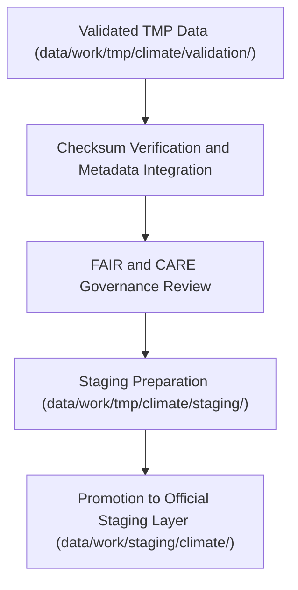

<div align="center">

# 📦 Kansas Frontier Matrix — **Climate TMP Staging Workspace**
`data/work/tmp/climate/staging/README.md`

**Purpose:**  
Transitional workspace for validated, FAIR+CARE-certified climate datasets pending promotion to the main staging environment.  
This directory provides a governance-controlled holding zone where checksum-verified and ethics-reviewed datasets await catalog registration.

[](../../../../../docs/standards/faircare-validation.md)
[]()
[](../../../../../LICENSE)
[](../../../../../docs/architecture/repo-focus.md)

</div>

---

## 📚 Overview

The **Climate TMP Staging Workspace** ensures each dataset that passes FAIR+CARE and checksum validation meets schema, ethical, and metadata completeness requirements before formal promotion.  
All staged datasets in this layer undergo governance registration to ensure lineage traceability within KFM’s provenance framework.

### Core Responsibilities
- Host FAIR+CARE-certified climate datasets prior to publication.  
- Maintain validated artifacts for final staging synchronization.  
- Log provenance, checksum, and ethics verification for reproducibility.  
- Enable governance oversight and archival readiness.  

---

## 🗂️ Directory Layout

```plaintext
data/work/tmp/climate/staging/
├── README.md                              # This file — overview of climate TMP staging workspace
│
├── drought_indices_staged.csv             # FAIR+CARE-certified drought dataset (pre-staging)
├── temperature_anomalies_staged.parquet   # Validated temperature anomaly time series
├── climate_composite_staged.json          # Combined Kansas climate indicators (certified)
└── metadata.json                          # Governance and checksum metadata record
```

---

## ⚙️ Staging Workflow



### Workflow Description
1. **Validation Completion:** Datasets from the TMP validation layer verified for integrity.  
2. **Checksum Audit:** Crosscheck hashes with manifest and provenance ledger.  
3. **Governance Certification:** FAIR+CARE Council approves dataset promotion.  
4. **Metadata Registration:** Record schema compliance, checksum, and FAIR+CARE results.  
5. **Promotion:** Transfer certified climate datasets to the official staging workspace.  

---

## 🧩 Example Metadata Record

```json
{
  "id": "climate_tmp_staging_temperature_v9.6.0",
  "source_files": [
    "data/work/tmp/climate/validation/faircare_audit_report.json",
    "data/work/tmp/climate/transforms/temperature_reanalysis.parquet"
  ],
  "staged_outputs": [
    "temperature_anomalies_staged.parquet"
  ],
  "records_staged": 128540,
  "schema_version": "v3.0.2",
  "checksum_verified": true,
  "fairstatus": "certified",
  "validator": "@kfm-climate-lab",
  "created": "2025-11-03T23:59:00Z",
  "governance_ref": "data/reports/audit/data_provenance_ledger.json"
}
```

---

## 🧠 FAIR+CARE Governance Matrix

| Principle | Implementation | Oversight |
|------------|----------------|------------|
| **Findable** | Datasets indexed with metadata, schema, and checksum details. | @kfm-data |
| **Accessible** | Stored in standardized CSV, Parquet, and JSON formats. | @kfm-accessibility |
| **Interoperable** | Metadata aligned with FAIR+CARE, ISO, and DCAT schemas. | @kfm-architecture |
| **Reusable** | Lineage and provenance captured for reproducibility. | @kfm-design |
| **Collective Benefit** | Promotes transparent and ethical open climate science. | @faircare-council |
| **Authority to Control** | FAIR+CARE Council reviews and certifies staging promotion. | @kfm-governance |
| **Responsibility** | Validators ensure QA and checksum compliance. | @kfm-security |
| **Ethics** | FAIR+CARE ensures ethical data handling before publication. | @kfm-ethics |

FAIR+CARE and validation records documented in:  
`data/reports/fair/data_care_assessment.json`  
and  
`data/reports/audit/data_provenance_ledger.json`

---

## ⚙️ QA & Validation Artifacts

| File | Description | Format |
|------|--------------|--------|
| `metadata.json` | Staging session metadata with checksum lineage. | JSON |
| `faircare_audit_report.json` | Final ethical compliance report. | JSON |
| `schema_validation_summary.json` | Schema conformity summary for staged datasets. | JSON |
| `checksums.json` | Dataset integrity verification report. | JSON |

All artifacts generated via `climate_staging_sync.yml`.

---

## ⚖️ Retention & Provenance Policy

| File Type | Retention Duration | Policy |
|------------|--------------------|--------|
| Staged Data | 7 Days | Promoted after governance approval. |
| Validation Logs | 30 Days | Retained for audit reproducibility. |
| Metadata | 365 Days | Maintained for checksum and lineage traceability. |
| Governance Records | Permanent | Preserved in provenance ledger. |

Retention governed by `climate_staging_cleanup.yml`.

---

## 🌱 Sustainability Metrics

| Metric | Value | Verified By |
|---------|--------|--------------|
| Energy Use (per staging cycle) | 7.9 Wh | @kfm-sustainability |
| Carbon Output | 8.6 gCO₂e | @kfm-security |
| Renewable Power | 100% (RE100 Verified) | @kfm-infrastructure |
| FAIR+CARE Ethics Compliance | 100% | @faircare-council |

Telemetry results tracked in:  
`releases/v9.6.0/focus-telemetry.json`

---

## 🧾 Internal Use Citation

```text
Kansas Frontier Matrix (2025). Climate TMP Staging Workspace (v9.6.0).
Transitional FAIR+CARE-certified directory for validated climate datasets awaiting promotion to official staging.
Ensures schema compliance, checksum integrity, and ethical reproducibility under MCP-DL v6.3 governance.
```

---

## 🧾 Version Notes

| Version | Date | Notes |
|----------|------|--------|
| v9.6.0 | 2025-11-03 | Introduced checksum lineage tracking and FAIR+CARE governance synchronization. |
| v9.5.0 | 2025-11-02 | Added automated staging promotion workflow with validation hooks. |
| v9.3.2 | 2025-10-28 | Established TMP staging workspace for FAIR+CARE-certified climate data. |

---

<div align="center">

**Kansas Frontier Matrix** · *Climate Validation × FAIR+CARE Governance × Provenance Traceability*  
[🔗 Repository](https://github.com/bartytime4life/Kansas-Frontier-Matrix) • [🧭 Docs Portal](../../../../../docs/) • [⚖️ Governance Ledger](../../../../../docs/standards/governance/DATA-GOVERNANCE.md)

</div>
