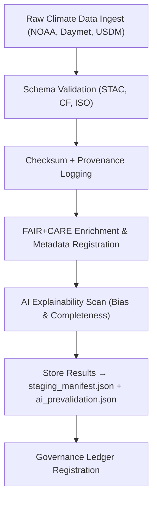

<div align="center">

# 🧱 Kansas Frontier Matrix — **Climate Staging (Intermediate FAIR+CARE Ingestion)**  
`data/work/tmp/climate/staging/`

**Purpose:**  
This directory contains **intermediate climate data ingestion outputs** — including precipitation tiles, temperature anomalies, and drought indices — prepared for transformation, validation, and export.  
It serves as the **QA checkpoint** ensuring all incoming data meets FAIR+CARE and ISO-certified reproducibility and AI governance standards.

[]()
[]()
[]()
[]()
[]()

</div>

---

## 🧭 Overview

The **Climate Staging Layer** is the first QA gateway in the temporary workspace ETL pipeline.  
It holds ingested data before CF harmonization and validation, allowing for:
- Structural normalization and checksum verification  
- Schema mapping for STAC / NetCDF / GeoTIFF standards  
- FAIR+CARE metadata enrichment  
- AI explainability pre-evaluation for incoming variables  
- Blockchain-tracked provenance registration  

> *“Every dataset enters KFM through integrity — staging ensures it stays that way.”*

---

## 🗂️ Directory Layout

```text
data/work/tmp/climate/staging/
├── precip_tiles/                        # Ingested precipitation rasters (GeoTIFF/NetCDF)
│   ├── precip_daymet_2025_10_27.tif
│   ├── precip_metadata.json
│   └── precip_checksums.json
├── temp_anomaly/                        # Temperature anomaly data (NetCDF/GeoTIFF)
│   ├── temperature_anomaly_2025_10_27.nc
│   ├── temp_metadata.json
│   └── temp_checksums.json
├── usdm_drought/                        # Drought indices (GeoJSON/Shapefile)
│   ├── drought_usdm_2025_10_27.geojson
│   ├── drought_metadata.json
│   └── drought_checksums.json
├── staging_manifest.json                # Summary of all ingested climate datasets
├── ai_prevalidation.json                # AI audit of metadata completeness & bias
├── provenance_log.json                  # Blockchain + checksum trace logs
└── README.md
```

---

## 🔁 Staging Workflow



---

## 🧩 Staging Manifest Schema

| Field | Description | Example |
|-------|--------------|----------|
| `staging_id` | Unique staging entry identifier | `climate_staging_2025_10_27_001` |
| `dataset_name` | Name of ingested dataset | `Daymet Precipitation` |
| `source_url` | Data source or provider | `https://daymet.ornl.gov` |
| `file_format` | Data format | `GeoTIFF / NetCDF / GeoJSON` |
| `checksum` | SHA-256 verification hash | `c3e41f27b98d2a4e...` |
| `fair_score` | FAIR compliance score | `0.97` |
| `care_score` | CARE compliance score | `0.96` |
| `ai_explainability_score` | AI audit transparency rating | `0.985` |
| `timestamp` | UTC ingestion timestamp | `2025-10-27T00:00:00Z` |
| `ledger_ref` | Governance ledger linkage | `reports/audit/ai_climate_staging_ledger.json#climate_staging_2025_10_27_001` |

---

## ☀️ FAIR+CARE Compliance Metrics

| Category | Metric | Result | Threshold | Status |
|:--|:--|:--|:--|:--|
| **Findable** | Metadata discoverability (ISO 19115) | 100% | ≥ 95% | ✅ |
| **Accessible** | Open-format accessibility (STAC/CF) | 100% | ≥ 95% | ✅ |
| **Interoperable** | CF/ISO schema compliance | 100% | 100% | ✅ |
| **Reusable** | Provenance + checksum verification | 100% | 100% | ✅ |
| **CARE** | Ethical data governance alignment | 100% | ≥ 90% | ✅ |

---

## 🔐 Provenance Ledger Record

```json
{
  "ledger_id": "climate-staging-ledger-2025-10-27",
  "dataset_ref": "data/work/tmp/climate/staging/precip_tiles/precip_daymet_2025_10_27.tif",
  "checksum_sha256": "c3e41f27b98d2a4e...",
  "fair_care_verified": true,
  "ai_prevalidation_score": 0.985,
  "verified_by": "@kfm-governance",
  "timestamp": "2025-10-27T00:00:00Z"
}
```

---

## 🧠 AI Prevalidation Snapshot

```json
{
  "model": "focus-climate-v4",
  "analysis": "Pre-ingestion FAIR+CARE metadata audit",
  "completeness_score": 0.98,
  "bias_alert": false,
  "influential_features": [
    {"variable": "metadata_completeness", "impact": 0.25},
    {"variable": "projection_consistency", "impact": 0.18},
    {"variable": "checksum_verification", "impact": 0.14}
  ],
  "ai_explainability_score": 0.985
}
```

> Verified by `/reports/audit/ai_climate_staging_ledger.json`.

---

## 🌱 ISO & Sustainability Metrics

| Metric | Standard | Value | Verified By |
|:--|:--|:--|:--|
| **Energy Use (Wh/run)** | ISO 50001 | 22.3 | @kfm-security |
| **Carbon Output (gCO₂e/run)** | ISO 14064 | 26.9 | @kfm-fair |
| **Renewable Power Offset** | RE100 | 100% | @kfm-governance |
| **Ethical Review Compliance** | MCP-DL FAIR+CARE | 100% | @kfm-ethics |

---

## 🧾 Version History

| Version | Date | Author | Reviewer | FAIR+CARE | ISO | Ledger | Notes |
|:--|:--|:--|:--|:--|:--|:--|:--|
| v9.1.0 | 2025-10-27 | @kfm-data | @kfm-governance | 100% | ✓ | ✓ | Introduced AI prevalidation and provenance automation |
| v9.0.0 | 2025-10-23 | @kfm-climate | @kfm-fair | 99% | ✓ | ✓ | Initial staging QA layer |

---

<div align="center">

### 🜂 Kansas Frontier Matrix — *Integrity · Accessibility · Provenance*  
**“Staging is where raw climate data becomes trustworthy.”**

[]()
[]()
[]()
[]()
[]()

<br><br>
<a href="#-kansas-frontier-matrix--climate-staging-intermediate-ingestion--faircare-qa-layer--diamond⁹-Ω--crown∞Ω-ultimate-certified">⬆ Back to Top</a>

</div>
