<div align="center">

# 📦 Kansas Frontier Matrix — **Climate TMP Staging Workspace**
`data/work/tmp/climate/staging/README.md`

**Purpose:**  
Governance-controlled transitional workspace for validated, FAIR+CARE-certified climate datasets awaiting promotion to the main staging environment.  
Ensures checksum verification, schema compliance, and ethical traceability before formal registration in governance systems.

[](../../../../../docs/architecture/README.md)
[](../../../../../docs/standards/faircare-validation.md)
[]()
[](../../../../../LICENSE)

</div>

---

## 📘 Overview

The **Climate TMP Staging Workspace** provides a secure, ethics-audited checkpoint for verified climate datasets.  
All files here have passed FAIR+CARE, checksum, and schema validation and are queued for integration into the primary `data/work/staging/climate/` repository.

### Core Responsibilities
- Maintain FAIR+CARE-certified datasets prior to publication.  
- Record governance lineage and checksum validation.  
- Ensure metadata completeness and schema harmonization.  
- Enable reproducibility, transparency, and ethical compliance before promotion.  

---

## 🗂️ Directory Layout

```plaintext
data/work/tmp/climate/staging/
├── README.md
├── drought_indices_staged.csv
├── temperature_anomalies_staged.parquet
├── climate_composite_staged.json
└── metadata.json
```

---

## ⚙️ Staging Workflow

```mermaid
flowchart TD
    A["Validated TMP Climate Data (tmp/climate/validation/)"] --> B["Checksum & Metadata Integration"]
    B --> C["FAIR + CARE Governance Audit"]
    C --> D["TMP Staging Certification (tmp/climate/staging/)"]
    D --> E["Promotion → Official Climate Staging (data/work/staging/climate/)"]
```



### Steps
1. **Validation Completion** — Datasets verified for structural + checksum integrity.  
2. **Checksum Audit** — Cross-check hashes with provenance manifests.  
3. **Governance Review** — FAIR+CARE Council certifies data ethics + transparency.  
4. **Metadata Integration** — Finalize schema, FAIR+CARE, and lineage records.  
5. **Promotion** — Move certified datasets to official staging repository.  

---

## 🧩 Example Metadata Record

```json
{
  "id": "climate_tmp_staging_temperature_v9.7.0",
  "source_files": [
    "data/work/tmp/climate/validation/faircare_audit_report.json",
    "data/work/tmp/climate/transforms/temperature_reanalysis.parquet"
  ],
  "staged_outputs": [
    "temperature_anomalies_staged.parquet"
  ],
  "records_staged": 128540,
  "schema_version": "v3.1.1",
  "checksum_verified": true,
  "fairstatus": "certified",
  "validator": "@kfm-climate-lab",
  "created": "2025-11-06T23:59:00Z",
  "governance_ref": "data/reports/audit/data_provenance_ledger.json"
}
```

---

## 🧠 FAIR+CARE Governance Matrix

| Principle | Implementation | Oversight |
|-----------|----------------|-----------|
| **Findable** | Indexed with schema, metadata, and checksum lineage. | `@kfm-data` |
| **Accessible** | Available in CSV, Parquet, and JSON formats. | `@kfm-accessibility` |
| **Interoperable** | Aligned with FAIR+CARE, ISO 19115, and DCAT 3.0. | `@kfm-architecture` |
| **Reusable** | Provenance and lineage maintained in audit logs. | `@kfm-design` |
| **Collective Benefit** | Promotes open, ethical climate data governance. | `@faircare-council` |
| **Authority to Control** | Council certifies ethics and schema compliance. | `@kfm-governance` |
| **Responsibility** | Validators record QA + checksum verification. | `@kfm-security` |
| **Ethics** | Ensures ethical curation and culturally responsible metadata. | `@kfm-ethics` |

**Audit refs:**  
`data/reports/fair/data_care_assessment.json` · `data/reports/audit/data_provenance_ledger.json`

---

## ⚙️ Validation & QA Artifacts

| File | Description | Format |
|------|-------------|--------|
| `metadata.json` | Staging metadata record w/ checksum lineage. | JSON |
| `faircare_audit_report.json` | Final ethics + compliance audit report. | JSON |
| `schema_validation_summary.json` | Schema conformity + structural integrity report. | JSON |
| `checksums.json` | Verified dataset checksum registry. | JSON |

**Automation:** `climate_staging_sync.yml`

---

## ♻️ Retention & Lifecycle Policy

| File Type | Retention | Policy |
|------------|----------:|--------|
| Staged Datasets | 7 Days | Promoted post-governance approval. |
| Validation Reports | 30 Days | Archived for reproducibility. |
| Metadata | 365 Days | Stored for checksum lineage continuity. |
| Governance Logs | Permanent | Kept under provenance ledger. |

**Telemetry:** `../../../../../releases/v9.7.0/focus-telemetry.json`

---

## 🌱 Sustainability Metrics

| Metric | Value | Verified By |
|--------|------:|-------------|
| Energy Use (per staging cycle) | 7.9 Wh | `@kfm-sustainability` |
| Carbon Output | 8.6 gCO₂e | `@kfm-security` |
| Renewable Power | 100% (RE100) | `@kfm-infrastructure` |
| FAIR+CARE Compliance | 100% | `@faircare-council` |

---

## 🧾 Internal Citation

```text
Kansas Frontier Matrix (2025). Climate TMP Staging Workspace (v9.7.0).
Governed pre-staging workspace for FAIR+CARE-certified climate datasets.  
Ensures schema alignment, checksum integrity, and ethical reproducibility under MCP-DL v6.3.
```

---

## 🕰️ Version History

| Version | Date       | Author           | Summary |
|--------:|------------|------------------|---------|
| v9.7.0  | 2025-11-06 | `@kfm-climate`   | Upgraded telemetry schema, retention governance, and automation alignment. |
| v9.6.0  | 2025-11-03 | `@kfm-climate`   | Introduced checksum lineage and governance synchronization. |

---

<div align="center">

**Kansas Frontier Matrix**  
*Climate Validation × FAIR+CARE Governance × Provenance Traceability*  
© 2025 Kansas Frontier Matrix — Internal · FAIR+CARE Certified · Diamond⁹ Ω / Crown∞Ω Ultimate Certified  

[Back to Climate TMP](../README.md) · [Governance Charter](../../../../../docs/standards/governance/DATA-GOVERNANCE.md)

</div>