<div align="center">

# 📦 Kansas Frontier Matrix — **Climate TMP Staging Workspace**
`data/work/tmp/climate/staging/README.md`

**Purpose:** Transitional FAIR+CARE-certified workspace for validated and pre-approved climate datasets in the Kansas Frontier Matrix (KFM).  
This layer acts as the **final temporary checkpoint** before data is promoted to the main staging repository, ensuring each dataset maintains schema fidelity, ethical compliance, and full provenance traceability.

[](../../../../../docs/standards/faircare-validation.md)
[](../../../../../LICENSE)
[](../../../../../docs/architecture/repo-focus.md)

</div>

---

## 📚 Overview

The `data/work/tmp/climate/staging/` directory functions as a **controlled quality and governance handoff zone** for climate datasets validated through KFM’s FAIR+CARE framework.  
All data within this layer have undergone complete schema validation, checksum verification, and ethics review, making them ready for certification and promotion to `data/work/staging/climate/`.

### Core Responsibilities
- Host fully validated and FAIR+CARE-approved climate datasets pre-promotion.  
- Maintain intermediate but traceable artifacts with complete lineage tracking.  
- Store governance-linked metadata, checksum records, and QA reports.  
- Emit **telemetry** events for promotion readiness and staging analytics.  

All contents are automatically promoted or purged after governance verification.

---

## 🗂️ Directory Layout

```plaintext
data/work/tmp/climate/staging/
├── README.md
│
├── drought_indices_staged.csv             # Normalized drought index data (FAIR+CARE-certified)
├── temperature_anomalies_staged.parquet   # Validated temperature anomaly harmonization results
├── climate_composite_staged.json          # Kansas-wide FAIR+CARE-certified climate composite
└── metadata.json                          # Governance, checksum, and telemetry linkage metadata
```

---

## ⚙️ Staging Workflow

```mermaid
flowchart TD
    A["Validated Climate Data (data/work/tmp/climate/validation/)"] --> B["Staging Preparation (data/work/tmp/climate/staging/)"]
    B --> C["FAIR+CARE Certification Audit"]
    C --> D["Checksum Verification & Metadata Synchronization"]
    D --> E["Governance Ledger & Telemetry Registration"]
    E --> F["Promotion → data/work/staging/climate/"]
```



### Workflow Description
1. **Validation Completion:** Only datasets with passing FAIR+CARE audits are admitted to TMP staging.  
2. **Checksum Verification:** File hashes cross-checked against validation manifests.  
3. **Ethical Certification:** FAIR+CARE Council approves datasets for promotion.  
4. **Governance Integration:** Provenance, lineage, and telemetry updated automatically.  
5. **Promotion & Cleanup:** Certified artifacts transferred to the primary staging workspace.

---

## 🧩 Example Metadata Record

```json
{
  "id": "climate_tmp_staging_drought_monitor_v9.5.0",
  "source_files": [
    "data/work/tmp/climate/validation/faircare_audit_report.json",
    "data/work/tmp/climate/transforms/drought_normalization.csv"
  ],
  "staged_outputs": [
    "drought_indices_staged.csv"
  ],
  "records_staged": 3280,
  "schema_version": "v3.2.0",
  "created": "2025-11-02T16:52:00Z",
  "validator": "@kfm-climate-lab",
  "checksum": "sha256:4ab9bcb3ac42fd21705e2cbb3272e99b8c1a4e2b...",
  "fairstatus": "certified",
  "telemetry_link": "releases/v9.5.0/focus-telemetry.json",
  "ai_metrics": {
    "drift_detected": false,
    "data_completeness": 1.0,
    "distribution_skew": 0.03
  },
  "governance_ref": "data/reports/audit/data_provenance_ledger.json"
}
```

---

## 🧠 FAIR+CARE Climate Governance in TMP Staging

| Principle | Implementation |
|------------|----------------|
| **Findable** | All staged artifacts indexed with unique IDs, schema version, and checksum. |
| **Accessible** | Stored in open, interoperable formats (CSV, Parquet, JSON). |
| **Interoperable** | Schema aligned with KFM Data Contracts, STAC/DCAT standards. |
| **Reusable** | Provenance and checksum validation ensure reproducibility. |
| **Collective Benefit** | Guarantees ethically governed data promotion. |
| **Authority to Control** | FAIR+CARE Council reviews and authorizes all staged exports. |
| **Responsibility** | Validators document all field corrections and QA reports. |
| **Ethics** | Datasets verified for non-sensitive, ethically neutral content. |

Audit and ethics confirmations logged to:  
`data/reports/audit/data_provenance_ledger.json` • `data/reports/fair/data_care_assessment.json`

---

## ⚙️ Validation & QA Reports

| Report | Description | Output |
|---------|-------------|---------|
| `faircare_audit_report.json` | Summarizes FAIR+CARE compliance status for staged datasets. | JSON |
| `schema_validation_summary.json` | Validates schema consistency and contract adherence. | JSON |
| `checksums.json` | Maintains integrity registry for data lineage verification. | JSON |
| `ai_quality_metrics.json` | Tracks drift, bias, and completeness metrics for AI-assisted QA. | JSON |
| `governance_sync.log` | Documents governance certification and promotion events. | Text |

All validations automated by **`climate_staging_sync.yml`**.

---

## ⚖️ Governance & Provenance Integration

| Record | Description |
|---------|-------------|
| `metadata.json` | Records runtime context, validator identity, and telemetry reference. |
| `data/reports/audit/data_provenance_ledger.json` | Logs staging lineage and FAIR+CARE certification status. |
| `data/reports/validation/schema_validation_summary.json` | Cross-domain QA results for climate data. |
| `releases/v9.5.0/manifest.zip` | Central registry of checksums and lineage hashes. |

Governance and telemetry synchronization managed via **`climate_staging_sync.yml`** pipeline.

---

## 🧾 Retention Policy

| File Type | Retention Duration | Policy |
|------------|--------------------|--------|
| Staged Datasets | 7 days | Promoted to staging upon certification sign-off. |
| Metadata | 365 days | Retained permanently for provenance auditing. |
| QA & AI Reports | 30 days | Archived for FAIR+CARE and model explainability review. |
| Temporary Artifacts | 14 days | Auto-purged after governance confirmation. |

Retention automation controlled by **`climate_staging_cleanup.yml`**.

---

## 🧾 Internal Use Citation

```text
Kansas Frontier Matrix (2025). Climate TMP Staging Workspace (v9.5.0).
Transitional FAIR+CARE and AI-governed workspace ensuring schema integrity, ethical certification, and governance traceability of climate data prior to staging.
Restricted to internal QA, ethics review, and provenance workflows.
```

---

## 🧾 Version Notes

| Version | Date | Notes |
|----------|------|--------|
| v9.5.0 | 2025-11-02 | Added telemetry linkage, AI drift metrics, and FAIR+CARE automation sync. |
| v9.3.2 | 2025-10-28 | Introduced checksum governance verification and FAIR+CARE staging certification. |
| v9.2.0 | 2024-07-15 | Added automated staging promotion workflow. |
| v9.0.0 | 2023-01-10 | Established TMP staging workspace for transient climate datasets. |

---

<div align="center">

**Kansas Frontier Matrix** · *Climate Intelligence × FAIR+CARE Ethics × Provenance Governance × Telemetry Insight*  
[🔗 Repository](https://github.com/bartytime4life/Kansas-Frontier-Matrix) • [🧭 Docs Portal](../../../../../docs/) • [⚖️ Governance Ledger](../../../../../docs/standards/governance/)

</div>
