<div align="center">

# 📦 **Kansas Frontier Matrix — Climate TMP Staging Workspace**  
`data/work/tmp/climate/README.md`

**Purpose:**  
Governance-controlled transitional workspace for **FAIR+CARE-certified climate datasets** that have passed TMP validation and are ready for promotion into the primary **`data/work/staging/climate/`** layer.

This workspace:

- Consolidates validated climate outputs from `tmp/climate/validation/`  
- Applies final **checksum, schema, and governance checks**  
- Prepares artifacts for **official staging, cataloging, and downstream use**  

[](../../../../../docs/architecture/README.md)  
[](../../../../../docs/standards/faircare/FAIRCARE-GUIDE.md)  
[]()  
[](../../../../../LICENSE)

</div>

---

## 1. 📘 Overview

The **Climate TMP Staging Workspace** is the **final internal checkpoint** before climate datasets enter the official `data/work/staging/climate/` layer.

All assets here have:

- Passed **TMP climate validation** (`tmp/climate/validation/`)  
- Undergone **FAIR+CARE pre-release audits**  
- Completed **checksum and schema validation**  
- Been linked to **provenance & governance records**  

This workspace guarantees that only **trusted, reproducible, and ethically certified** climate datasets progress into long-lived staging and then to `data/processed/climate/`.

---

## 2. 🗂️ Directory Layout (Mobile-Safe)

```text
data/work/tmp/climate/staging/
├── README.md                           ← this file
├── drought_indices_staged.csv          # Certified drought metrics
├── temperature_anomalies_staged.parquet# Certified temp anomalies
├── climate_composite_staged.json       # Certified climate composites
└── metadata.json                       # Staging-level metadata & lineage
```

- Additional `*_staged.*` files MAY be added but MUST be:
  - Validated  
  - Checksummed  
  - Documented in `metadata.json`  

---

## 3. ⚙️ Staging Workflow

```mermaid
flowchart TD
    VAL["Validated Climate (tmp/climate/validation/)"]
      --> INTEG["Checksum & Metadata Integration (tmp/climate/staging/)"]
    INTEG --> GOV["FAIR+CARE Governance Review"]
    GOV --> CERT["TMP Staging Certification"]
    CERT --> PROMO["Promotion → Official Staging (data/work/staging/climate/)"]
    PROMO --> LEDGER["Provenance Ledger Registration"]
```



### Workflow Steps

1. **Validation Completion**  
   - Datasets from `tmp/climate/validation/` have met schema and FAIR+CARE requirements.

2. **Checksum Integration**  
   - Cross-verify with `checksums.json` and climate-domain manifests.  

3. **Governance Review**  
   - FAIR+CARE Council confirms ethical fitness and integrity.  

4. **Staging Certification**  
   - `metadata.json` is updated with:
     - Provenance, telemetry, data-contract refs  
     - Certification decision and reviewer identifiers  

5. **Promotion**  
   - Staged artifacts promoted to `data/work/staging/climate/` for final certification & publication.  

---

## 4. 🧩 Example Staging Metadata Record

```json
{
  "id": "climate_tmp_staging_temperature_v11.0.0",
  "domain": "climate",
  "source_files": [
    "data/work/tmp/climate/validation/faircare_audit_report.json",
    "data/work/tmp/climate/transforms/temperature_reanalysis.parquet"
  ],
  "staged_outputs": [
    "temperature_anomalies_staged.parquet"
  ],
  "records_staged": 129820,
  "schema_version": "v3.2.0",
  "checksum_verified": true,
  "fairstatus": "certified",
  "telemetry": {
    "energy_wh": 0.8,
    "carbon_gco2e": 1.1,
    "validation_coverage_pct": 100,
    "runtime_sec": 29
  },
  "validator": "@kfm-climate-lab",
  "created": "2025-11-20T23:59:00Z",
  "governance_ref": "data/reports/audit/data_provenance_ledger.json"
}
```

This object is:

- A **staging-level `prov:Entity`** reference  
- Used by:
  - Staging pipelines  
  - Governance ledger  
  - Telemetry aggregations  

---

## 5. 🧠 FAIR+CARE Governance Matrix

| Principle              | Implementation                                            | Oversight             |
|------------------------|-----------------------------------------------------------|-----------------------|
| **Findable**           | Staged artifacts indexed by IDs, schema, checksum.        | `@kfm-data`          |
| **Accessible**         | Internal-only data; controlled promotion to staging.      | `@kfm-accessibility` |
| **Interoperable**      | DCAT/STAC + JSON Schema + ISO 19115 alignment.           | `@kfm-architecture`  |
| **Reusable**           | Provenance, QA, and telemetry linked in metadata.         | `@kfm-design`        |
| **Collective Benefit** | Staged climate data supports robust, ethical decision-making. | `@faircare-council` |
| **Authority to Control** | FAIR+CARE Council approves promotion to staging.       | `@kfm-governance`    |
| **Responsibility**     | Domain stewards maintain staging-level QA & metadata.     | `@kfm-security`      |
| **Ethics**             | Final review confirms ethics, context, and representation.| `@kfm-ethics`        |

Governance / Audit References:

- `data/reports/fair/data_care_assessment.json`  
- `data/reports/audit/data_provenance_ledger.json`  

---

## 6. 📊 Validation & QA Artifacts

`metadata.json` in this directory aggregates:

- Schema validation statuses  
- Linkage to:
  - `schema_validation_summary.json`  
  - `faircare_audit_report.json`  
  - `checksums.json`  
- Final staging certification outcome  

Other staging-related artifacts (by convention):

- `faircare_audit_report.json` — Final FAIR+CARE assessment  
- `schema_validation_summary.json` — Staging-level schema checks  
- `checksums.json` — Staging manifest cross-check  

Automation Workflow:

- `climate_staging_sync_v2.yml` — orchestrates staging certification & promotion.  

---

## 7. ♻️ Retention & Lifecycle Policy

| Asset Type             | Retention | Policy                                             |
|------------------------|----------:|----------------------------------------------------|
| TMP Staged Datasets    | 7 days    | After promotion, TMP copies are purged.            |
| Staging QA Reports     | 90 days   | Archived for reproducibility and governance audit. |
| Staging Metadata       | ≥ 365 days| Retained for provenance & catalog reference.       |
| Governance Records     | Permanent | Immutable in ledger.                               |

Telemetry Reference:  
`../../../../../releases/v11.0.0/focus-telemetry.json`

---

## 8. 🌱 Sustainability Metrics

Example Climate Staging Cycle:

| Metric                         | Value  | Verified By            |
|--------------------------------|-------:|------------------------|
| Energy Use (per staging run)   | 0.8 Wh | `@kfm-sustainability`  |
| Carbon Output (per staging run)| 1.1 gCO₂e | `@kfm-infrastructure`|
| Renewable Power Share          | 100%   | `@kfm-infrastructure`  |
| Validation Coverage            | 100%   | `@faircare-council`    |

These values are aggregated into:  
`releases/v11.0.0/focus-telemetry.json`

---

## 9. 🕰️ Version History

| Version | Date       | Author           | Summary                                                         |
|--------:|------------|------------------|-----------------------------------------------------------------|
| v11.0.0 | 2025-11-20 | `@kfm-climate`   | Upgraded to v11 preferred format; telemetry & governance synced |
| v10.0.0 | 2025-11-09 | `@kfm-climate`   | Added telemetry v2, checksum & DCAT/STAC validation            |

<div align="center">

**Kansas Frontier Matrix — Climate TMP Staging Workspace**  
📦 FAIR+CARE Certified · Integrity-Verified · Diamond⁹ Ω / Crown⁹ Ω  

© 2025 Kansas Frontier Matrix — Internal Processing Layer  

[Back to Climate TMP](../README.md) · [Data Architecture](../../../../ARCHITECTURE.md) · [Governance Charter](../../../../../docs/standards/governance/ROOT-GOVERNANCE.md)

</div>
