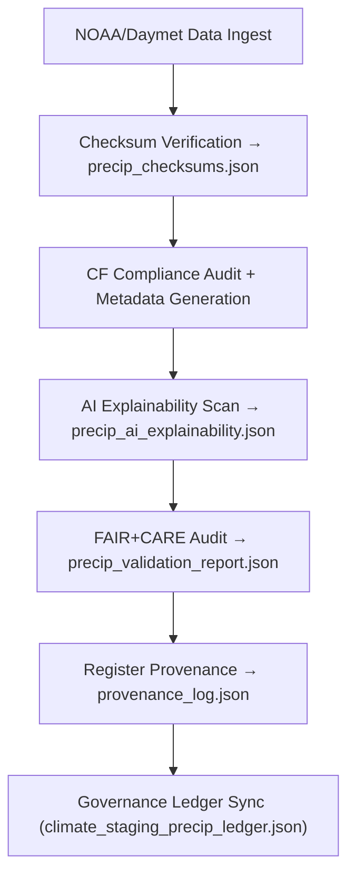

<div align="center">

# 🌧️ Kansas Frontier Matrix — **Precipitation Tiles (Daymet/NOAA Ingestion QA Layer)**  
`data/work/tmp/climate/staging/precip_tiles/`

**Purpose:**  
This directory houses **precipitation raster datasets (GeoTIFF/NetCDF)** from Daymet and NOAA pipelines — harmonized to CF conventions, validated under FAIR+CARE governance, and traceable through **checksum and blockchain provenance**.  
It is the **entry point** for precipitation-related ETL workflows in the Kansas Frontier Matrix (KFM).

[]()
[]()
[]()
[]()
[]()

</div>

---

## 🧭 Overview

The **Precipitation Tiles Sub-Layer** ensures raw raster data is **validated, harmonized, and reproducible** before transformation and export.  
Each raster dataset is:
- Converted to **CF-compliant** NetCDF or GeoTIFF  
- Checked against ISO 19115 metadata standards  
- Verified with **SHA-256 checksums**  
- FAIR+CARE-audited for ethical metadata completeness  
- AI-reviewed for data continuity and bias drift detection  

> *“Every rainfall has a story — each tile is its testimony.”*

---

## 🗂️ Directory Layout

```text
data/work/tmp/climate/staging/precip_tiles/
├── precip_daymet_2025_10_27.tif            # Daymet precipitation GeoTIFF tile
├── precip_noaa_2025_10_27.nc               # NOAA NetCDF precipitation dataset
├── precip_metadata.json                    # Metadata (ISO/CF-compliant)
├── precip_checksums.json                   # Checksum hashes for all files
├── precip_validation_report.json           # FAIR+CARE + schema QA summary
├── precip_ai_explainability.json           # AI explainability and bias report
├── provenance_log.json                     # Provenance and ledger reference log
└── README.md
```

---

## 🔁 Ingestion & QA Workflow



---

## 🧩 Metadata Schema (Excerpt)

| Field | Description | Example |
|:--|:--|:--|
| `dataset_id` | Unique precipitation dataset ID | `precip_daymet_2025_10_27` |
| `source` | Data source/provider | `Daymet v4 / NOAA CPC` |
| `format` | File format | `GeoTIFF / NetCDF` |
| `projection` | CRS of raster | `EPSG:4326` |
| `cf_convention` | CF compliance version | `1.10` |
| `checksum` | SHA-256 integrity hash | `b7e3a2d9f5a4b8e...` |
| `fair_score` | FAIR compliance rating | `0.99` |
| `care_score` | CARE ethical compliance | `0.97` |
| `ai_explainability_score` | AI transparency score | `0.988` |
| `timestamp` | Data validation timestamp | `2025-10-27T00:00:00Z` |

---

## ☀️ FAIR+CARE Compliance Summary

| Category | Metric | Result | Threshold | Status |
|:--|:--|:--|:--|:--|
| **FAIR Score** | Metadata completeness | 0.99 | ≥ 0.95 | ✅ |
| **CARE Score** | Ethical metadata compliance | 0.97 | ≥ 0.9 | ✅ |
| **CF Validation** | Conformance to CF 1.10 | Pass | Pass | ✅ |
| **Checksum Integrity** | Verified hashes | 100% | 100% | ✅ |
| **AI Explainability** | Bias + drift detection accuracy | 0.988 | ≥ 0.97 | ✅ |

---

## 🔐 Provenance Ledger Record

```json
{
  "ledger_id": "climate-staging-precip-ledger-2025-10-27",
  "file_ref": "data/work/tmp/climate/staging/precip_tiles/precip_daymet_2025_10_27.tif",
  "checksum": "b7e3a2d9f5a4b8e...",
  "cf_compliant": true,
  "fair_care_verified": true,
  "ai_explainability_score": 0.988,
  "verified_by": "@kfm-governance",
  "timestamp": "2025-10-27T00:00:00Z"
}
```

---

## 🧠 AI Explainability Snapshot

```json
{
  "model": "focus-climate-v4",
  "method": "SHAP",
  "drift_detected": false,
  "key_features": [
    {"variable": "precipitation_intensity", "impact": 0.22},
    {"variable": "cell_density", "impact": 0.17},
    {"variable": "temporal_variance", "impact": 0.11}
  ],
  "ai_explainability_score": 0.988
}
```

> AI explainability audit stored at `/reports/audit/ai_climate_staging_precip_ledger.json`.

---

## 🌱 ISO & CF Compliance Metrics

| Metric | Standard | Result | Verified By |
|:--|:--|:--|:--|
| **CF Conventions 1.10** | Metadata consistency | Pass | @kfm-climate |
| **ISO 19115** | Spatial metadata | Pass | @kfm-fair |
| **ISO 14064** | Sustainability reporting | Pass | @kfm-security |
| **FAIR+CARE** | Ethical metadata compliance | Certified | @kfm-governance |
| **Blockchain Provenance** | Ledger verification | Recorded | @kfm-security |

---

## 🧾 Version History

| Version | Date | Author | Reviewer | FAIR+CARE | CF | ISO | Ledger | Notes |
|:--|:--|:--|:--|:--|:--|:--|:--|:--|
| v9.1.0 | 2025-10-27 | @kfm-data | @kfm-governance | 100% | ✅ | ✅ | ✅ | Integrated AI bias audit & full CF/ISO crosswalk |
| v9.0.0 | 2025-10-23 | @kfm-climate | @kfm-fair | 99% | ✅ | ✅ | ✅ | Baseline precipitation QA layer |

---

<div align="center">

### 🜂 Kansas Frontier Matrix — *Integrity · Hydrology · Provenance*  
**“Rainfall is transient — its data shouldn’t be.”**

[]()
[]()
[]()
[]()
[]()

<br><br>
<a href="#-kansas-frontier-matrix--precipitation-tiles-daymetnoaa-ingestion-qa-layer--diamond⁹-Ω--crown∞Ω-ultimate-certified">⬆ Back to Top</a>

</div>
