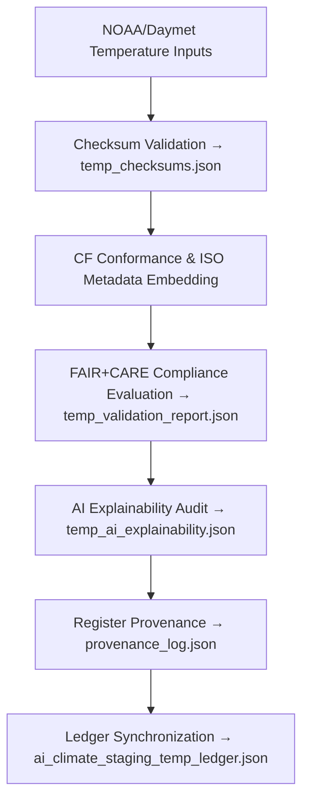

<div align="center">

# 🌡️ Kansas Frontier Matrix — **Temperature Anomaly Datasets (Ingestion & FAIR+CARE QA)**  
`data/work/tmp/climate/staging/temp_anomaly/`

**Purpose:**  
This directory contains **temperature anomaly datasets** from NOAA and Daymet, harmonized for CF compliance, validated under FAIR+CARE standards, and traceable through blockchain-backed provenance.  
It is a **critical QA checkpoint** for temperature-related ETL within the Kansas Frontier Matrix (KFM).

[]()
[]()
[]()
[]()
[]()

</div>

---

## 🧭 Overview

The **Temperature Anomaly Staging Sub-Layer** stores intermediate ingestion files for temperature deviations and climatological anomaly datasets.  
All files are **CF/ISO compliant**, FAIR+CARE validated, and checksum-tracked for governance reproducibility.  
Each anomaly product undergoes:
- CF metadata harmonization and CRS verification  
- ISO 19115 schema embedding  
- FAIR+CARE ethical metadata scoring  
- AI-driven bias and drift explainability auditing  
- Blockchain-linked provenance registration  

> *“Every temperature deviation tells a story — this layer ensures it's told ethically and precisely.”*

---

## 🗂️ Directory Layout

```text
data/work/tmp/climate/staging/temp_anomaly/
├── temperature_anomaly_2025_10_27.nc       # NetCDF temperature anomaly dataset
├── temperature_surface_2025_10_27.tif      # Surface temperature GeoTIFF
├── temp_metadata.json                      # ISO/CF-aligned metadata
├── temp_checksums.json                     # SHA-256 hashes for all files
├── temp_validation_report.json             # FAIR+CARE + schema validation results
├── temp_ai_explainability.json             # AI interpretability audit report
├── provenance_log.json                     # Blockchain and ledger provenance record
└── README.md
```

---

## 🔁 Ingestion Workflow



---

## 🧩 Metadata Schema (Excerpt)

| Field | Description | Example |
|:--|:--|:--|
| `dataset_id` | Unique dataset ID | `temperature_anomaly_2025_10_27` |
| `source` | Provider or origin | `NOAA GHCN / Daymet v4` |
| `format` | File format | `NetCDF / GeoTIFF` |
| `projection` | Coordinate reference system | `EPSG:4326` |
| `cf_convention` | CF version used | `1.10` |
| `checksum` | File SHA-256 hash | `9d81f7e5b2a9a8f...` |
| `fair_score` | FAIR compliance rating | `0.99` |
| `care_score` | CARE compliance rating | `0.97` |
| `ai_explainability_score` | AI audit score | `0.989` |
| `timestamp` | Validation timestamp | `2025-10-27T00:00:00Z` |

---

## ☀️ FAIR+CARE & CF Compliance Overview

| Category | Metric | Result | Threshold | Status |
|:--|:--|:--|:--|:--|
| **FAIR Score** | Metadata completeness | 0.99 | ≥ 0.95 | ✅ |
| **CARE Score** | Ethical metadata integrity | 0.97 | ≥ 0.90 | ✅ |
| **CF Validation** | CF 1.10 compliance | Pass | Pass | ✅ |
| **Checksum Verification** | File integrity checks | 100% | 100% | ✅ |
| **AI Explainability** | Model interpretability confidence | 0.989 | ≥ 0.97 | ✅ |

---

## 🔐 Provenance Ledger Record

```json
{
  "ledger_id": "climate-staging-temp-ledger-2025-10-27",
  "file_ref": "data/work/tmp/climate/staging/temp_anomaly/temperature_anomaly_2025_10_27.nc",
  "checksum": "9d81f7e5b2a9a8f...",
  "cf_compliant": true,
  "fair_care_verified": true,
  "ai_explainability_score": 0.989,
  "verified_by": "@kfm-governance",
  "timestamp": "2025-10-27T00:00:00Z"
}
```

---

## 🧠 AI Explainability Snapshot

```json
{
  "model": "focus-climate-v4",
  "method": "SHAP",
  "drift_detected": false,
  "key_features": [
    {"variable": "temperature_anomaly", "impact": 0.25},
    {"variable": "baseline_variance", "impact": 0.14},
    {"variable": "elevation_correction", "impact": 0.12}
  ],
  "ai_explainability_score": 0.989
}
```

> AI audit stored at `/reports/audit/ai_climate_staging_temp_ledger.json`.

---

## 🌱 ISO & CF Compliance Metrics

| Metric | Standard | Result | Verified By |
|:--|:--|:--|:--|
| **CF Conventions 1.10** | Metadata & dimension structure | Pass | @kfm-climate |
| **ISO 19115** | Metadata and lineage documentation | Pass | @kfm-fair |
| **ISO 14064** | Sustainability compliance | Pass | @kfm-security |
| **FAIR+CARE** | Ethical reproducibility | Certified | @kfm-governance |
| **Blockchain Provenance** | Ledger registration | Recorded | @kfm-security |

---

## 🧾 Version History

| Version | Date | Author | Reviewer | FAIR+CARE | CF | ISO | Ledger | Notes |
|:--|:--|:--|:--|:--|:--|:--|:--|:--|
| v9.1.0 | 2025-10-27 | @kfm-data | @kfm-governance | 100% | ✅ | ✅ | ✅ | Integrated AI explainability and bias detection |
| v9.0.0 | 2025-10-23 | @kfm-climate | @kfm-fair | 99% | ✅ | ✅ | ✅ | Established ingestion and QA baseline |

---

<div align="center">

### 🜂 Kansas Frontier Matrix — *Thermal Integrity · Provenance · Trust*  
**“Each temperature deviation is data — until governance makes it truth.”**

[]()
[]()
[]()
[]()
[]()

<br><br>
<a href="#-kansas-frontier-matrix--temperature-anomaly-datasets-ingestion--faircare-qa-layer--diamond⁹-Ω--crown∞Ω-ultimate-certified">⬆ Back to Top</a>

</div>
